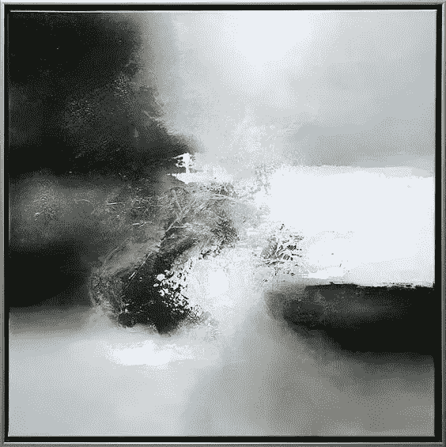

# 追逐文化

> 原文：<https://medium.datadriveninvestor.com/chase-culture-537bb46c6205?source=collection_archive---------6----------------------->

我们被迫去追逐。

当我们“关闭”时会发生什么？当我们达到目标时会发生什么？接下来会发生什么？

抓到兔子的灰狗不知道该拿它怎么办。

现在*的文化*，点播*的文化*和享乐主义的沉迷困扰着我们。

没有人，团体或个人可以被指责，这只是两点之间的最短路径——完成一项任务所需的最少能量。

结果，我们成为“任务成功者”——不可思议的成功者，因为我们的文化奖励我们这样做。它奖励了我们的短视。不是*思考*，而是采取行动——不断推动完成更多。

这种奇妙的问题解决方式并不抽象。它是在一个系统中，在一个盒子里的思想。这是有限的创造力。

> 它是有限的，这没关系。

是的，它看起来很懒——也许确实如此，但这只是以短期能量守恒的名义。

是的，这看起来很愚蠢——但这并没有恶意，只是简单地随大流。或者，更适合我们中的“意识到”或“觉醒”的人，默许文化规范并减少社会排斥。

问题是，接受和拒绝哪些规范是合适的？

视角的尺度决定了答案——而答案(总是)被某种程度的恐惧所驱使。

在这个问题上，没有答案是真正正确的——这是一个视角的问题。

我们是否认为，因为改变现状直接支持了不必要的资源支出，就应该保留已建立的制度？

还是我们坐在另一端，认可生命的目的是成长和适应，无论代价如何？

*Eelco Maan — Love and fear*

没有力量的平衡，没有*推*和*拉*的平衡，就不会有混乱——没有混乱，只有确定。

绝对确定的生活是无聊的——它是微不足道的，而且在我们的生活中(很可能)是不可能的。它意味着完美的可预测性——没有思想的冲击，没有成长和衰退，只有无限事件序列中的“步骤”。

也许这些事件会循环往复，永无止境……也许不会。

也许我们注定要集体跟随我们的鼻子，保持反动，被局限在本地团体中，为我们的生存而祈祷。

尽管力量平衡，紧张和压力测试，*当代*将永远对抗*传统*。

> 道德寻求带来平衡，但自身却戴着一个透镜。

强大的财富力量将永远争夺控制权，人民的力量将定义我们的集体价值观，借方将永远等于贷方。

善的存在是为了平衡恶，恶的存在是为了对抗善的敌人。

随着时间的推移，所有的风暴都将规范，衰退将不可避免地接踵而至——熵既是我们的朋友，也是我们的敌人，是生命特有机会的反面。

我们总是渴望更多——我们追求成长。

我们想要的只是生命的生存和繁荣——而生命需要成长。

但是实现这一点需要抽象。它需要超越人性和我们创造的“*工具*范围的创造力——除非我们能创造一个比我们自己更强大的工具(雪莱和阿西莫夫可能也这么想——但我们只能推测)。

我们的工具将变得更加复杂，原因有三:

1.  渴望有所作为
2.  对增长的渴望
3.  我们注意力的分散

首先是激发我们的自我。第二是因为生活需要它，第三是因为我们意识到即将到来的厄运。我们*想要的*，什么*就是*和*害怕的*。

因此，知道接受和拒绝什么规范是一个视角问题——我们选择如何影响我们所处的空间。只要我们的思想存在，只要我们的结构支撑着一个不断扩展的生命链的生长，我们就能呼吸。

任何被创造出来的东西，都是由现实底层的另一个头脑完成的。每一项发明，规范，系统或过程，存在或想法，它们都是通过一个抽象概念的表现，以工具为媒介向我们的感官传达符号。

假设我们必须追逐事物——生活需要追逐和逃避，一场捉迷藏的游戏，一系列无限的钟摆——我们选择去追逐的事物有多大，有多闪亮？

我们现在对视角的永久校准调整到了什么程度？它能并且会趋向一个极限吗？

我们选择问的问题会有多大，我们的集体存在会变成什么样？

无论你*选择*去追*——请知道如果你抓到它该怎么做*。