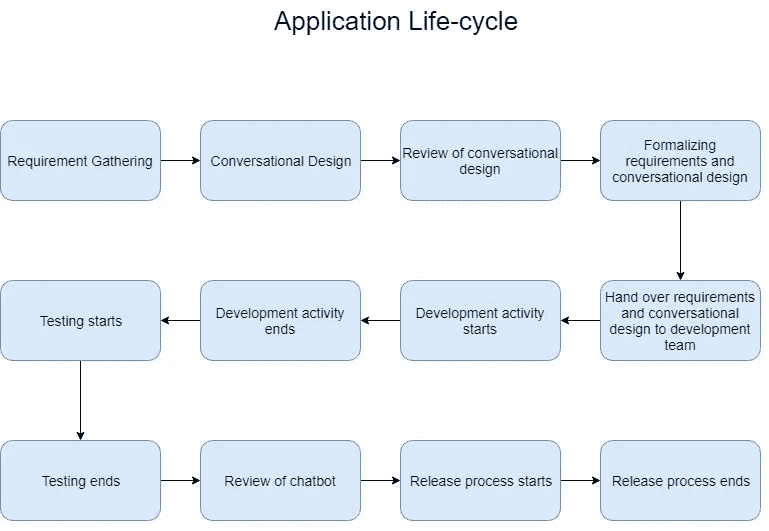

# 聊天机器人应用程序生命周期

> 原文：<https://medium.datadriveninvestor.com/chatbot-application-life-cycle-8b2d083650a8?source=collection_archive---------0----------------------->

随着越来越多的组织采用聊天机器人，定义生命周期或构建聊天机器人应用程序的整个过程非常重要。

"*聊天机器人应用程序与其他应用程序有何不同？*“聊天机器人应用不同于其他应用，因为它们有一个额外的组件，即聊天机器人。还考虑到聊天机器人内部有两个不同的[组件](https://medium.com/datadriveninvestor/the-50-50-model-for-conversational-solutions-31798fa92ffb)，这使得整个过程不同于其他应用程序。

*如果聊天机器人的应用程序不同，这是否意味着我需要不同的人来完成工作？*“没错！常规团队结构不适用于聊天机器人应用程序。

这就引出了下面两个问题:

1.  想要开发聊天机器人应用程序的团队需要什么样的技能？
2.  整个过程或生命周期是怎样的？

让我们一次看一个问题

想要开发聊天机器人应用程序的团队需要哪些技能？

与其直接回答这个问题，不如让我走一条更长的路线。让我们看看构建聊天机器人需要哪些高级活动

1.  需求收集
2.  解决方案设计
3.  对话式设计
4.  前端/客户端开发
5.  聊天机器人开发
6.  服务开发
7.  测试
8.  发布流程
9.  审查和再培训

当我们深入生命周期时，我们将在第二部分中查看这些活动，但是现在让我们看看谁是这些活动下的利益相关者。

1.  **需求收集** —需求收集通常由领域专家或业务分析师完成。例如，如果您正在为领域 A 构建一个应用程序，那么该领域的业务分析师将接触不同的人并获得需求。*因此，巴是第一个团队成员*。
    由于应用程序是一个团队将要构建的产品，因此在此活动中还需要产品负责人。*我们的第二位团队成员是 PO。*
2.  **解决方案设计** —一旦团队有了需求，下一步就是将应用程序架构和设计落实到位。在这一步，不同的组织走不同的路。对于一些人来说，整个团队都是这一步的一部分，但是对于一些人来说，只有一组被选择的人参与这一活动。他们之间有什么共同点？这组人总是由应用程序架构师领导。*因此，架构师成为第三个团队成员。*
3.  **对话设计—** 对话设计是聊天机器人开发中的另一项活动。此外，这是一个不同于其他应用程序的活动。对于这一步，需要进行对话式设计。要了解更多关于对话式设计的信息，请浏览 ***对话式体验设计与开发*** 部分的[链接](https://medium.com/datadriveninvestor/the-50-50-model-for-conversational-solutions-31798fa92ffb)。
    *参加本次活动的团队成员有对话体验设计师、应用架构师、BA 和 PO。*
4.  **前端/客户端开发** — 对于每一个聊天机器人应用来说，都有一个前端或客户端。例如，我们要么有一个用户界面，要么集成到数字助理，如 Siri，谷歌助理，Cortana，Alexa 等。我们也可以有一个电话集成，即 IVR 通道。
    *此活动需要一名相关的前端开发人员。* *如果建立一个用户界面，那么也需要一个用户界面/UX 设计师。*
5.  聊天机器人开发 — 聊天机器人是一个关键的组件，它们也需要一个专门的开发人员。因此，我们有了下一个团队成员——聊天机器人开发者。
6.  **服务开发** —还需要后端或服务和数据库，因此*需要一个或多个服务开发人员*。
7.  **测试** —测试和开发一样必要，因此需要 QA 测试人员。此外，考虑到我们有聊天机器人，自动化测试人员比人工测试人员更受欢迎。
8.  **发布流程** —应用程序构建完成后，*我们还需要一名 DevOps 开发人员来处理发布流程*并部署应用程序。一般来说，组织有一个团队负责整个发布过程，所以这可能是也可能不是分配给特定聊天机器人团队的专门开发人员。
9.  **审查和重新培训** —我们必须理解聊天机器人是预测性解决方案的事实，因此，它们需要在审查后频繁进行培训更新。*本活动需要的团队成员包括 BA、PO、chatbot 开发人员、应用程序架构师和对话设计人员。*

这就结束了聊天机器人开发中的活动。如上所述，我们需要以下团队成员

1.  邮局（post office)
2.  钡
3.  前端开发人员
4.  应用程序架构师
5.  对话设计器
6.  服务开发人员
7.  质量保证
8.  聊天机器人开发者
9.  DevOps 开发人员

**整个过程或生命周期是怎样的？**

上图展示了聊天机器人应用程序的整个生命周期。现在，让我们深入了解每项活动。

1.  **需求收集** —像任何其他应用程序一样，聊天机器人应用程序也从需求收集会话开始。在这里，团队由 PO 和 BA 代表，会议在业务或领域涉众与 PO 和 BA 之间进行。所有要求最终确定且 BA 和 PO 同意后，这些会议就结束了。
2.  **对话式设计** —对话式设计是另一项关键活动，需要在任何开发活动之前完成。在此活动中，对话体验设计师、建筑师、PO 和 BA。让开发人员参与这项活动会很有帮助，因为他们知道在给定的时间框架内可以做的事情的限度。为了设计一个有效的对话模型，必须考虑以下几点
    ——对于最终用户来说，聊天机器人是黑匣子，也就是说，除非明确告诉他们，否则他们不会知道聊天机器人会如何或在哪里帮助他们。
    ——要设计一个有效的对话模型，应该有某种手把手的指导，帮助用户理解如何使用聊天机器人。
    —这些用于指导的功能可以内置于 bot 或 UI/前端
    —在您构建了用于围绕对话模式指导用户的功能后，您必须构建一些功能，以便在用户离开您的领域时让他们回到您的领域。例如，如果你的聊天机器人用于教育领域，而你的用户进入了医疗保健领域，你不仅需要帮助他/她回到你的领域，还要设定你的机器人能做什么的期望。
    —一旦您的设计最终确定，您就可以对设计进行评审。
3.  **对话式设计的审核** —对话式设计的开发一旦完成，就需要通过业务。一旦业务部门批准了对话设计，它就被发送到核心团队，开始正式化需求。
4.  **形式化需求和对话设计** —一旦评审完成，对话模型和需求被形式化，团队开始讨论如何实现它。这一步的结果是一个解决方案设计文档，它涵盖了整个应用程序的深入细节。
5.  **将需求和对话式设计移交给开发团队** —一旦解决方案设计文档准备就绪，团队就开始讨论所有组件以及如何构建它们。这是正式开始开发活动前的最后一步。
6.  **开发**——所有实际的开发活动都在这里完成，包括大量的编码、调试、缺陷修复和讨论
7.  **测试** —测试分两步进行:— a .单元测试 b .集成测试。一旦组件的开发完成，开发人员就进行单元测试，在与其他组件集成时，集成测试就完成了。
    一旦所有的开发活动都完成了，业务测试和应用测试也就完成了。
8.  聊天机器人的审查——一旦测试完成，聊天机器人的审查就开始了。在这里，利益相关者试图通过各种方式与聊天机器人交谈来打破聊天机器人。所有确定的问题都得到解决，这个过程一直持续到所有利益相关者都完全满意为止。
9.  **发布** —最终将应用和聊天机器人发布到外部环境使用。

这是一个建立聊天机器人和相应应用程序的总体方法。然而，这不是基准或最终结果。组织和团队经常调整过程以适应他们的需求。