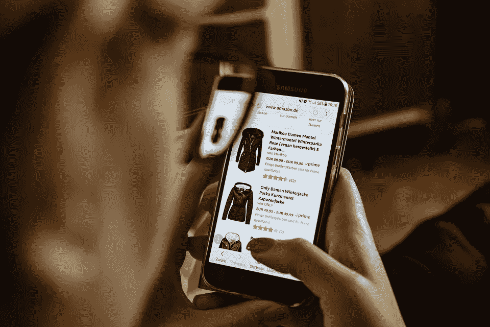

# 聊天机器人个性化:革新客户体验

> 原文：<https://medium.datadriveninvestor.com/chatbot-personalization-revolutionizing-customer-experience-dcd130696f0a?source=collection_archive---------5----------------------->

据研究，全球近 85%的高管认为，在人工智能的帮助下，他们的生产力将得到很大程度的提高。这也将帮助他们的公司在激烈的竞争中获得优势。在 B2C 领域，许多应用程序都准备部署聊天机器人。除此之外，B2E 和 B2B 营销的组织场景也见证了巨大的推动。

人工智能有大量的应用可以帮助世界变得更美好。但是一个日益流行的应用是聊天机器人的使用。根据一些研究，很明显-

*   到 2020 年，80%的公司希望聊天机器人能够提升他们的组织。
*   从 2017 年到 2021 年，聊天机器人市场预计将使 CAGR 增长 37.11%。

**实施聊天机器人对企业的好处:**

1.机器人是保持品牌一致性的有效工具。
2。机器人全天不间断地提供客户服务。
3。他们通过完成日常工作来减少体力劳动和节省时间。
4。机器人提供的响应是即时的，它们在很大程度上减少了等待时间。

**聊天机器人个性化的意义**

自从开始讨论人工智能的重要性以来，大多数企业现在应该已经意识到聊天机器人的个性化对他们组织的进步有多么重要。由于有太多的基本通用信息，互联网充满了停滞。用户现在只希望看到第一眼就能激起他们兴趣的东西。他们喜欢看为满足他们个人需求而量身定做的东西。

不幸的是，有许多营销人员意识到提供个性化服务的好处，但他们没有在他们的战略中实施这些方法。

# “Econsultancy 指出，大约 74%的营销人员知道个性化的优势，但只有一小部分人(19%)在营销活动中采用了这种方法。”

如今，企业最重要的方面是利用工具收集用户数据，并在不超出预算的情况下提供用户所需的个性化服务。这听起来可能有点不现实，但实现起来并不像大多数企业主认为的那样困难。聊天机器人是吸引客户注意力的有趣武器，这要归功于自动化和人工智能(AI)。

Botforces，即一组互动的聊天机器人，随时准备在整个销售过程的任何阶段满足不同的客户需求。聊天机器人的最大特点是，它们可以激发新用户的兴趣，向反复查看内容的访问者推荐阅读内容，当交易接近尾声时，它们可以通过讨论价格信息将对话带入下一个层次。

**聊天机器人个性化如何工作**

顾客的忠诚度取决于几个主要因素。因此，公司必须确保在销售的每一步，他们都可以随时满足顾客的所有需求。跟踪顾客的购买习惯是成功企业采用的众多方法之一。

**全渠道项目**

为了即兴发挥他们的客户体验，51%的企业依赖至少 8 个渠道来促进与用户的顺畅沟通。在 2018 年，大多数公司预计将完成全渠道计划的整合，并奠定基础，以确保在所有主要平台上保持信息的一致性。

客户互动及其跨所有平台的交叉引用有助于公司更好地了解购买行为、反馈和投诉。然后他们可以继续工作，改善他们的服务。

**自助服务分析**

根据阿伯丁的研究，该地区预计将在 2018 年见证最大的进步。在目前的情况下，52%的公司利用他们的分析来检查他们的消息系统、聊天机器人和网站是否正确地满足了客户的需求。预计到今年年底，这一比例将飙升 32%。

实时聊天、聊天机器人和许多其他服务正受益于在文本分析的帮助下优化的关键词的使用。它提供了客户是否对服务满意的指标，并指出任何有助于业务发展的即兴创作。这有助于公司适应客户行为并进行分析，以尽可能最好的方式改进他们的服务。

**聊天机器人个性化如何革新用户体验**

当你的用户感到特别和有价值时，你就有更多的机会增加你的收入。无论是聊天机器人对话、电子邮件还是网站，你都可以通过个性化服务让用户感到他们被理解，他们的意见受到重视。但是大多数聊天机器人的一个问题是它们缺乏个人魅力。除了在对话中使用客户的名字，没有多少聊天机器人能做到更多。当然，这还不够。

**借助真实场景理解个性化**

考虑现实生活中的情况。假设你走进一家商店，店主问了你一些相关的问题来改善他的服务。下一次你去商店时，店主很可能会为你提供个性化的体验，满足你的特定需求。既然有了有效的双向对话，个性化就开始了。

这正是高效聊天机器人为企业所做的事情。社交媒体、电子邮件和登录页面提供了一种单向的交流，这种交流永远无法像客户和聊天机器人之间的个性化双向对话那样有效。

**包装完毕**

如果你想为你的用户创造个性化的体验，聊天机器人是最好的方法之一。尽管确保个性化是真实的，因为对用户不切实际的希望只会破坏你的商业信誉。聊天机器人的目的应该是让顾客的生活更轻松。你需要做的就是训练你的机器人问相关的问题。这种程度的个性化一定会增加你的转换率，使你的企业达到成功的顶峰。

作者简介:

阿尼班·古哈是一名经验丰富的集客营销和沟通专家，目前在企业级聊天机器人平台 [Kore.ai](https://kore.ai/) 工作。他是最新技术趋势的敏锐观察者，喜欢写关于这些趋势的文章。你可以在[推特](https://twitter.com/anibeg25)和 [LinkedIn](https://www.linkedin.com/in/anibeg25/) 上关注他。