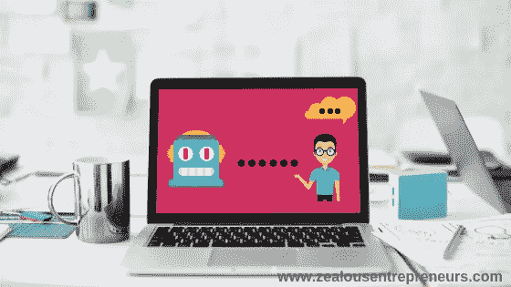
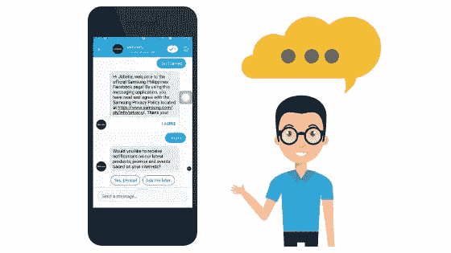
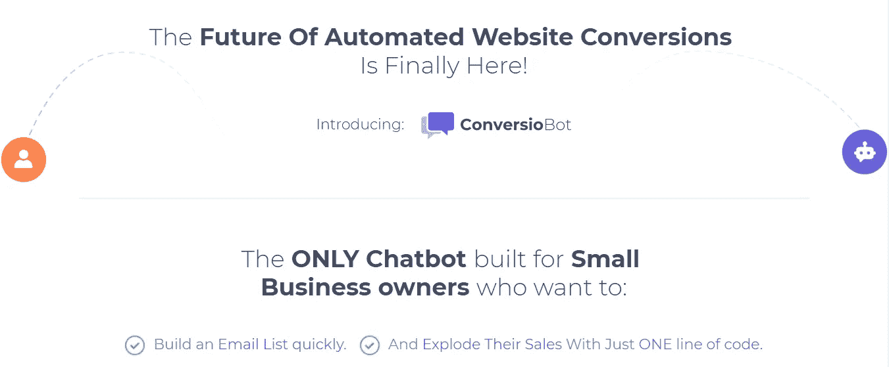

# 聊天机器人:潜在客户产生和转化的未来

> 原文：<https://medium.datadriveninvestor.com/chatbot-the-future-of-lead-generation-and-conversions-5e44084a2eb2?source=collection_archive---------18----------------------->

*免责声明:本文包含附属链接。[点击此处阅读完整的免责声明。](https://www.zealousentrepreneurs.com/disclaimer.html)

如果你正在手机上阅读这篇文章，很可能你的屏幕上有一个活跃的聊天窗口。那很可能是你的配偶，你的男/女朋友，你最好的朋友，你朋友的群聊，也可能是你最近联系的公司。而你还在等他们的回应。或者如果该公司有良好的客户服务，你的担心可能已经解决了。这就是我们一直想要的，优秀的客户服务。

有时，当我们在脸书上滚动浏览一个产品时，我们想要联系该页面并询问该产品。然而，我们很少得到我们想要的回应。大多数情况下，我们会收到自动回复:“我们会尽快回复你。”如果我们能得到一个自动回复来回答我们的问题，那就更好了。

如果你是企业主，为了成功，你需要考虑这些事情。你必须为客户提供实时的答案或解决方案。但是有这么多客户询问信息，这不是一件容易的事情。你可以雇一个助理来和客户沟通，但是一个或几个助理不足以应对几个客户。

好消息是，有一种人工智能叫做**聊天机器人**。聊天机器人来自“聊天”或对话，而“机器人”来自机器人。这意味着对话是自动进行的。因此，您可以一次性回应数百万客户。

脸书信使已经在使用聊天机器人。马克·扎克伯格知道聊天机器人将会成为商业和脸书广告商的一件大事。他透露**聊天机器人将是脸书未来十年成功的秘密。**

聊天机器人一定会给你的脸书主页带来成功。但是你如何在你的商业页面或网站中使用这项技术呢？

# 转换机器人

ConversioBot 将这项技术带到了您的业务中。您可以将其完全集成到您的电子邮件营销服务中，如 MailChimp、AWeber、Sendlane 或 GetResponse。把你的产品或服务带给人们需要很多努力，让他们离开完全是一种浪费。你花钱买广告，让它们出现在人们面前。因此，你必须让他们留下来，你可以通过出色的客户服务做到这一点。

[https://conversiobot.com/videos/ConversioBot_1a_zoo.mp4](https://conversiobot.com/videos/ConversioBot_1a_zoo.mp4)

ConversioBot 允许您向客户伸出援手并提供解决方案。完成所有这些后，你就可以从根本上**增加你的销售线索和转化率**。而且最棒的是，你不用给开发商几千块钱。这个工具已经为你做好了。[点击这里](https://conversiobot.com/botcb?cbnick=joe1106&tid=blog)体验 ConversioBot，了解所有细节。

【www.zealousentrepreneurs.com】最初发表于**。**