# 聊天机器人和自动化的未来

> 原文：<https://medium.datadriveninvestor.com/chatbots-and-the-future-of-automation-314253e1e9b5?source=collection_archive---------18----------------------->

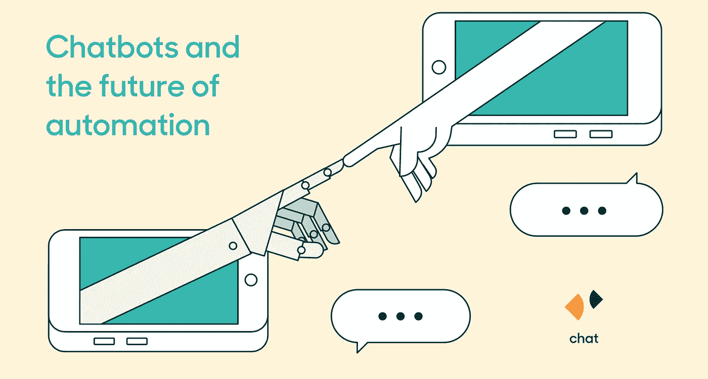

谈到支持体验，客户寻求熟悉、非正式、最重要的是即时的联系方式。这就是为什么，对于寻求与消费者直接互动的品牌来说，实时沟通是显而易见的。如今，强调实时客户互动的公司通过在网络和移动领域使用自动化，将互动向前推进了一步。聊天机器人是单向的，公司正在实现客户服务互动的自动化，当品牌将聊天机器人纳入实时交流如实时聊天时，他们通常旨在扩大规模，以及改善第一反应时间和代理效率。

许多网络和移动环境都配备了支持机器人的集成。根据 Gartner 研究副总裁 Van Baker 的说法，“到 2020 年，超过 50%的大中型企业将部署产品聊天机器人。”也就是说，当涉及到个性化的人际互动时，这些强大的互动工具可能会有所欠缺。留给品牌的任务是什么？在新兴技术中创造一种深刻的、感性的、人性化的体验。换句话说，公司需要知道何时让聊天机器人做他们最擅长的事情，以便人类可以反过来做他们最擅长的事情。

# 目录

*   1.理解聊天机器人的能力和局限性
*   2.人类支持的重要性
*   3.机器人到人的移交最佳实践:进行彻底的切换
*   4.人类的角色:让我们谈谈机器人吧

# 1.理解聊天机器人的能力和局限性

什么是聊天机器人？它们包括脚本化和自学的人工智能工具，这些工具被编程为以模拟与真人在线对话的方式与客户交谈。

> 聊天机器人可以讲笑话，处理付款，并给你推荐玉米卷。

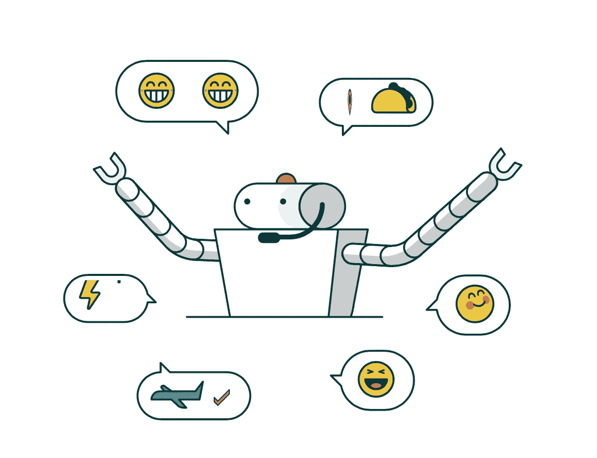

他们可以讨论时事，并传递你的网上购物订单。然而，例如，机器人不能检测讽刺或恶意。最重要的是，他们可能模仿人类，但不能真正像我们一样行动。就目前而言，应该是这样的。“机器人有广泛的用途，但有正确和错误的方式来使用它们，”杰森·迈尔斯说， [Ada 支持](https://ada.support/zendeskchat/)的客户成功负责人。“有时候，当涉及到客户支持时，机器人就是做不到。”

为了通过机器人有效地与客户沟通，品牌需要了解聊天机器人的能力和局限性，并充分利用聊天机器人和人工支持。企业需要考虑如何平稳地从机器人支持过渡到人工支持，或者机器人到人工的移交最佳实践。

**以下是品牌使用聊天机器人的五种支持方式，从实用到有趣:**

## 1.实时常见问题的聊天机器人

你猜对了:FAQ 机器人用预编程的答案回答用户的提问。它们是一个品牌可以构建的最简单的机器人之一，答案直接从他们自己的网站页面上抓取。但是为什么就此打住呢？易贝的 ShopBot 比标准的 FAQ 更进了一步，它不仅提供关于服务的答案，还提供关于库存的答案。ShopBot 根据商品、品牌名称和价格引导购物者购买产品，并通过问题提供多项选择答案。你要袋子吗？ShopBot 会问你在考虑什么材料——尼龙、超细纤维、皮革、聚酯？

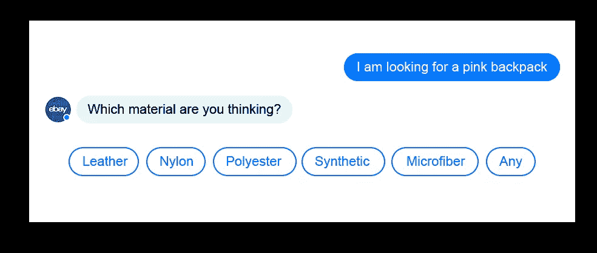

该机器人还会提示购物者提出某些问题，因为它已经有了答案。所以当 ShopBot 建议你问“什么是趋势？”你会得到这样的答案:

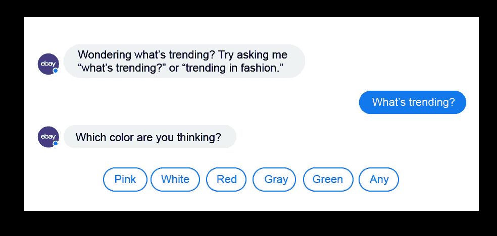

根据购物者的选择，ShopBot 会推荐一种流行产品。

## 2.执行简单服务的聊天机器人

百度首席科学家吴恩达在《哈佛商业评论》上写道:“如果一个典型的人可以用不到一秒钟的时间思考完成一项脑力任务，那么现在或在不久的将来，我们或许可以用人工智能来自动化这项任务。”。

举个例子:根据 Forrester 的数据，荷兰皇家航空公司(KLM Royal Dutch Airlines)的聊天机器人(chatbot)在运营的前三周就向顾客发放了 5 万张登机牌。该机器人还会向客户更新航班变化，发送登机通知并确认预订。同样，旅客可以通过中国南方航空公司的微信聊天机器人预订航班。

这些机器人之所以成功，是因为它们的创造者了解聊天机器人在哪里表现最好——需要简单逻辑的琐碎任务。虽然直到你引起空乘人员的注意可能会感觉很久，但他们只需要一会儿就可以确认你的座位并给你一张登机牌——这是一个机器人可以轻松完成的任务。

## 3.聊天机器人作为娱乐

星巴克的季节性超级明星南瓜香料拿铁前段时间大张旗鼓地拥有了自己的 Twitter 账户。南瓜香料机器人是 2016 年 8 月机器人热潮期间的下一个合乎逻辑的步骤。这种热饮的粉丝可以和南瓜香料聊天，只是为了寻求刺激，虽然它的回应并不总是直接回答用户的问题，但这个机器人肯定被它的古怪迷住了。

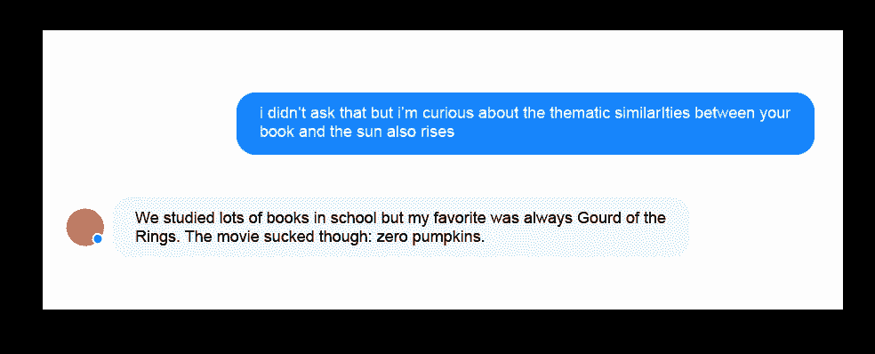

这里的用户沉浸在与机器人聊天的新奇中，挑战机器人的极限，与一个奇怪的有生命的无生命物体互动。

## 4.聊天机器人是关系的建立者

介于实用性和娱乐性之间，有一些机器人可以为一个品牌建立消费者信用。这些机器人教授了与品牌相关的课程，培养了用户和产品之间的关系，但没有推动销售。

联合利华的 [Signal Pepsodent 牙膏使用 Facebook Messenger](http://www.thedrum.com/news/2016/10/20/unilever-using-facebook-chatbots-encourage-kids-brush-their-teeth) 来教孩子们健康的刷牙习惯。每天，这个机器人都会在用户可以预先设定的时间发出一系列名为“大刷子，小刷子”的动画剧集。像这样的聊天机器人功能旨在通过品牌内容将家庭聚集在一起，因此当他们前往超市时，信号 Pepsodent 将是脑海中的第一个想法。

## 5.回答深层品牌问题的聊天机器人

其他聊天机器人充当某个品牌领域的专家。类似于 FAQ 聊天机器人，这些专家对与该品牌相关的主题有更深入的了解。

例如，威士忌制造商麦卡伦(Macallan)通过 Facebook Messenger 用多项选择的形式回答问题。或者，顾客可以向机器人寻求选择“正确”威士忌的建议。它对自然语言没有特别的响应，但它是一个关于威士忌的信息库，即使它对每个查询只提供少量的股票响应。

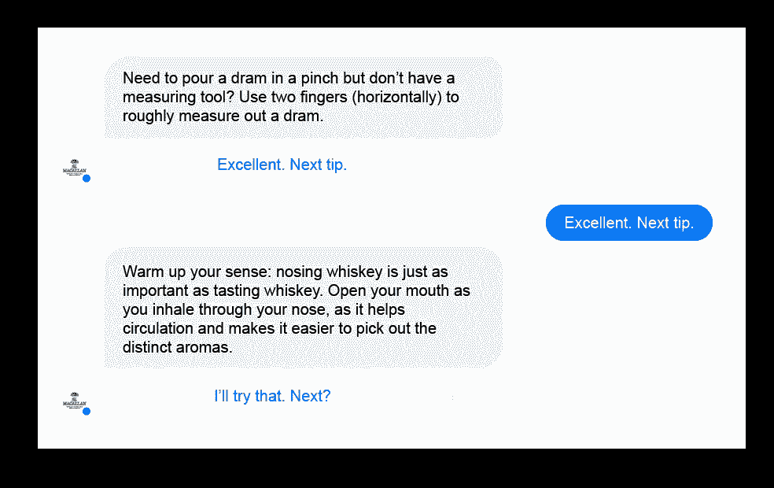

# 2.人类支持的重要性

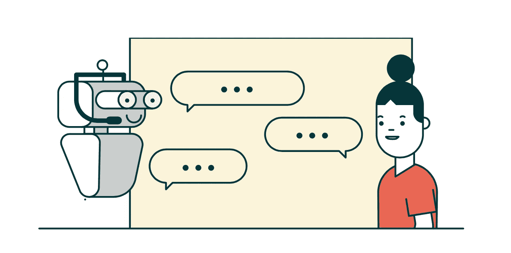

你可能不认识肯尼·贝克，但你肯定会在他最著名的角色中认出他，我们指的是在他最著名的角色中。作为 R2-D2，贝克驾驶着电影史上最受喜爱的机器人之一，赋予他的*星球大战*同志 C3P0 曾称之为“一团超重的油脂”的个性和感情

与此同时，在一个离家更近的星系中，我们的[羽翼未丰的机器人](https://techcrunch.com/2016/07/30/the-human-role-in-a-bot-dominated-future/)“对于解决人类不需要花费时间的重复交互最有用——这使得人类可以专注于最需要他们的高优先级案件驱动程序，”Ada Support 的迈尔斯说。聊天机器人可以做很多事情，这是真的，但它们的能力因其在创建健康的人类支持体验方面的缺点而黯然失色。

“我们已经知道聊天机器人的局限性在哪里，以及人的因素有多重要。DigitalGenius 的米哈伊尔·瑙莫夫说，聊天机器人在客户服务方面的能力源于人类智慧和机器智能的协同工作。仅仅信任一个机器人或一个人来做这件事不再是最好的方式。“最好的方法是将两者结合起来，让机器做机器最擅长的事情，为人类做同样的事情铺平道路。

在个性化支持体验中，人不是可有可无的，事实上，他们是至关重要的。

## 使用机器人实现一对一沟通

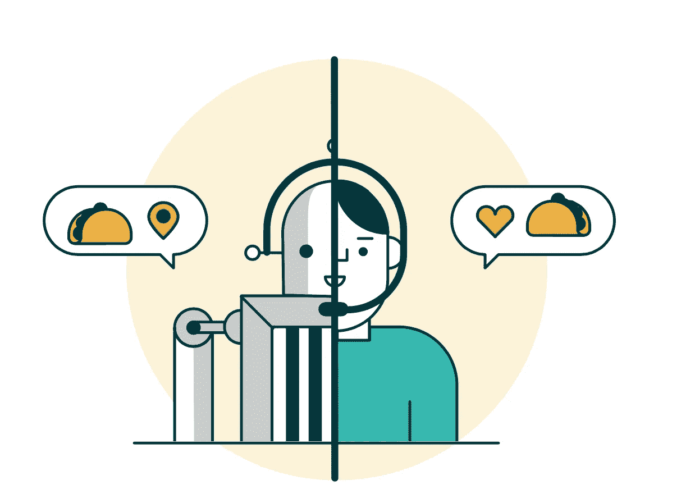

聊天机器人不是用来接管客户支持的。相反，它们是作为中介而构建的，目的是在营业时间之外保持客户支持的可访问性，并腾出人工代理来处理棘手的请求。

不幸的是，一些公司，如电子邮件调度程序 Clara 和 X.ai 以及礼宾服务 GoButler，都非常渴望实现自动化系统的出现，他们最终给人类员工带来了更大的负担。

例如，在 2016 年初，礼宾机器人 GoButler 作为一种人工智能服务被推向市场，它可以通过预订航班、点餐，以及在一个案例中购买一个古董人类头骨，全天候为你服务。不幸的是，[“机器人”只是一个可怜的代表](https://www.bloomberg.com/news/articles/2016-04-18/the-humans-hiding-behind-the-chatbots)，在电脑屏幕的另一端执行琐碎的任务。在公司的节日派对上，员工们甚至轮流参加派对，以确保 GoButler 能够随时响应用户的请求。

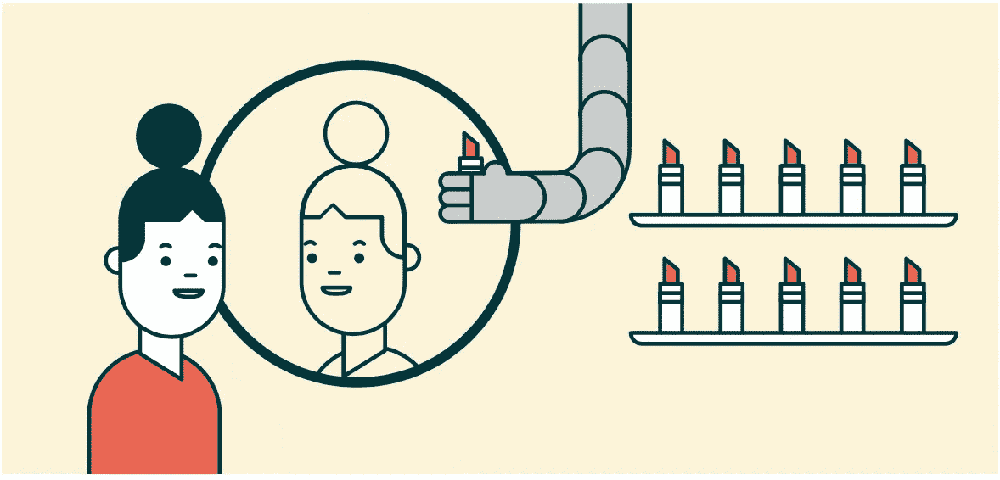

丝芙兰更成功。它的 Facebook Messenger 聊天机器人，丝芙兰的虚拟助手，通过允许用户上传自拍和虚拟测试[不同的口红颜色](https://www.fastcompany.com/3064845/human-lessons-from-brands-using-chatbots)，消除了店内化妆师的等待。这个机器人执行它被编程的特定任务(而不是承诺从晚餐预订到人类头骨的一切)，它甚至通过动画显示用户的面部来提供美容教程[，因为它走过了每一步。](http://www.multivu.com/players/English/7749652-sephora-virtual-artist-lip-lash/)[截至 2016 年 10 月](https://www.fastcompany.com/3064845/human-lessons-from-brands-using-chatbots)，丝芙兰虚拟艺术家已经在 9000 万种唇彩中被使用超过 400 万次。

## 过渡到人工支持

机器人到人的移交的基础可能在简单逻辑树(SLT)和自然语言处理(NLP)聊天机器人之间有所不同。

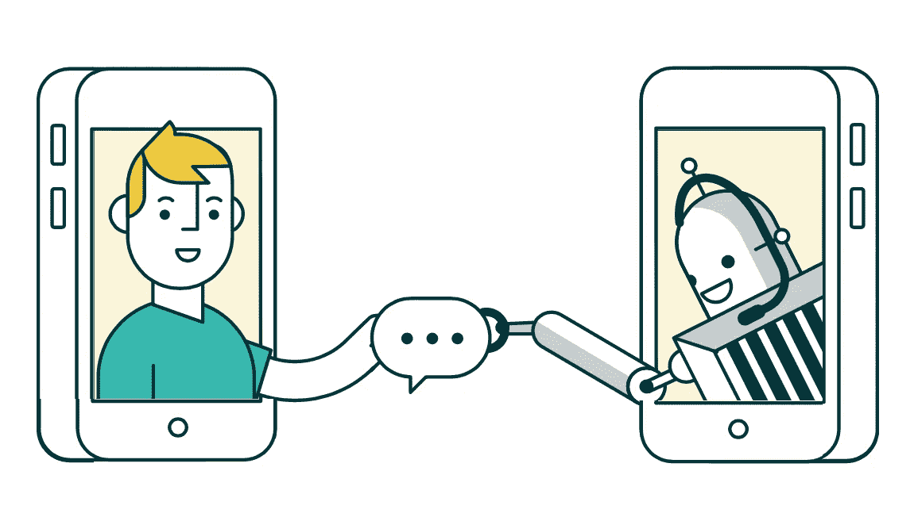

有了 SLT 机器人，很容易判断一个人什么时候需要接替一个机器人——通常是因为有些东西不会计算。在这些情况下，不理解问题的机器人会重复提供相同的答案，让他们的客户绝望地与人类交谈。为了避免这种困境，SLT 机器人需要一个逃生出口，比如“与人类代表交谈”的选项

具有机器学习能力的 NLP 机器人将试图评估它们是否能够处理每个请求。这些机器人[可以呼叫后援](https://www.levvel.io/blog-post/Getting-Started-with-Chatbots-and-NLP-Part-One)，如果它们冒险进入未编程的领域，就会向人类监视器发出信号接管。如果机器人对其答案的信心至少是中等的，被示意的人将检查它的反应。一旦它被人类检查和批准，机器人可以继续与它的客户互动。

# 3.机器人到人的移交最佳实践:进行彻底的切换

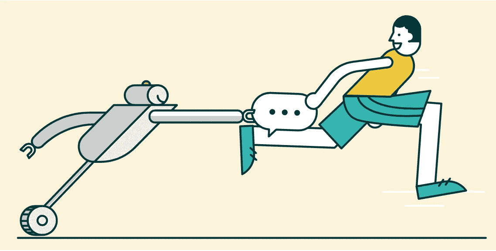

机器人可以帮助你的品牌进行一对一的沟通，但代理商可以帮助你的品牌人性化，并给客户留下难忘的个性化体验。当到了响应号召的时候，人类必须在各个方面都是可用的，无论是社交还是移动。移交策略根据人工代理等待的渠道、公司的营业时间以及用户查询的难度而变化。以下是你如何最好地处理机器人对人类的支持:

## 创造一个逃生出口

人工代理更容易在工作时间介入，尽管这一过程可能需要手动操作。从 9 点到 5 点，人们可以同时监控几个聊天机器人的对话，当聊天机器人被难倒时，他们就接管。这是大多数公司都会尽力避免的 GoButler 模式，尽管它确实允许销售代表根据需要进出对话，并同时处理多个对话。

逃生舱功能要有效得多。通过触发它——“我能和代表说话吗？”—人工代理可以在适当的时候介入，然后查看存档的机器人对话，快速收集用户查询的要点。

聊天机器人甚至可以通过预设的响应告诉人们在交接时应该说什么。例如，一个预订机器人可能会向它的人类对手发出 ping 命令，建议询问用户:“你想让我在哪个餐馆预订一张今晚的桌子？”这节省了销售代表审查整个 bot 副本所需的时间。当然，员工可以编辑这个回答，让它看起来更有个性。或者，如果他们不相信机器人的建议回复，他们可以查看一下记录，以防客户试图讨论其他事情。

## 使用自动回复

当人类员工不再在每个聊天机器人后面屏住呼吸等待时，机器人需要明确这一点。他们可以使用自动回复器，也就是专业人士发送的电子邮件(“OOO 本周在巴厘岛——如果有任何紧急问题，请给凯伦发电子邮件(抱歉，凯伦)”)！!").像 Karen 的幸运同事一样，聊天机器人可以包含一个公司或特定员工的电子邮件，客户可以在其中提出他们的问题。

自动回复器也适合在客服人员准备好并等待的时候使用。[以 SnapTravel](https://blog.sendsonar.com/2016/12/19/how-to-nail-the-bot-to-human-handoff/?utm_campaign=Submission&utm_medium=Community&utm_source=GrowthHackers.com) 为例，它帮助客户预订酒店。通过一系列查询，该品牌的聊天机器人可以将用户的旅行偏好缩小到一个简短的酒店和日期列表，并附带一条“一分钟后回来”的消息(见下图)，之后人类旅行社就会介入。为了增加魅力，[Radisson Blu Edwardian Hotel 的聊天机器人 Edward](https://blog.sendsonar.com/2016/12/19/how-to-nail-the-bot-to-human-handoff/?utm_campaign=Submission&utm_medium=Community&utm_source=GrowthHackers.com) 为所有非需求或投诉的客户信息准备了自动回复器。爱德华对幽默的信息有一套老一套的回答，一套是恭维的回答，还有一套是对常见问题的照本宣科的回答。

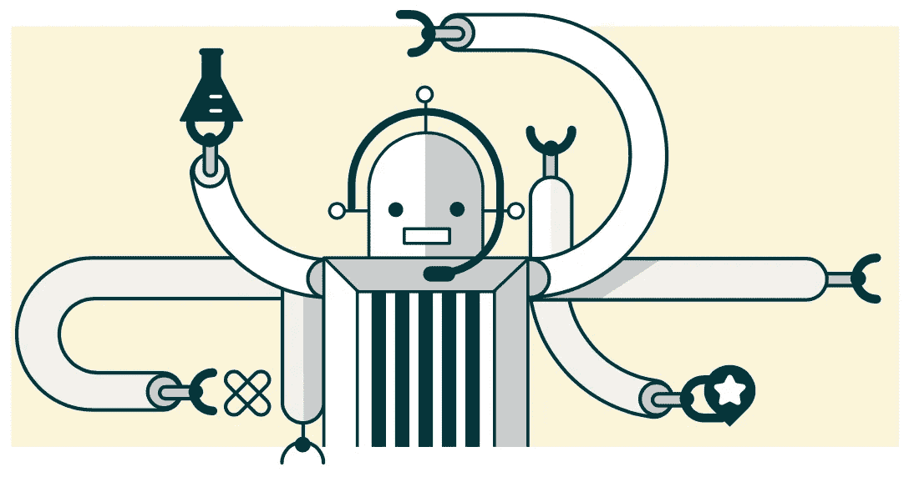

## 管理预期

在每次聊天机器人对话的开始，客户应该知道会发生什么。聊天机器人可以从自动介绍和简短的服务列表开始。例如，麦卡伦的威士忌聊天机器人以这条简单的信息开始:

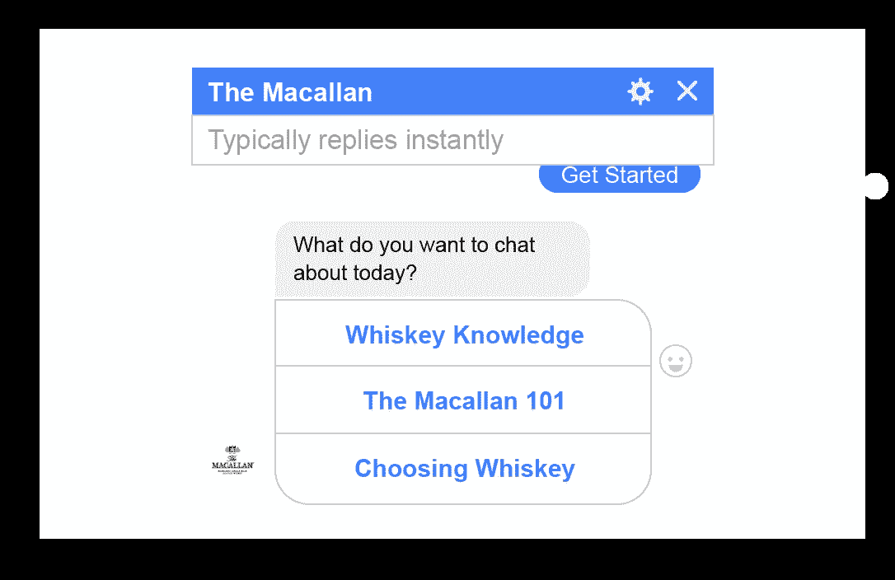

用户知道，他们可以在这些话题上与威士忌机器人互动——可能没有别的，至少基本上没有。

另一个策略是提前通知用户有逃生出口。让他们知道，他们可以在任何时候要求人工代表，如果他们不会立即可用，可能要等待一段时间。不这样做，你可能会引起客户的愤怒。一位不满的客户将威瑞森的聊天机器人描述为[“人工智能相当于电话树地狱](https://medium.com/@rmerrill/verizons-chat-bot-virtual-assistant-fails-in-human-handoff-d77295b64646)”难怪——当试图联系人类代表时，他陷入了这个令人恼火的循环:

公司需要确保他们的聊天机器人自动回复器反映了他们客户服务能力的真实情况。如果目前没有人可以提供帮助，让客户知道，此外，让他们知道何时会有人工代理。如果等待时间很长，至少向客户提供一个支持电子邮件地址。

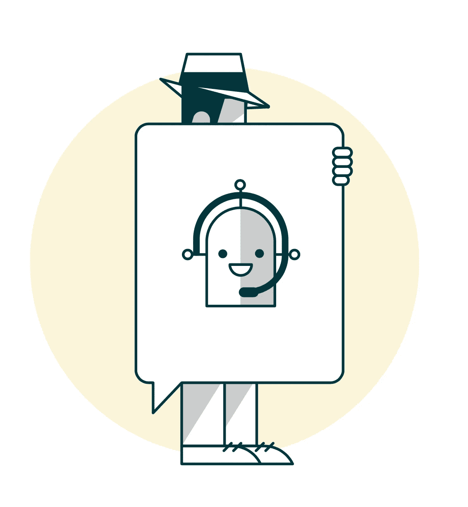

## 不要做特工

聊天机器人的对话永远不应该偷偷溜到人类手中。虽然不承认转让看起来更顺利，但透明度是关键。当人类接管聊天机器人的对话时，他们应该马上暴露自己。

人类代表应该简单直接:“你好，我叫 April，”在 SnapTravel 上挽救聊天机器人失败对话的代表写道。很明显，客户正在和一个陌生人交谈，而且很明显，这个人是一个友好而高效的人。(这位匿名聊天机器人甚至懒得给出名字。多么粗鲁！)

聊天机器人可以通过在销售代表介绍自己之前先介绍他们来减少这些转变的不确定性。例如，当聊天机器人无法处理客户的请求时，机器人可以回答“对不起，我不明白”，而不是说“对不起，我不明白”。让我找个人类代表来帮你。”添加一些品牌机器人幽默，移交就完成了。

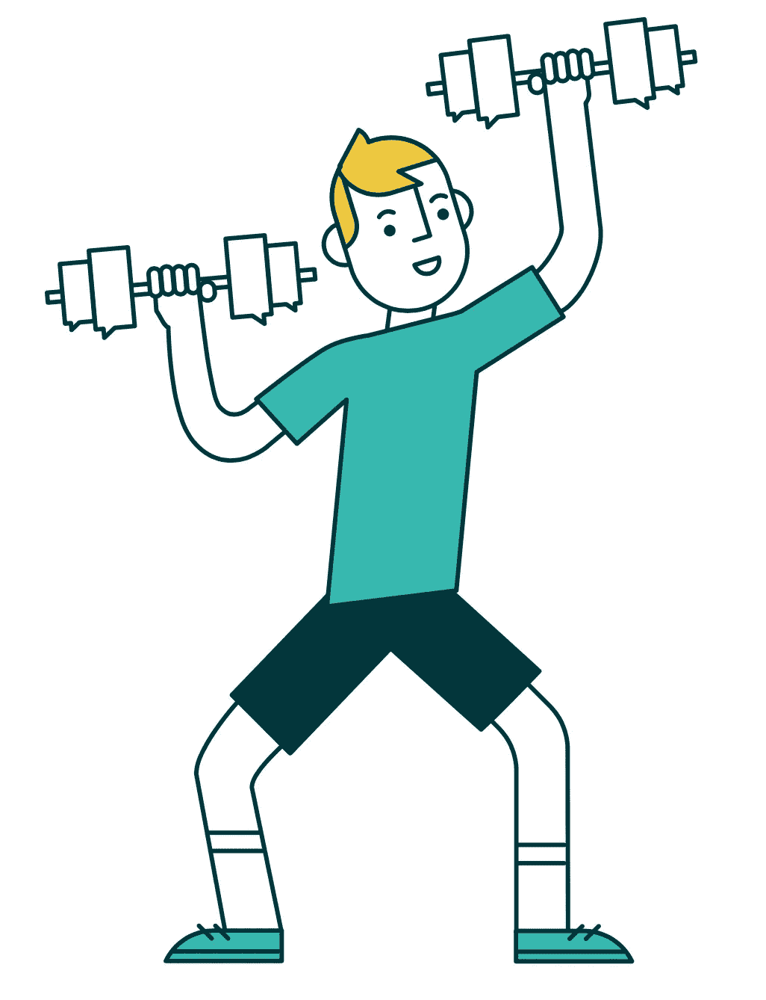

## 培训你的支持团队

用户与聊天机器人实时互动，从机器人到人类的过渡应该尽可能平稳，中断最少。为了确保平稳过渡，您的实时聊天团队应该接受聊天机器人各方面的培训(它能做什么和不能做什么)，最重要的是，他们应该知道聊天机器人的目标。这样，当客户从聊天机器人那里被移交过来时，聊天代理就能准确地知道客户的心情，以及如何以更人性化、个性化的方式最好地帮助他们。

例如，如果聊天机器人的目的是指导用户进行购买或回答特定类型的支持问题(如账单问题)，那么您的聊天团队需要精通该主题。一个精通的代理可以从聊天机器人离开的地方继续对话，并以一种情绪智能和个性化的方式帮助客户。

# 4.人类的角色:让我们谈谈机器人吧

有如此多的新兴技术，很容易想知道人类在不久的将来会适应什么。虽然我们还没有接近西方世界的场景，聊天机器人获得了感知能力，披着人类的外衣在我们中间行走，但聊天机器人在能力和应用方面都取得了长足的进步。机器人是一个伟大的工具，有助于自动回复，完成简单，平凡的任务，并达到更多的客户。好的一面是，顾客仍然更喜欢能够理解他们个人情绪的体验。也就是说人类。

随着公司进入未来的实时聊天领域，企业应该专注于将客户体验与机器人和人工代理相结合，以提高效率并增加人情味。记住你的聊天机器人能做什么，不能做什么，并设定界限。让它做好自己擅长的事，剩下的交给人类支持。在沙地上划一条线，一边是机器人的能力，另一边是人类的责任，并允许用户在需要时轻松跨越。

如果你需要为 Zendesk Chat 建立一个聊天机器人，你可以从我们的聊天机器人合作伙伴那里得到帮助:[阿达](https://ada.support/zendeskchat/)， [Aivo](https://aivo.co/en/zendesk/) 。

## 还没有聊天机器人吗？

在 Zendesk 聊天机器人合作伙伴的帮助下扩大你的支持范围: [Ada](https://ada.support/zendeskchat/) ， [Aivo](https://aivo.co/en/zendesk/)

*原载于*[*www.zendesk.com*](https://www.zendesk.com/chat/ai-chatbot/)*。*