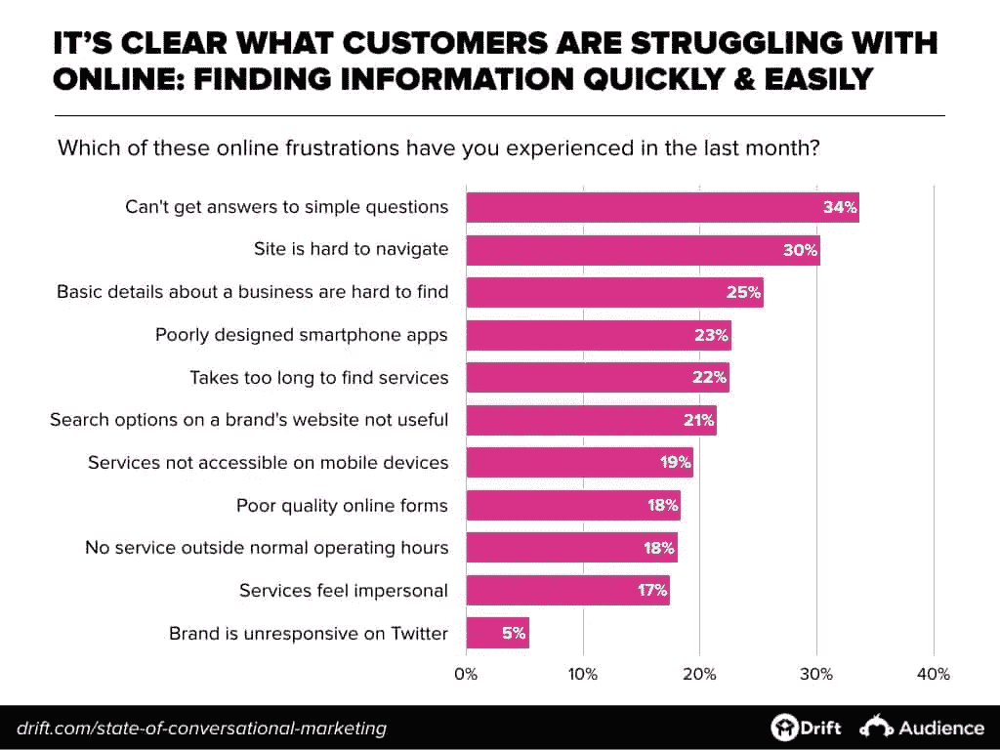

# 聊天机器人和你

> 原文：<https://medium.datadriveninvestor.com/chatbots-and-you-bbb7aff4567b?source=collection_archive---------15----------------------->

聊天机器人是对话代理；使用自然语言帮助完成任务的软件。通过理解你的疑问；无论是评论、担忧、问题还是投诉，聊天机器人都可以实时为您或您的客户提供答案。它们被广泛用于客户服务，能够回答与订单更新、退款和一般 QA 相关的问题。更先进的系统，如多米诺骨牌和 Booking.com 使用的系统，也允许你不离开聊天界面直接点餐/预订。这就是我们所说的“会话式商务”。

对话式商务是优步的克里斯·梅西纳在 2015 年发表在 Medium 上的一篇文章中创造的一个术语。它是指通讯应用和购物的交集。这意味着，通过 Facebook Messenger、WhatsApp、Talk 和微信等消息和聊天应用与企业互动的趋势。(鸣谢:Shopify 百科-[https://www . Shopify . com/encyclopedia/conversational-commerce)](https://www.shopify.com/encyclopedia/conversational-commerce))

 [## 对话营销是一个词|数据驱动的投资者

### 在购买之前，先谈一谈。这样做的营销人员将走在游戏的前面。这是保罗·因斯的前提…

www.datadriveninvestor.com](https://www.datadriveninvestor.com/2019/01/31/conversational-marketing-is-the-word/) 

聊天机器人可以作为独立的 web 应用程序接口托管在 Facebook Messenger 或 Telegram 等聊天应用程序上，也可以托管在您自己的商业应用程序上。

这些也不难做。如果你想尝试制作一个聊天机器人，你可以使用众多平台中的一个(有很多)。我们还在 hypermind technologies 开发了一个基于自定义 API 的聊天机器人解决方案。

研究表明，62%的消费者更喜欢与机器人交谈，而不是与人交谈。这可以归结为消费者在寻找信息方面的挫折，最大的担忧是无法获得简单问题的答案，包括难以导航的网站，这是消费者挫折的首要原因。

消费者希望实时获得信息。在同一份漂移报告中，研究人员发现，无论是通过电话/face2face 还是通过在线聊天，消费者都希望得到近乎即时的回应。

如果你经营一家企业，你需要优先考虑将聊天机器人开发到你的系统中。有了机器人，你不需要填写任何表格，你可以快速验证用户，用自然语言实时提供信息。

# 聊天机器人背后的技术

聊天机器人的核心是自然语言处理。理解用户说出的单词的语义联系，并像和朋友一样进行自然对话的能力。

这就是建立你自己的聊天机器人的问题所在。

人类的谈话艺术充满了细微差别和俗语，不容易解释或理解，即使是在彼此之间。要成功构建一个能够检测细微差别的自然语言处理算法，需要大量的训练。这需要三样东西:1.数据，2。处理能力和 3。时间。

小型企业往往会遇到这三个问题；没有足够的数据(尤其是初创企业)、处理能力(GPU、1tb 以上的存储空间和部署到云主机的能力——AWS/Azure，以确保超快的速度)和时间。

# 那么，我如何利用聊天机器人呢？

对于一些简单的东西，比如订单跟踪器或 FAQ 机器人，可以很容易地确定用户会问你的机器人什么问题。这意味着你可以建立一个问题列表和它们相应的意图。

对于更高级和潜在的交易(购物机器人)，你需要解决支付、数据、安全等法律问题，同时需要对决策变化、会话超时或支付无法捕获的情况做出反应。这些需要专门的开发工作。

一如既往，建议是从小处着手。

从你网站上的客户服务机器人开始做起。让它链接到你的常见问题，让客户提出问题，并得到他们所需的答案很容易。建立一个自动防故障系统，如果机器人不能回答，就把召集转移到一个人类代理。

[hypermind.tech](/hypermind.tech)