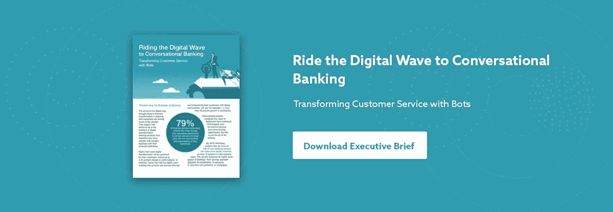

# 聊天机器人赶走银行客户服务噩梦，提供卓越体验

> 原文：<https://medium.datadriveninvestor.com/chatbots-drive-away-banks-customer-service-nightmares-deliver-superior-experience-2a881e0b386b?source=collection_archive---------3----------------------->

到 2020 年，金融科技聊天机器人将成为常态，因为消费者将通过人工智能聊天机器人控制 85%的与银行的商业合作伙伴关系:Gartner

客户期望的提高、客户满意度和忠诚度的下降以及运营成本的增加是银行业目前面临的一些最大挑战。在一个由竞争驱动的世界里，银行不能因为客户体验差而失去客户。那么出路是什么？

人工智能(AI)驱动的聊天机器人正在证明，银行可以通过在很大程度上取代人工干预来提高整体效率，从而缩短提供服务的时间并提高生产率。

一份 [Gartner 报告](https://www.gartner.com/imagesrv/summits/docs/na/customer-360/C360_2011_brochure_FINAL.pdf)显示，到 2020 年，85%的消费者和银行之间的商业联系将通过金融科技聊天机器人进行。

与此同时，Juniper 的研究还预测，到 2022 年，聊天机器人每年将节省超过 80 亿美元的成本。

无论是哪种情况，抵制数字化转型的银行预计将受到客户的惩罚，利润率将下降 35%；而那些通过创造新的产品和服务并利用数字技术为客户提供支持来驾驭数字浪潮的公司将会看到相反的情况——盈利能力增长超过 45%。

**全球银行正在将人工智能作为其数字化战略的一部分**

人工智能和聊天机器人正迅速成为全球银行业数字化战略的重要组成部分。美国银行、JP 摩根、美国运通、Capital One 等全球银行业领导者已经在业务运营中采用聊天机器人来提高客户参与度和体验。

银行正在不遗余力地利用人工智能的优势、通讯应用的普及以及聊天机器人等对话界面的便利来重新定义关系银行。随着聊天机器人的投入使用，银行能够在很大程度上自动化所有重复和平凡的任务，这些任务既耗时又会极大地影响部门的绩效。

如今，银行业领导人正在设想向“对话银行”过渡，由人工智能驱动的机器人作为新时代的客户服务代理，以减少整体周转时间和运营成本。领先的银行和全球金融机构正在评估为各种目标部署聊天机器人的可行性。

**聊天机器人改善银行客户服务体验的 5 种方式:**

**1。推动个人银行业务**

在个性化方面，客户对银行有很高的期望。聊天机器人的引入可以显著减少文书工作和等待时间，并改善客户体验。聊天机器人还可以帮助客户检查他们的账户余额，或者简单地索要交易清单。客户可以从以前的数据中快速查看他们的收入和支出。

银行可以通过个性化的客户服务来推动增长。聊天机器人可以减少在解决查询、更新“了解你的客户”( KYC)和提供新计划信息等任务中的人工干预。使用聊天机器人，银行可以在最短的时间内解决客户的查询，同时不会给客户留下他们正在与机器互动的印象。

**2。客户服务自动化的力量**

聊天机器人不仅是帮助客户的强大工具，更重要的是，它们在欺诈检测、数据分析和数据捕获方面的作用得到了广泛认可。聊天机器人在防止银行和其他金融机构欺诈方面发挥着极其重要的作用。机器人通常可以向用户共享任何交易的自动通知，并实时更新他们的账户活动。机器人经过训练，能够理解客户的痛点和需求，并在需要时提供帮助。

不仅如此，支持人工智能的机器人可以分析各种客户投诉数据，帮助银行当局解决客户不满的问题，并提供重要的见解和建议措施，以改善服务、客户满意度和产品供应。

**3。提供更好的客户反馈**

银行可以通过部署基于内部网的聊天机器人来改善客户反馈流程。员工可以从不同的分支机构收集见解，而管理层可以采取纠正措施来提高运营效率。这为员工和银行获得有意义的见解和提高生产力提供了双赢的局面。

**4。针对客户的个性化营销**

银行为客户提供广泛的产品和服务。但是并不是所有的产品和服务都有合适的买家。为了解决这个问题，银行可以部署聊天机器人，根据客户数据提供个性化服务。在正确的时间提供正确的个性化服务可以将整体转化率提高 25%。

**5。提高员工生产力**

不仅仅是面向客户的服务，银行还可以使用聊天机器人来帮助员工申请休假、访问个人和工资明细、更新联系信息、查看时间表等等。这将在很大程度上减少人为干预，并使员工能够更好地利用他们的工作时间来提高生产率。

毫无疑问，聊天机器人是一种强大的破坏性工具，可以提高客户满意度，降低银行的服务成本。聊天机器人的训练方式不会让你的客户觉得他们在与机器互动，同时在尽可能短的时间内解决任何问题，这太完美了。

希望你喜欢阅读这篇文章。下载我们的 [**执行摘要**](https://info.kore.ai/banking-executive-brief?hsCtaTracking=a562c221-f7d3-4c64-b9d9-7a98cc5d599b%7C9e4ce823-b247-403b-87eb-a02abf62d9ab) **，了解更多有关银行部门实施聊天机器人的细节。**

*最初发表于*[*blog . Kore . ai*](https://blog.kore.ai/chatbots-drive-away-banks-customer-service-nightmares-deliver-superior-experience)*。*