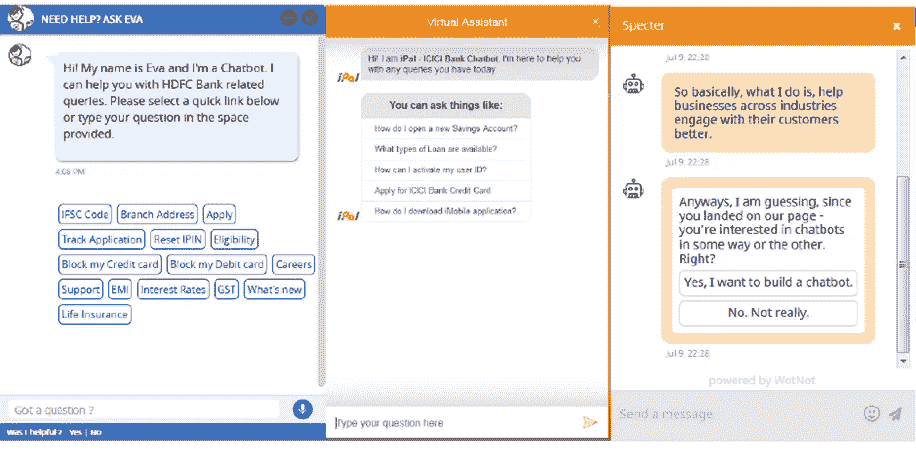
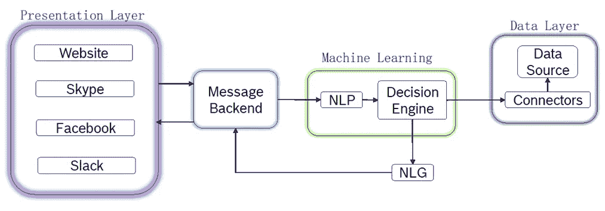

# 傻瓜聊天机器人

> 原文：<https://medium.datadriveninvestor.com/chatbots-for-dummies-8df87a5b89c2?source=collection_archive---------4----------------------->

## 聊天机器人简介

Ready to listen, and answer! (Photo by [Alex Knight](https://unsplash.com/@agkdesign?utm_source=medium&utm_medium=referral) on [Unsplash](https://unsplash.com?utm_source=medium&utm_medium=referral))

企业希望有新的途径来接触更多的顾客。网站设计只有一个用户界面的日子已经一去不复返了，这个用户界面是只能从用户的桌面屏幕上看到的 web UI。

现在，我们的网站被设计成自动适应任何类型的屏幕，如桌面、手机、平板电脑甚至电视屏幕和许多其他屏幕。企业将受益于拥有尽可能多的渠道来接触更多的客户。

同样重要的是，用户将希望使用最新的方法进行交互，因为这也是一件有趣的事情。例如，当每个人都使用他们的智能手机浏览时，你会希望你的网站有一个点击友好的移动布局，并且还可以在线接受订单，而不仅仅是显示电话号码。

聊天机器人提出了一个奇怪的案例，用户可以与它聊天，甚至与它交谈，背后的人工智能将提供有意义的自动响应。许多聊天机器人提供导航网站的有用链接，并作为一级支持，而一些人则更进一步，通过聊天机器人界面接受订单。

我们都见过聊天机器人吧？这里有几个例子，如果你不确定的话！

Some Chatbots, captured as Screenshots from different websites

所有这些都以这样或那样的方式吸引顾客。上图中的前两个只是为了减少他们在呼叫中心收到的支持查询，而第三个则试图通过聊天机器人平台进行推销。

## 聊天机器人背后的技术

计算机传统上只接受简单的命令。这就是为什么人们可以用专门设计的编程语言与计算机进行交互。它们可以是高级的，看起来像英语，如 Java 或 Python，但是它们仍然是少于 50 个关键字的简单命令集。

像英语这样的语言完全是另一回事。根据[这篇文章，](https://en.oxforddictionaries.com/explore/how-many-words-are-there-in-the-english-language/)英语目前总共有 171476 个单词在使用！这就创造了无限多的语言组合。虽然人类很容易理解这一点，但人们认为机器几乎不可能做到这一点。1950 年，计算机教育之父艾伦·图灵预言，到 2000 年，机器将能够与人类互动，而任何人都不会意识到他们正在与机器对话。他还为此设计了一个测试，并称之为[图灵测试](https://en.wikipedia.org/wiki/Turing_test)。然而，到目前为止，还没有聊天机器人通过这项测试！

我们称聊天机器人背后的技术为自然语言处理。这是人工智能的一种形式。自然语言处理(NLP)的任务范围从简单的[正则表达式](https://en.wikipedia.org/wiki/Regular_expression)解析到复杂的概率模型。Jurafsy 和 Martin 在[的《语音和自然语言处理》中写了一篇很好的文章。甚至还有合著者之一丹·茹拉夫斯基的非常好的讲座。你可以在 YouTube 上找到一些，他真的是一个天才，一个非常好的老师。](https://www.amazon.in/Speech-Language-Processing-Introduction-Computational/dp/9332518416)

A Block Diagram view of a Chatbot

聊天机器人有不同的组件，如上图所示。

**表示层**

这是用户交互发生的地方。建立一个网站来托管你的聊天机器人不是一个好主意，因为它没有任何意义。因此，聊天机器人必须集成到网站或信息平台中。网站现在是从门户平台(如 Liferay 或 IBM Portal)构建的，并且他们已经捆绑了在门户内构建聊天机器人的能力。也可以在 Facebook Messenger 中托管您的聊天机器人，这是许多在线营销人员首选和最便宜的方法。这只是从人类用户那里获取输入的一些不同方式。你也可以将你的表示层看作是一个支持语音的界面，比如亚马逊的 Alexa，用户只需说出他们想要的，语音在做进一步处理之前被转换成文本。

**机器学习**

我们可以将自然语言处理归类为人工智能中机器学习的一种形式，这里是理解英语(和其他自然语言)的地方。它们被标记化，不同的词类被标记，最终信息的意图被理解。意图的数量通常是有限的，不在意图列表中的任何东西都被认为超出了简单聊天机器人的范围。

下面是一个如何从句子中对意图进行分类的例子:

Intent Classification Example

试图理解用户所说内容的另一面是自然语言的生成。在这里，聊天机器人试图以上下文的方式对给定的句子做出响应，将响应的不同元素组合起来。通常，这里采用概率模型，通过研究成千上万的真实用户对话来得出给定场景的最合适的答案。这里还使用了递归神经网络(RNNs)等深度学习模型来记住之前对话的状态。通常，大量的数据，如 twitter feed 或脸书信使聊天对话，被用来为该模型提供训练，以“教授”真实对话的样子。

聊天机器人的机器学习通过以下步骤完成:

a)通过提供数万个真实对话来训练模型。对于这种训练，用户查询和响应都被提供给聊天机器人。

b)然后用一组更小的真实对话来测试该模型。这里，只给出用户的查询，chatbot 将根据它在训练阶段所学的知识，给出合适的响应。这与实际响应进行比较，并计算置信度。通常，如果模型训练有素，置信度将大于 0.9。

c)该模型可以投入使用，用户将实际使用聊天机器人，并获得实时响应。

d)虽然步骤 a)到 c)被称为监督学习，但是当聊天机器人运行时，学习继续进行。聊天机器人继续存储响应，并根据它在实时对话中从真实用户那里学到的东西，尝试找到最合适的响应。这是无监督学习的一部分。如果你稍微研究一下谷歌助手，如果它不知道答案，它会尝试从你那里得到一些反馈，这样它就可以学习了。比如问“我叫什么名字？”。回答应该是，“对不起，我不知道。如果你告诉我，下次我会记得的”。这是无监督学习循环的一部分。

**数据层**

显然，这都需要数据。通常一个数据库被用来存储来自用户的对话，所以聊天机器人将能够分析以前的响应并提供一个有意义的答案。此外，意图和实体也作为主数据维护，可能在 JSON 或 YAML 文件中。

## 流行的聊天机器人框架

虽然门户框架和消息平台为聊天机器人提供了前端集成，但聊天机器人本身也有可用的框架和平台，因此您不必从头开始编写聊天机器人代码。事实上，你只需要设计对话式 UI，在那里你将设计对话式流程。

下面是 25 个聊天机器人框架的列表和对比。聊天机器人是一个非常活跃的领域，不时有许多新进入者完全接管这个领域。在所有这些情况下，Chatbot 框架都提供了执行以下操作的功能，因此您可以专注于对话式 UI，以及您想要实现的任何特定功能(比如根据用户请求预订酒店房间):

a)发送和接收消息

b)用自然语言处理输入。

c)跟踪对话状态

d)触发行动，如果有的话。

## 聊天机器人当前面临的挑战

这是一个不断发展的领域，尽管有许多新的用例，但仍有很长的路要走。下面列出了一些挑战。

**设计挑战**

a)不相关的用例:开发人员被机器回答用户的前景冲昏了头脑，毫无理由地开发聊天机器人。一开始，它创造了一个令人惊叹的因素，当聊天机器人投入使用后，它没有任何实际用途的事实变得昭然若揭。像这样的聊天机器人占大多数，这足以给人留下关于聊天机器人的负面印象。开发人员必须克服这一点。聊天机器人应该有一个明确的目的，对话流程必须事先决定(不是精确的对话)

b)一个聊天机器人功能太多:聊天机器人可以提供更好的服务，如果它们只有几个功能要做的话。我们还不需要致力于让聊天机器人像人一样。毕竟，一个孩子需要几年时间才能理解所有的背景，并有意义地与成年人进行对话。

c)缺乏人工升级:聊天机器人是一种机器。所以，它需要时不时的人工干预。因此，这必须建立在对话式用户界面中。例如，如果聊天机器人正在为你的公司处理第一级查询，当客户想要比聊天机器人所能提供的更多的输入时，你肯定不想错过赢得客户的机会。当聊天机器人无法处理用户查询时，最好提供一个选项来直接与支持人员对话。

**技术挑战**

现在面临的许多技术挑战都与自然语言处理有关。

a) NLP 技术在识别讽刺、否定回答等方面仍然不是很好。例如，如果用户说了一些话，然后在下一句话中立即改变了主意，这对于 Chatbot 来说是一个困难的情况。聊天机器人不会完全理解用户改变了主意。如果用户用讽刺的语气说话，尽管人类用户可以很容易理解，但这对聊天机器人来说是一个复杂的挑战。

b)用户可以用数百种不同的方式重新构建同一个问题。例如，“今天天气如何”和“今天会下雨吗？”是答案几乎相同的同义问题。而是“今天会下雨吗？”是一个是/否的问题，拥有完整的天气信息是一个补充信息。聊天机器人无法区分这些细微差别。

c)如果我们的问题在同一个句子中有多个主题，聊天机器人很难将单词分组。

谷歌声称，他们已经通过深度学习训练有素的模型克服了其中一些挑战。这是来自 [Google IO Conference](https://www.youtube.com/watch?v=d40jgFZ5hXk) 的简短演示，其中 Google Assistant 与人类用户对话，人类用户不断来回移动，但 Google Assistant 仍然可以在实现其目标的同时进行对话。

很快我们就可以期待类似的模型可以被聊天机器人直接用在我们的代码中，因此聊天机器人的未来前景是光明的。

## 结论

聊天机器人是一种新型的用户界面，用户可以直接交谈并获得答案，而不是浏览网站或与人类用户交谈。如果使用得当，这可以提高客户满意度，减少支持查询，甚至通过这种方式增加销售额。

***如果你认为，你对聊天机器人有什么想法，请点击几下👏👏👏，所以我会有动力去做更多这类文章！中等允许最多 50 次鼓掌，所以请随意！请通过评论让我知道你对这篇文章的想法！***

职业是软件开发，做过 AI 的实验项目。我主要写软件工程、生产力和书评。可以在 [LinkedIn](https://www.linkedin.com/in/manjunathrajamanickam/) 和我联系。