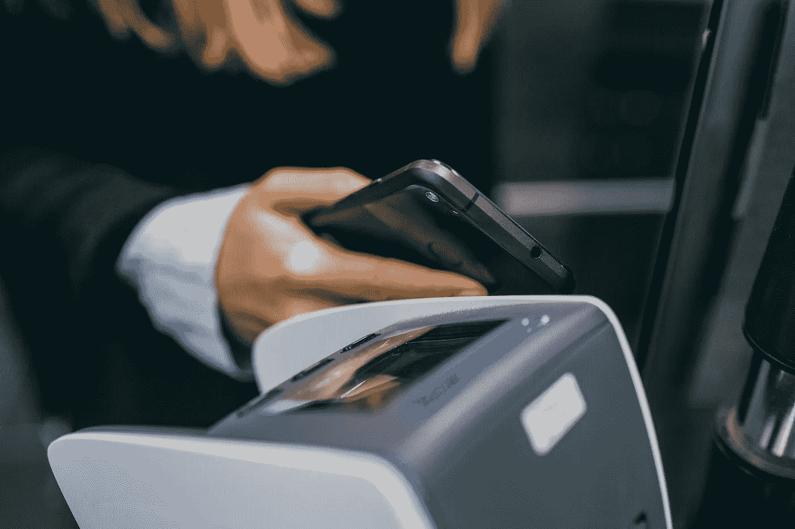
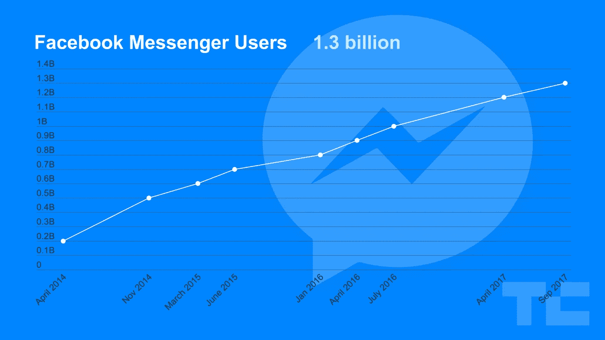

# 聊天机器人:它们如何帮助企业增加销售和收入

> 原文：<https://medium.datadriveninvestor.com/chatbots-how-they-help-increase-sales-and-revenue-for-businesses-184ebc8185d5?source=collection_archive---------0----------------------->

# **通过信使平台接触数百万潜在客户**

为了发展你的业务，你需要与尽可能多的潜在客户互动。

这就是聊天机器人发挥作用的地方，它们为客户创造了一条轻松的路径，通过 Facebook Messenger 等消息平台通过[对话人工智能](https://amzn.to/2Qlpc3p)与你的业务进行交易，正如你在 Techcrunch 的图表中看到的那样，[最近超过了 13 亿](https://techcrunch.com/2017/09/14/facebook-messenger-1-3-billionhttps://techcrunch.com/2017/09/14/facebook-messenger-1-3-billion/)用户。

[via techrunch.com](https://techcrunch.com/2017/09/14/facebook-messenger-1-3-billion/)

也就是说，有 13 亿潜在客户可以直接访问已经安装在他们设备上的聊天机器人。

作为参考，全球 iOS 应用的平均每次安装成本 [(CPI)为 0.86 美元。](http://www.businessofapps.com/guide/cost-per-install/)利用聊天机器人可以节省大约*(13 亿 x . 86 = 11.18 亿美元)*用于获取用户的营销预算。

简而言之，聊天机器人利用内置受众的消息平台，让您的企业与数亿潜在客户进行交易，而无需浪费宝贵的资源进行下载。

# **通过提高订单效率增加销售额**

聊天机器人可以极大地提高任何企业的销售额。这通过两种方式实现。

1.  减少购买产品的步骤
2.  减少收到产品所需的时间

例如，一家咖啡店在早高峰期间努力为大量顾客服务。长长的队伍降低了订单效率，吓退了对时间敏感的潜在客户。

然而，有了像 [OrderBot](https://mindat.io/order-pay-pickup/) 这样的机器人，客户可以在到达之前通过三个简单的步骤完成订单，如下图所示。

命令

支付

收集

via [mindat.io](https://mindat.io/order-pay-pickup/)

客户现在可以通过三个简单的步骤购买和预付任何产品。大大减少了 QSR 企业的排队时间。简化的订单流程使 OrderBot 客户的订单数量平均增加了 23%,销售额增加了 30%。

# **总结**

到 2020 年， [85%的客户](https://www.ibm.com/blogs/watson/2017/10/how-chatbots-reduce-customer-service-costs-by-30-percent/)互动将在没有人工代理的情况下进行。聊天机器人是每个企业从人工到自动化客户服务转变的一部分。机器人将通过其向最大数量的潜在客户提供无缝支付的能力，在实体企业和电子商务之间架起桥梁。

*原载于 2018 年 9 月 10 日*[*mindat . io*](https://mindat.io/2018/09/10/chatbots-how-they-can-help-increase-sales-and-revenue-for-businesses/)*。*