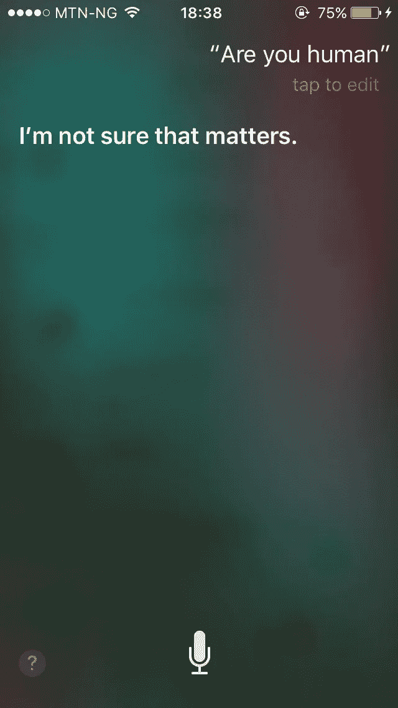

# 聊天机器人:像人类还是假人类？

> 原文：<https://medium.datadriveninvestor.com/chatbots-humanlike-or-fake-humans-3b743d148404?source=collection_archive---------16----------------------->

> 嘿 wanabee，你现在是人类还是机器人？

Photo by [James & Carol Lee](https://unsplash.com/photos/xtKA91zd9Ho?utm_source=unsplash&utm_medium=referral&utm_content=creditCopyText) on [Unsplash](https://unsplash.com/search/photos/human-robot?utm_source=unsplash&utm_medium=referral&utm_content=creditCopyText)

作为对话代理开发者/设计师，我们的工作包括确保我们的聊天机器人为用户提供尽可能人性化的体验，但它应该如此真实以至于误导吗？机器人应该告诉你它不是人类吗？这些是为聊天机器人写对话时想到的问题。

最初，我的想法是以一种模仿所有人类对话品质的方式来构建聊天机器人。不使他们尽可能像人类，显然意味着设计一个体验不太好的聊天机器人。但问题就在这里，当你赋予它一个非常好的人类个性时，人们可能会忘乎所以，把它误认为是一个真实的在线人类，他们开始期望它像人类一样行动，例如进行非线性对话。像 Siri、Google assistant 这样尽可能伪装成人类的人总是遇到一个问题，用户希望他们像真人一样做事和回答随机问题，当他们不这样做时，整个聊天机器人的体验就变得不那么好了。

# 拟议解决方案

为什么要制造伪装成人类的机器人，为什么不把真人的声音放入机器人，为什么不把聊天机器人变成一种媒介(像书籍、电子邮件)而不是数字存在。

When books talk to us, we know it’s the author speaking not the paper

如果我们的目标是给聊天机器人一个类似人类的人格，为什么不承认聊天机器人是一个由真实的人类制造的东西(**【我想到的是*)。将它们比作自动回复器，但**智能**自动回复器可以与用户交流。自动回复器有时可能很烦人，但当它们有能力像具有自然语言处理能力的人工智能机器人一样聪明时，这种体验可以更进一步。在**发布的机器人**(不自称是数字生物的机器人)缺乏的地方，人类即发布者会在他们上线时填补。*

*上面提出的解决方案可能不是最好的，也不能完全解决问题，但它是我目前正在开发的对话代理中的一个解决方案，我目前正在开发这个解决方案，它将被包含在下一个测试版的 [Pencliq](https://pencliq.com) 中(稍后将详细介绍)。如果聊天机器人像我们所相信和宣称的那样在未来成为一种东西，那么有一些伦理问题需要回答。*

**

*Should Siri admit that it is nothing more than a bot?*

*聊天机器人应该如此真实以至于误导人们认为它们是人类吗？*

*聊天机器人是类人还是假人类？*