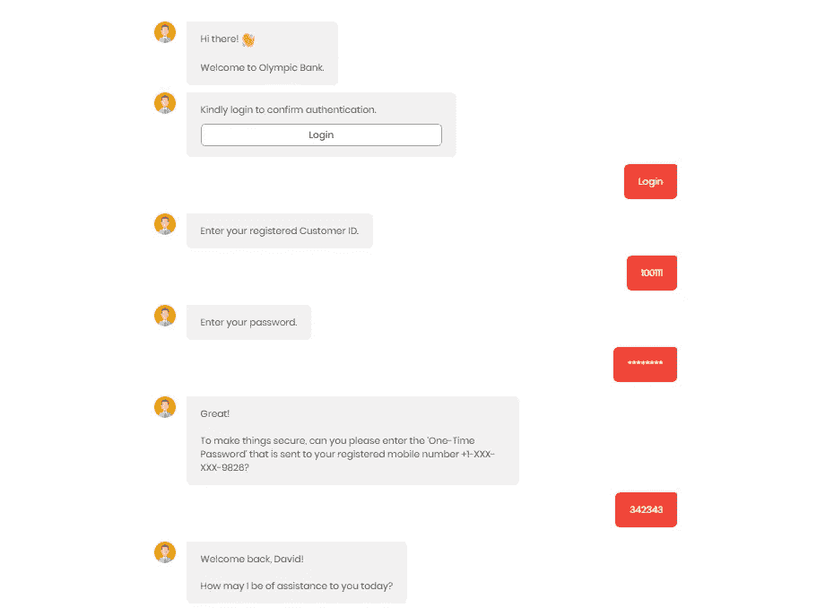

# 银行业的聊天机器人——简化运营并留住客户

> 原文：<https://medium.datadriveninvestor.com/chatbots-in-banking-streamline-operations-and-retain-customers-ad0bdf62110a?source=collection_archive---------7----------------------->

一个人对其银行的一般体验通常是不令人满意的，也不是亲客户的。服务差是银行流失客户的主要原因之一。如今，客户希望与他们互动的企业能够提供无缝服务和便捷的访问。

银行业也必须沿着数字化道路前进。因此，在银行领域需要聊天机器人不再是一个遥不可及的想法。这是一个充满希望的现实，因为它带来了大量的好处。

> **Gartner 预测，到 2020 年，聊天机器人将驱动 85%的客户服务互动。**

以下是聊天机器人在银行业表现良好的案例。

 [## 对话式营销是文字数据驱动的投资者

### 在购买之前，先谈一谈。这样做的营销人员将走在游戏的前面。这是保罗·因斯的前提…

www.datadriveninvestor.com](https://www.datadriveninvestor.com/2019/01/31/conversational-marketing-is-the-word/) 

# 客户支持

客户服务新时代的标准已经在所有行业中确立，银行业也不例外。客户已经习惯了快速和个性化的服务，他们希望银行也能如此。

聊天机器人通过提供 24*7 的客户服务来拯救我们。聊天机器人用即时响应取代了长时间的等待，有助于让您的客户的旅程变得轻松愉快。聊天机器人回答常见问题，基于 NLP 的聊天机器人也可以被训练来解释和响应客户的定制输入。聊天机器人还可以将请求转发给销售代表。

# 线索挖掘

聊天机器人可以为银行业开辟一条新的发展道路。聊天机器人与银行网站上的新流量互动，向它们询问相关问题，与它们交谈并产生线索。

聊天机器人还可以部署在多个渠道，如脸书、Twitter、WhatsApp 等，以增加参与度和品牌知名度。从各种渠道收集的线索可以由销售团队跟进。聊天机器人还可以捕捉线索并与销售团队分享见解，从而让他们直接进入与感兴趣的潜在客户讨论的第二阶段。

# 创建支持票证

聊天机器人可以将复杂的银行术语简化为更简单的语言，并指导客户完成简单的步骤，从而有助于减少混淆。聊天机器人还可以为客户创建支持票，帮助他们解决面临的问题。该机器人可以创建一个支持票，并向客户确认票号和工程师回复他们的预计到达时间。

对于已经创建的票证，客户可以访问 bot 并输入他们的票证编号，bot 可以从内部系统获取票证的最新状态详细信息并保持更新。

# 反馈收集

随着整个银行业不断努力提高客户满意度，从客户那里获得关于他们希望如何获得更好服务的反馈非常重要。乏味冗长的反馈表格通常会被扔进垃圾桶或垃圾文件夹。

但是有了聊天机器人，反馈收集的过程变成了对话和互动，这鼓励用户给出诚实的反馈。通过对话提供反馈会让用户更享受这个过程，并增加用户花时间向您提供改进服务所需信息的机会。

客户服务有了突飞猛进的发展。随着客户成为各行各业营销和销售活动的中心，银行业也必须加强客户服务。

聊天机器人为各垂直行业的企业带来了多方面的好处。高效的客户支持是这些优势中最明显的。聊天机器人让你的银行服务更容易被客户使用。这不仅能帮你留住客户，还能吸引新客户成为忠实客户。

值得注意的是，聊天机器人不会取代客户服务代理，但会使他们专注于复杂的问题，而聊天机器人可以立即解决简单的查询。

创建一个真正有益的聊天机器人并不像看起来那么容易。重要的是设计聊天机器人，使其为企业和客户提供价值。在 WotNot，我们了解这一点，并与各垂直行业的企业合作，开发有价值和可扩展的聊天机器人，作为个人助理，为客户提供无缝体验。

我们还有一个**预定义的银行模板，您可以在这里免费体验聊天机器人**。花一分钟时间，感受一下你如何获得上面列出的所有好处[这里](https://app.wotnot.io/preview/interact?url=&themeColor=%23F44336&alignment=right&templateKey=banking)。

Subscribe to Free Trial and experience the bot for FREE.

— — — — — — — — — — — — — — — — — — — — — — — — — — — — — — —

> 如果你喜欢这篇文章，请随意点击鼓掌按钮👏帮助其他人找到它。