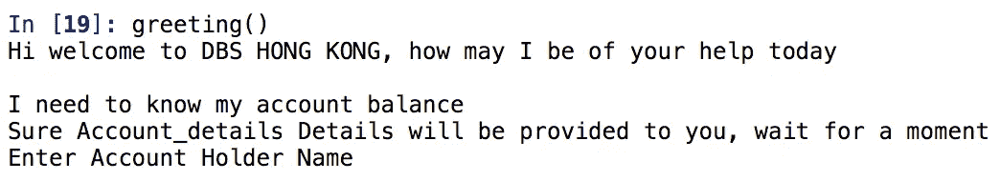
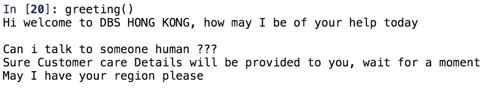

# 聊天机器人-让一切变得简单！！！

> 原文：<https://medium.datadriveninvestor.com/chatbots-made-easy-baa1e3e7d29e?source=collection_archive---------21----------------------->

随着企业客户群规模的指数级增长，对客户服务主管团队的需求也在急剧增长。BFSI 和 E-com 的客户服务团队规模增幅最大，这是为了适应其庞大的客户群，并提供最佳服务，从而留住他们的客户群

> 聊天机器人是客户服务的未来？？

> “每年企业在客户服务电话上花费 1.3 万亿美元
> 
> 每年有 2650 亿个客户支持请求

即使有一大群客户服务主管来提供服务，大多数消费者仍然抱怨在有人来解决他们的问题之前要等待很长时间，这最终导致了客户流失。

*作为一名顾客*:如果我们能摆脱无休止的等待，只为日常事务与客户服务代表交谈，如检查你的银行账户或计算出你信用卡的最后几笔交易细节，会怎么样？或者，您可能正在从事农业活动，并希望了解您的商品在附近市场的价格，以便做出更好的销售决策。

*作为一家企业*:如果客户服务代表能够成为主题专家，能够在瞬间解决客户的疑问，并以组织定义的方式同时与多个客户互动，而不涉及他们自己的偏见和情绪，会怎么样？

> “由于糟糕的客户服务，美国公司每年损失 410 亿美元”

聊天机器人可以帮助企业节省客户服务成本，方法是加快响应时间，让代理从事更具挑战性的工作，并回答高达 80%的常规问题。

# 如何启动一个机器人！！！！

聊天机器人的开发通常从理解*意图*和*实体*的概念开始。

**意图**:意图是指用户输入文本背后的意图。理解意图在向客户提供最佳解决方案方面发挥着关键作用。

我可以知道我的账户余额-> **目的:账户余额明细**
我的账户里还有多少钱- > **目的:账户余额**明细

**实体**:一旦文本的意图被分类，下一步就是从输入文本中收集信息，这将有助于向客户提供解决方案。

我可以知道今天新德里的大米售价吗

**实体:大米:商品，新德里:地点，今天:日期**

Coded in Python

在开发一个真正由人工智能驱动的机器人时，有很多机制在起作用，我将在下一篇文章中介绍(用 Python 代码)。如果你喜欢这篇文章，并想获得更多关于聊天机器人开发架构的信息，请订阅以示感谢。