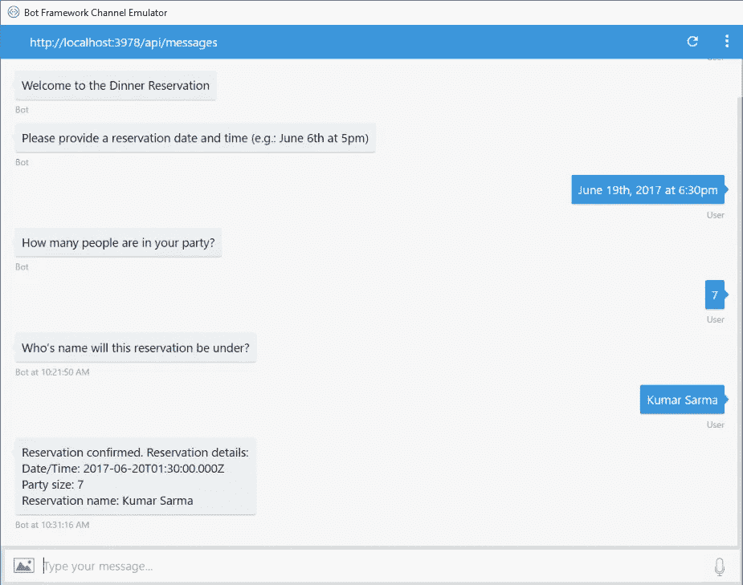
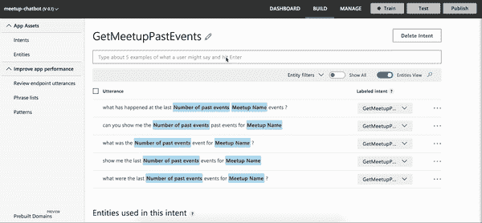

# 聊天机器人:简化— LUIS

> 原文：<https://medium.datadriveninvestor.com/chatbots-simplified-luis-567774125ad?source=collection_archive---------6----------------------->

[](http://www.track.datadriveninvestor.com/1B9E)

[Photo by Shane Rounce on Unsplash](https://unsplash.com/photos/PHKgQSGzwpw)

继我的[上一篇博客](https://petermcaree.com/unlocking-the-power-of-chatbots/)之后，我认为是时候快速介绍一下如何开始使用聊天机器人了——更多一些技术方面的东西。

正如我在之前的博客中提到的，我主要是在使用微软的 Bot 框架 SDK。它同时提供 C#和 JavaScript(特别是 Node.js)。作为一名 UI 工程师，我喜欢 JavaScript 的所有东西——所以我一直在开发 Node 产品。

# **可信赖的图书馆📚**

当开始开发聊天机器人时，他们有一些最低要求:

*   [Node.js](https://nodejs.org/en/) ( & npm)
*   [Bot 框架模拟器](https://github.com/Microsoft/BotFramework-Emulator)

对于现代 JavaScript 开发来说，这是非常标准的！这是它如此伟大的原因之一。

在一个非常基本的层面上，**聊天机器人是一个简单的网络服务，用户可以与之互动**。所以第一步是安装一个我们最喜欢的 web 服务库——像 Express 或 Restify 这样的库可以完成这项工作:

```
$ npm install —-save express
```

基本聊天机器人只需要在 web 服务器上注册一个端点(POST ),来监听来自用户的任何传入消息。这使得理解聊天机器人的逻辑流程变得非常容易——因为只有一个进入应用程序的入口点，所以调试变得很容易。创建节点服务的入口点， *index.js* 。

注册 POST 端点时，在 Express 中要求(或 Restify)并设置简单的 HTTP 服务:

```
const express = require('express');const app = express();// Listen for incoming messages.app.post('/api/messages', (req, res) => {});app.listen(3978, () => console.log('Listening on 3978.'));
```

这其中的大部分应该看起来相当熟悉，这是聊天机器人发展如此之好的另一个原因！

# 【BotBuilder 简介🤖

随着微软最近发布了他们的 [BotBuilder SDK](https://docs.microsoft.com/en-us/azure/bot-service/?view=azure-bot-service-4.0) 的 v4，它带来了一些巨大的改进，使开发变得更加容易。它将大量适配器和配置代码包装在 ES6 类中——这简化了初始设置。

在深入研究一些代码片段之前，有必要先了解一下用户可以与聊天机器人进行的不同类型的交互。

**对话框**

非常基本的机器人可以用来通过一系列问题来捕捉用户的基本信息，然后最终处理输入并向用户提供一些见解。

这些类型的机器人通常用于简化和增强捕获基本信息的 UX，例如下面捕获预订详细信息的示例:



[Bot Framework — Waterfall dialogs](https://docs.microsoft.com/en-us/azure/bot-service/media/bot-builder-nodejs-dialog-manage-conversation/waterfall-results.png?view=azure-bot-service-3.0)

在这些对话框中，有许多不同的提示，您可以利用它们来增强 UX 并简化数据输入流程。一旦用户响应了

BotBuilder 使这一点非常容易实现。它很好地将功能包装在一些不同的类中，我们可以在构建我们的机器人时利用这些类——查看这个示例机器人以了解更多细节。

**问答**

稍微高级一点，QnA bot 是聊天机器人人工智能方面的第一次轻触。目的是为不需要任何专业知识或帮助的常见问题提供自动化和准确的支持。

开发人员可以与微软已经创建的特定认知服务— [QnA Maker](https://www.qnamaker.ai/) 进行交互。这使得人们可以非常容易地创建和培训他们的 QnA 服务，满足人们的许多用例。


[QnA Maker — Icon](https://www.qnamaker.ai/)

它在幕后卸载了条件逻辑，意味着开发人员只与他们精心包装的 BotBuilder SDK 类进行交互(是的，你猜对了)。

**自然语言处理**

虽然 QnA 聊天机器人内置了 NLP 的元素，但是作为一名开发人员，您并不能完全控制模型、期望和结果。对于那些需要定制逻辑的人，微软已经创建了[语言理解智能服务](https://luis.ai/) (LUIS)，它允许不是机器学习专家的开发人员实现一个相当复杂的模型，这将满足他们的很多需求。

LUIS 是一种认知服务，这意味着它非常容易在任何应用程序中实现，而不仅仅是聊天机器人。认知模型可以通过简单的 web 应用程序(如下)或预先存在的 JSON 模型进行手动训练。



Using the LUIS web application

实施 LUIS 模型时，在开发它之前，您需要理解三个概念:

*   **话语** —用户说出/键入的句子
*   **实体** —用户引用的名词，例如物体、地点
*   **意图** —用户希望机器人执行的动作

QnA Maker 和 LUIS 之间的主要区别(除了粒度控制)是来自 API 的响应如何被开发人员使用。

对于 QnA Maker，从开发人员的角度来看没有真正的处理，从 API 返回的结果是应该直接发送给用户的。

而对于 LUIS，来自 API 的响应是预测分数、意图和一些额外元数据的组合。然后，开发人员必须处理这个 API 响应，并在响应用户之前根据做出反应——这允许自由添加一些更复杂的逻辑，而不仅仅是简单的消息响应。

# **给我看看代码💸**

好了，回到一些代码片段——我们如何将这个难以捉摸的 BotBuilder 库挂接到我们简单的节点 web 服务中？

我将把重点放在一个利用 LUIS 并相应地处理响应的基本用例上。

**节点端点 ft。适配器**

首先，BotBuilder SDK 将其功能抽象为几个独立的包，以确保开发人员只将所需的内容捆绑到自己的应用程序中。我们将要求在它的基础库以及 AI 库中也有:

```
$ npm install --save botbuilder botbuilder-ai
```

从基本 BotBuilder 库的 *BotFrameworkAdapter* 类中请求并创建它的一个新实例。类似于以下内容:

```
const { BotFrameworkAdapter } = require('botbuilder');

// Create adapter to facilitate communication
const adapter = new BotFrameworkAdapter({
    appId: process.env.MicrosoftAppId,
    appPassword: process.env.MicrosoftAppPassword
});

// Listen for incoming requests.
app.post('/api/messages', (req, res) => {
    adapter.processActivity(req, res, async(turnContext) => {
        // TODO: Include bot handler
    });
});
```

我们基本上是用一些凭证来初始化我们的适配器(这些凭证来自于向 [Azure bot 服务](https://azure.microsoft.com/en-gb/services/bot-service/)注册您的 Bot)，然而，本地开发不需要这些凭证，所以它们可以留空。适配器促进了机器人和用户之间的通信和认证。

所有消息都通过`processActivity`处理程序路由，这实质上是进入机器人的入口点。然后它有一个异步回调函数传入 turnContext，这是包含用户消息(以及其他信息)的地方。

## 机器人逻辑

最后，我们只需要为我们的 bot 逻辑创建自定义类。对于这个特殊的 LUIS bot，我们将在`botbuilder-ai`库中要求并使用它的一些功能:

```
const { LuisRecognizer } = require('botbuilder-ai');

class LuisBot {
    constructor(application, luisPredictionOptions) {
        this.luisRecognizer = new LuisRecognizer(application, luisPredicationOptions);
    }

    async onTurn(turnContext) {
        // TODO: Some conditional logic
    }
}
```

因为我们正在与微软的认知服务交互，他们有一个类很好地包装了我们需要的所有 LUIS 功能。我们简单地调用构造函数，传入一些配置——包括应用程序 ID 和密钥(可以在注册您的 [LUIS](https://www.luis.ai/) 应用程序时访问)。

我们定义了异步`onTurn`函数，它方便了对 LUIS API 的请求，以及处理响应的条件逻辑:

```
async onTurn(turnContext) {
    // Make API call to LUIS with turnContext (containing user message)
    const results = await this.luisRecognizer.recognize(turnContext);

    // Extract top intent from results
    const topIntent = results.luisResult.topScoringIntent;

    switch (topIntent.intent) {
        case 'Greeting':
            await turnContext.sendActivity('Hey! Ask me something to get started.');
            break;
        case 'UpdateInfo':
            await updateInfoIntent.handleIntent(turnContext);
            break;
    }
}
```

还记得传入我们端点入口点中回调函数的`turnContext`对象吗？好了，现在你可以充分看到它的用法了。首先，我们将它传递给`luisRecognizer.recognize`函数，该函数返回 LUIS API 响应。

一旦我们有了响应，我们就可以切换我们在 LUIS web 应用程序中定义的不同意图，并适当地处理它们。

至关重要的是，每当我们准备好向用户发送响应时，我们都会再次使用`turnContext`对象，通过它包含的`sendActivity`函数。

## 塞在一起

这个难题的最后一部分是在我们的节点入口点内创建我们的 bot 类的一个实例，这样每当端点被点击时，我们就可以调用`onTurn`函数:

```
const bot = new LuisBot(luisApplication, luisPredictionOptions);

// Listen for incoming requests.
app.post('/api/messages', (req, res) => {
    adapter.processActivity(req, res, async(turnContext) => {
        await bot.onTurn(turnContext);
    });
});
```

就是这样！在一个非常基本的层面上，这些是你需要用来创建一个与 LUIS 互动的聊天机器人的主要组件。

# 摘要

总的来说，使用微软的 BotBuilder SDK 和 Node.js，智能聊天机器人的安装和运行非常简单。

*   我正在使用微软的认知服务产品——AWS、GCP 以及其他云提供商也将提供类似的服务，您也可以与之集成。
*   认知服务真的可以增加聊天机器人的能力，以及它能为你的个人用例做些什么。
*   利用可用的资源！外面有大量的服务、教程和框架——使用它们吧！

我在这个[要点](https://gist.github.com/pmc-a/740a39d327e31faeca2a206c5183012e)中包含了一些资源，我会不时更新的！