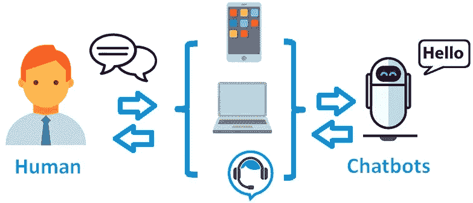
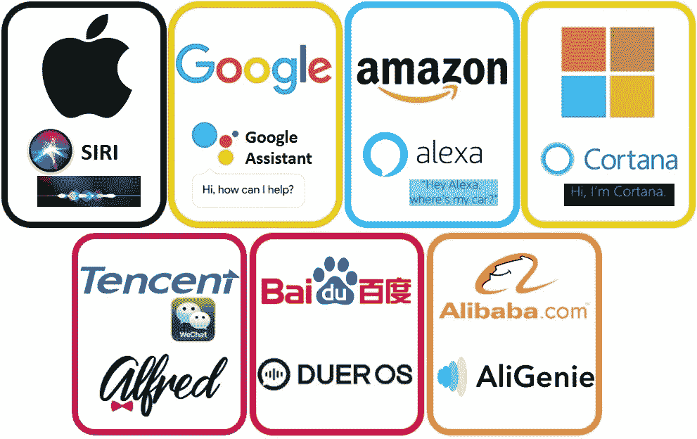
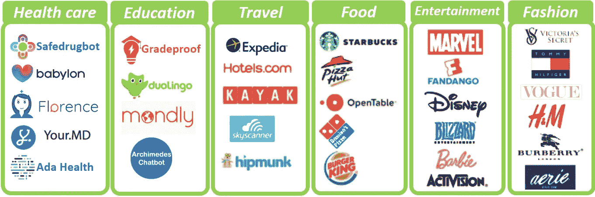
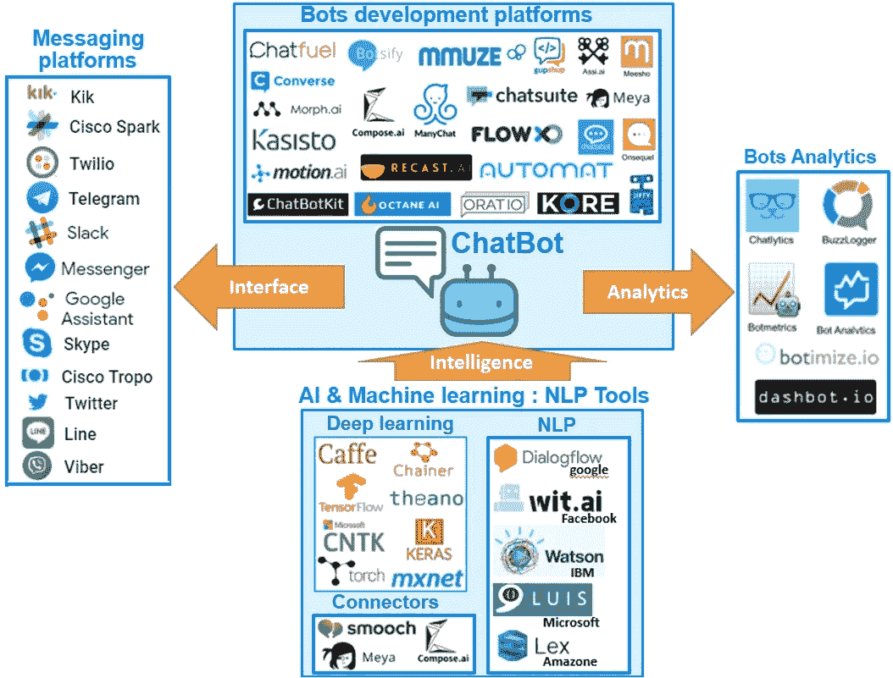
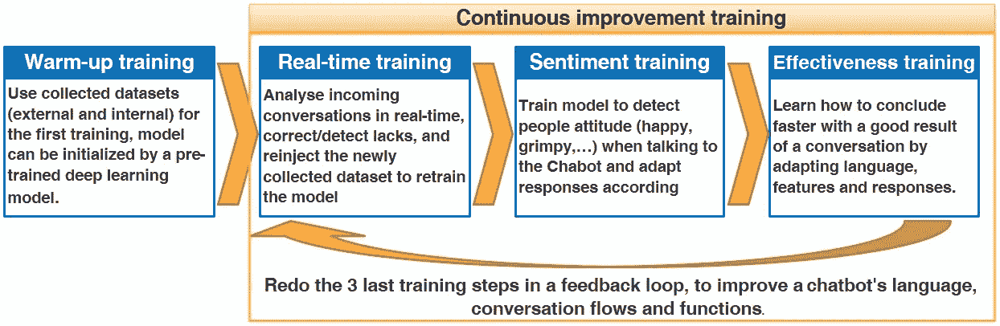

# 聊天机器人，所有人的人工智能(第 1 部分:概述)

> 原文：<https://medium.datadriveninvestor.com/chatbots-the-ai-for-all-part-1-overview-bc77ffd99bd5?source=collection_archive---------13----------------------->

Human vs chatbot

如今，人们在与数字界面(电脑、智能手机、平板电脑等)互动的方式上寻求更舒适和更简单的方式，用户体验和搜索行为正在发生变化，人们希望获得即时响应和全天候即时帮助。通过个人助理和聊天机器人大规模采用人工智能加速了这一趋势。

中国的微信认为，在不久的将来，所有的应用程序功能都将转变为聊天界面。采用这种技术的速度势不可挡。截至 2017 年底，美国已售出超过 3000 万台数字助理(来源 marketingland.com)。此外，专家预测，在未来 5 年内，语音用户界面(VUI)将被集成到几乎任何应用程序中，到 2020 年，50%的搜索将通过语音技术进行(来源 comScore)。聊天机器人市场预计将从目前超过 2.5 亿美元的市值增长到 2024 年超过 13.4 亿美元(来源 gminsights.com)。

2018 年做过一个关于聊天机器人的有趣报道，见[链接](https://www.drift.com/wp-content/uploads/2018/01/2018-state-of-chatbots-report.pdf)。

# **什么是聊天机器人？**

聊天机器人是一个基于人工智能的聊天界面，它通过文本或语音交互自动管理与人类的对话，用户可以向聊天机器人提问或发出命令/命令，聊天机器人回答或执行请求的动作。最常见的使用案例有:

**询问和答&问:**不动用人力资源回答客户问题

**购物&点餐**:理解并执行客户订单(如预订旅游、点餐)

**个人(数字)助理**:帮助和协助人们的日常生活(主动建议、设置闹钟、定时器和提醒、查找问题答案、搜索和预订航班和酒店等)

Most known personal assistants

# **聊天机器人的优势:**

全天候可用

低成本可扩展

改进的个性化

非常适合具有可测试结果的重复性和事务性用例(汇款、约会或订单)

# **聊天机器人类型:**

**基于规则:**聊天机器人试图将用户输入映射到一组预定义的意图，这些意图是为有限的范围和特定的上下文设计的，具有手工制作的规则(如果…那么…)，如果没有给出特定的命令，聊天机器人会提供通用的答案。这类聊天机器人比较死板，但是不会犯语法错误。

基于人工智能的(AI-based):人工智能聊天机器人(AI Chatbot)可以理解用自然语言表达的人类问题，并像真人一样回答这些问题。它通过使用自然语言处理/理解(NLP/NLU)来实现，这是人工智能的一个子领域，涉及计算机和人类(自然)语言之间的交互，使用机器学习算法，如(SVM)或深度学习算法，如 Seq2Seq，最后一个将在本文的第二部分解释。这种聊天机器人能更好地适应令人惊讶的需求和问题，但更难做到完美。

当通过语音与机器人通信时，会使用附加层，如语音到文本和文本到语音功能。

根据 2018 年全球市场洞察报告，2017 年基于规则的聊天机器人市场份额为 85%，但他们预测，基于人工智能的聊天机器人将迅速赶上，在 2024 年达到 53%。

# **每个域名排名靠前的聊天机器人:**

# **聊天机器人架构:**

**消息平台:**为了产生更大的影响，聊天机器人必须插入用户/客户大部分时间所在的消息平台:

**大量受众** : Facebook Messenger、Kiko、Telegram、Line

**初创公司和开发者** : Slack

**聊天机器人开发平台**:

必须支持 NLP 和语音支持，允许理解用户意图和回复相关内容。

必须允许新对话的 NLP 模型的永久训练(理解à回忆à学习)，聊天机器人必须不断学习(即使在上线后)

必须有设计，建立和定制聊天机器人的界面

**聊天机器人分析:**分析 KPI 和**指标趋势**聊天机器人开发者可以了解用户的想法，评估聊天机器人的受欢迎程度和成功程度，主要使用的指标有:

每次对话的步骤(转换步骤是用户和聊天机器人之间的一次来回消息交换)

回退响应(未能对用户询问做出响应)

经常性活动用户

会话长度

用户评级

**AI &机器学习**:深度学习模型的使用是非常可取的，接下来我们将深入探讨 seq2seq 模型的一个实现。

# 聊天机器人项目的提示和技巧 **:**

客服团队必须参与聊天机器人的培训

范围必须在开始时加以限制，用户必须知道机器人仍然是一个测试版本。

永久监控和检测缺少的功能。

**为机器学习/深度学习模型部署持续培训流程**

**Continuous training process for the Machine learning/Deep learning model**

**结论:**

对于任何公司来说，建立聊天机器人都是一个优化人力和资源的好主意，它还允许建立一个基于知识的系统，可以为所有员工提供运营经验反馈，并为客户提供更好的用户体验。