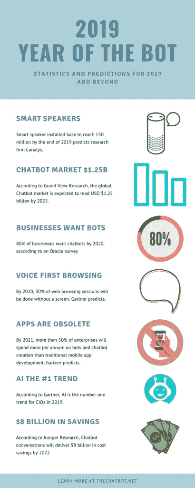

# 日常生活中聊天机器人无处不在，我们几乎没有注意到它们

> 原文：<https://medium.datadriveninvestor.com/chatbots-useful-integration-into-our-daily-lives-885678cd2ac2?source=collection_archive---------2----------------------->

如今，没有听说过或遇到过机器人几乎是不可能的。它们在我们的日常生活中无处不在，从询问 Alexa 天气或重新订购杂货等平凡的任务。

> 聊天机器人完成了超过 50%的任务，贡献了大约 20%的社交媒体“对话”。

根据[大观研究](https://thechatbot.net/trends-stats-chatbots-2019/)的一项调查，聊天机器人的数量只会继续增长，预计到 2020 年将达到 125 亿美元的市场价值。请看这张来自 thechatbot.net[的信息图](https://thechatbot.net/trends-stats-chatbots-2019/)

[Via thechatbot,net](https://thechatbot.net/trends-stats-chatbots-2019/)

那么，什么是机器人，它是如何融入我们的生活的？聊天机器人已经存在很长时间了；像谷歌这样的搜索引擎已经广泛利用机器人，也称为蜘蛛或网络爬虫，来分析内容和索引网络。

 [## 对话式人工智能的兴起将如何影响世界数据驱动的投资者

### 从不同的专业服务，保险，教育，金融，旅游，电信，到建筑，银行，和…

www.datadriveninvestor.com](https://www.datadriveninvestor.com/2019/02/07/how-the-rise-of-conversational-ai-will-impact-the-world/) 

机器人本质上是执行自动化任务的软件，有时是为了模拟或取代重复性的人工任务——聊天机器人尤其如此。聊天机器人旨在以对话的方式在脸书和 WhatsApp 等即时通讯平台上与人类互动。这对于电子商务和实体在线零售商来说很方便，因为他们没有能力亲自回应客户的每一个询问或请求。

机器人越来越多地以虚拟助手的形式使用。苹果的 Siri、微软的 Cortana、亚马逊的 Echo 和谷歌的 language control 等语音控制助手是一些主要的例子，说明企业如何利用机器人的进步来回答客户的查询，并帮助快速完成工作，而不需要与另一个人说话。

机器人已经通过信使、网站和社交媒体平台帮助改善企业的客户服务，加快购物过程和响应速度。[微软首席执行官塞特亚·纳德拉认为机器人是“新应用”](https://www.theguardian.com/technology/2016/apr/13/facebook-army-chatbots-messenger-news-sports)因为一切都是通过你智能手机上可能已经有的现有通讯应用来完成的。

*原载于 2019 年 3 月 20 日*[*order bot . my*](https://orderbot.my/2019/03/20/chatbots-useful-integration-into-our-daily-lives/)*。*