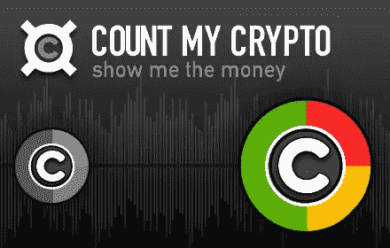

# 与 countmycrypto.com 的联合开发者 Rhian Lewis 聊天

> 原文：<https://medium.datadriveninvestor.com/chatting-with-rhian-lewis-co-developer-of-countmycrypto-com-32663224ff02?source=collection_archive---------9----------------------->

感谢您抽出时间来做这件事，非常感谢。

-你能告诉我一些关于你自己的事吗？

我是一名软件工程师。我是比特币投资组合追踪器 countmycrypto.com 的联合开发者，比特币伦敦女性聚会的联合主持人，我是区块链所有事情的频繁演讲者和培训师。我住在伦敦和柏林之间，我来自威尔士。

-当你在活动中发言时，你会说些什么？

**这取决于事件。例如，下周我将在 Pathfounder Cryptonomics 活动上主持一个关于加密货币数据和媒体的小组讨论。过去，我做过关于区块链和物联网的演讲，但我的主要专业之一是测试区块链应用程序的主题**

-你现在和过去都在做什么？

**我刚刚与 B9Lab 合作推出了以太坊 QA 工程师课程:**[**https://academy . B9 lab . com/courses/course-v1:B9 lab+ETH-QA-1+2018-2/about**](https://academy.b9lab.com/courses/course-v1:B9lab+ETH-QA-1+2018-2/about)**这让我很忙，同时还为各种客户做自由职业**

-关于你的加密跟踪器？我们总是推荐追踪器，因为好的追踪器不多。德尔塔是我目前使用的。

**我和我的朋友布鲁斯在 2013 年开始开发 Countmycrypto。它最初是我写的一个小脚本，用来记录我自己的投资组合。我做后端开发和系统管理员。我们正处于一个重大的重新启动过程中，因为网站在四年后开始看起来相当过时，我们正在添加一些很酷的新功能**

那真的很酷。跟踪的选项越多越好。你能告诉我一些更新吗？你希望什么时候完成？我也想把这个分享出来

**谢谢提问:)主要的变化是人们将能够输入更多关于具体交易的信息。因此，如果你在五个不同的日期从五个不同的交易所购买 LTC，所有这些信息将被单独记录，但你会有一个 LTC 的合计总数，你可以展开它来查看不同的交易。我们还增加了一个选项，这样你就可以看到你在任何主要的密码以及任何菲亚特的余额。**

-是什么让你加入区块链加密公司的？

我获得了经济学学士学位，我一直对经济和金融系统感兴趣。当我开始阅读比特币时，我很着迷，交易密码让我着迷。

我也迷上了交易。

**危险地上瘾；——)**

-你们有什么样的法规或政府支持？就在最近，怀俄明州通过了一项法律，将虚拟货币定义为法定货币。他们通过了其他几项帮助加密的法案。他们率先这样做，其他几个州也在效仿。如果你想听的话，这里有一个链接。[https://above crypto . com/news/crypto-now-a-legal-currency-in-Wyoming/](https://abovecrypto.com/news/crypto-now-a-legal-currency-in-wyoming/)

**感谢链接。我认为监管是一个越来越普遍的话题，但我不认为加密需要政府的批准才能生存**

*——我完全同意*

-从长期和短期来看，您对加密的未来有什么看法？

**从短期来看，我认为银行、企业和机构将会反击，并试图对该行业实施监管，但最终，加密的去中心化和国际化性质将意味着他们将无法阻挡潮流**

*——你是对的。世界范围内的这种情况不能在潘多拉的盒子里被推回去*

-你认为我们怎样才能更快地采用它？

**随着越来越多的人从朋友那里听说它，随着千禧一代对更传统的投资、储蓄和支付方式失去信心，它将会自己发展壮大**

-让它成为主流可能遇到的最大障碍？

**主流媒体中的 FUD。让一些界面有更好的体验。**

*-fud 很可笑，但我猜是意料之中的。在界面上定义权利，不是初学者友好的。你希望看到什么样的界面？*

钱包可能有点笨重。开发者应该提供更多的信息，为什么交易需要时间来确认，什么是 tx 费用等。运行一个节点也应该容易得多。人们越依赖轻型客户端，网络就越不安全。事实上，我认为大多数交易所都非常用户友好..

-你最喜欢的货币是什么？

**比特币、Monero、Cardano**

-关于这个行业，你希望每个人都知道或了解什么？

去中心化真的非常非常重要，使用加密技术不需要很专业

再次感谢你这么做。你真酷。