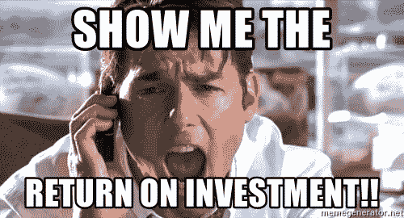
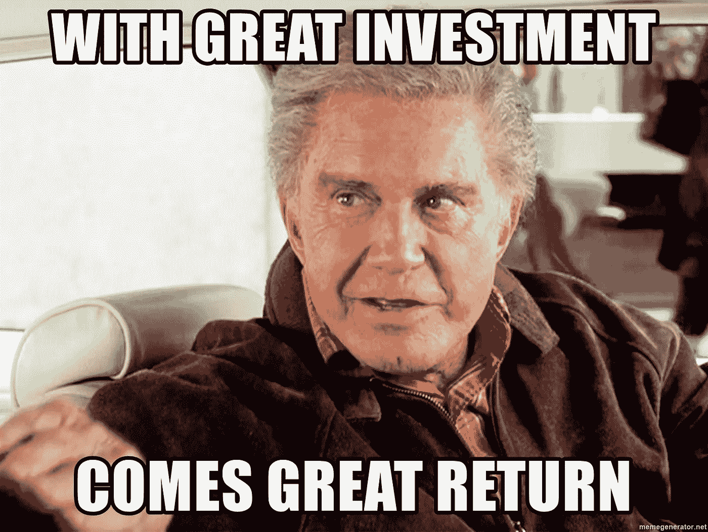

# 吸引风险投资 A+轮的创业公司创始人名单

> 原文：<https://medium.datadriveninvestor.com/check-list-of-the-startups-founder-to-attract-venture-capital-investment-a-rounds-277b1efe22d6?source=collection_archive---------13----------------------->

初创公司发展迅速，你决定吸引风险投资者的 A+轮投资。

在吸引投资的时候，创始人很清楚他为什么需要风险投资，哪个投资人会为他聪明，他的创业公司已经达到了一定的指标(创业公司与创业公司之间有很大的不同):

**1。** **有必要在需要投资前 6-12 个月开始吸引投资。**
两边没错。对你和你的团队来说，这是对未来的稳定和信心。当资金被搁置一个月时，你不必为投资者的挤兑而颤抖。投资者看到公司的业绩记录会很有用，他会了解你的进展。

**2。考虑风险资本家的季节性。**
在俄罗斯——新年、五月、夏天；在欧洲、亚洲、美国——各有特色。例如，1 月份的中国将在前 2-3 周积极工作，但在新年(2019 年 2 月 5 日)前一周甚至更早，人们将开始休息。

**3。获得上一轮投资者的承诺。当前股东参与这些轮次总是意义重大——他们已经是董事会成员，知道如何发展一家初创公司，看到其增长潜力。如果他们不想考虑与新投资者一起进入的选择，了解这有什么意义，从他们那里得到反馈。**

**4。正确确定回合数。**
在这件事情上，创始人尽可能的展现自己的想象力。我建议根据公司的需求确定该轮的金额+打下一个枕头(如果你需要 100 万美元，并且你明白他们会持续 10 个月，再打下 3 个月的储备，吸引 130 万美元)。

**5。列出潜在投资者的名单。**
在这个阶段，你已经形成了一个网络。写下至少 50 名潜在投资者，并与每个人建立沟通。如果你能想象朋友。也要对你所在行业的投资活动、竞争对手进行研究。谁在过去 12 个月里筹集了资金？联系他们，一起喝咖啡，重要的是从已经通过这种方式的创始人那里获得有价值的人脉和建议。

**6。在最初的会议中找出最薄弱的地方。**
每周计划 5-7 次会议，首先会见那些作为投资者不太感兴趣的人，然后与最想要的投资者举行最好的会议。重要的是从投资者那里听到创业公司的所有弱点，并在第一次会议上结束这些弱点。总是直接问为什么你不感兴趣，要求一个开放的反馈，并积极努力。

**7。会后与每个投资者一起工作，创建一个关于你的创业成功的通知系统。**
在与投资者会面后，明确他是否希望收到您关于公司主要业绩的信息。这可以是每两周或每月一封关于团队、新客户、技术变化、投资活动过程的短信。

**8。选择一个长期投资者。赶紧做个交易。**下一阶段的投资者应该加强你的创业。您的企业将从合作中获得哪些协同效应？尝试从最有用的投资者那里获得投资，不要忘记结构化。每走一步，别忘了问自己:这是我公司的事吗？为什么？有什么用？投资者喜欢捍卫自己创业公司利益的强势企业家，因为也许这家公司很快也会成为他的，他会理解你在下一轮投资中的立场。