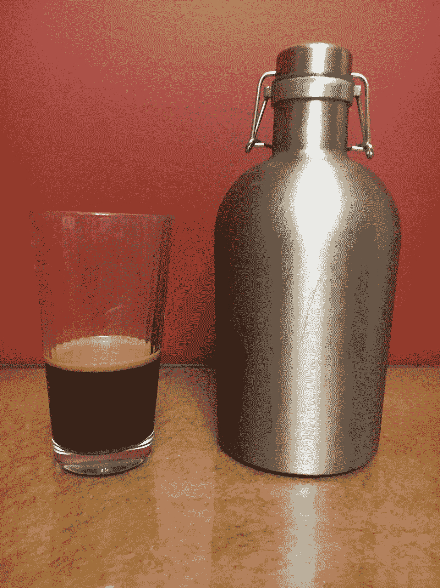

# 干杯——手工酿造在 2010 年代是一件大事

> 原文：<https://medium.datadriveninvestor.com/cheers-craft-brews-were-a-big-deal-in-the-2010s-298cf93e7308?source=collection_archive---------6----------------------->

Bourbon Barrel-Aged Stout and Steel Growler — TJOGrady

**花点时间思考一下:**

回想 2009 年，想想你能马上想到多少家精酿啤酒公司。你能想到五个酿酒商吗？你认为他们中有多少人是本地人？Local 可以指你所在的大都市地区或城市。Local 也可以指你所在的城镇、县，或者更广泛地指你所在的州或地区。我的猜测是，有一个很好的机会来说出五种在 2009 年对你来说是当地的精酿啤酒，你可能需要在州的层面上思考。现在考虑 2019 年底同样的问题。你可能很容易想到你所在的城市、镇或县的五家手工酿酒商的名字。

谷歌地图的快速搜索表明，在纽约州的首都地区，奥尔巴尼、斯克内克塔迪和伦斯勒县有 20 家当地的手工酿酒厂。在搜索“手工酿酒厂”出现的 20 家中，只有两家，埃文啤酒和布朗酿酒公司在 2009 年营业。对于首都地区，萨拉托加县的加入增加了 2019 年的供应，但不影响 2009 年的数字。

**在全国精酿啤酒现场:**

根据酿酒商协会的数据，2017 年精酿啤酒的销售额总计超过 260 亿美元。精酿啤酒的产量在 2017 年也增长了 5%。260 亿美元的总销售额占美国整个啤酒市场的 23.4%。精酿啤酒销售额比 2016 年增长了 25 亿美元，比 2015 年增长了 37 亿美元。精酿啤酒的繁荣始于 2000 年代末，2017 年是精酿啤酒销量以及精酿啤酒在整个啤酒市场中所占份额开始持平的第一年。

手工酿酒厂最初的增长曲线非常快。关于潜在精酿啤酒泡沫和市场饱和的初步讨论始于 2013-2014 年左右。到 2017 年，啤酒制造商协会正在讨论精酿啤酒市场的饱和。如果 10 年前你很难说出在你的驾驶距离内有多少精酿啤酒厂，现在这种情况肯定已经改变了。截至 2017 年，全美共有 6266 家啤酒厂在运营。其中，1000 家(或 16%)在 2017 年开业。倒闭的啤酒厂只有 129 家，仅占全国啤酒厂总数的 2.1%。啤酒酿造商协会的最新数据显示，2019 年初，美国仅有 7000 多家手工酿酒厂。这些啤酒厂在 2019 年销售了价值约 270 亿美元的啤酒，在 1140 亿美元的啤酒行业中占 24%的市场份额。

虽然整体销售额开始持平，但精酿啤酒的销售额在 2012 年至 2018 年的短时间内增长了近两倍。那么，这与酒精消费的整体趋势有什么关系呢？精酿啤酒的酒精含量普遍高于主流民族品牌。鉴于精酿啤酒不断增长的市场份额和精酿啤酒不断增强的效力，我们正在成为一个喧闹的国家吗？进一步阅读我们了解到情况可能并非如此。

Specialty Craft Beer Bottle Wax Sealed — TJOGrady

**全国饮酒趋势:**

B **eer** 是一个很大的产业，精酿啤酒已经从传统的大型啤酒生产商手中夺走了将近四分之一的产业，包括 Anheuser-Bisch、MillerCoors 和 Pabst Brewing。尽管精酿啤酒繁荣，根据啤酒营销商的见解，只有 11 家公司仍然生产美国消费的 90%的啤酒。考虑到上面讨论的数据，这似乎很难相信。根据已经提供的数据，这表明实际饮酒量低于预期。

根据国家酒精滥用和酒精中毒研究所(NIAA)的数据，酒精和啤酒的消费在 1979 年达到顶峰。1979 年，美国人均饮酒量约为 2.8 加仑。其中一半，1.4 加仑，是啤酒。一加仑等于 128 盎司。这意味着在 1979 年，人们每年喝掉大约 358 盎司的酒。这相当于每天大约一盎司的酒精。一杯标准饮料含有大约 0.6 盎司的酒精。所以在 1979 年，一个人每天大约喝 1.7 标准酒精饮料。其中大约一半是啤酒，或者每天大约一瓶啤酒。

根据数据，人均饮酒量在 20 世纪 80 年代开始急剧下降，直到 1995 年达到人均约 2.1 加仑的低点。使用与上一段相同的数学方法，这相当于每天大约 1 杯标准酒精饮料。酒精消费量的下降主要是由烈酒或烈性酒消费量的下降推动的。啤酒消费量逐渐下降，葡萄酒消费量逐渐上升。所以每个人每天喝大约四分之三的啤酒，或者每周喝五到六瓶啤酒。总体酒精消费量在 1995 年开始反弹，直到 2013 年(最近一次有数据可查)达到人均 2.4 加仑的新高。这一增长完全是由葡萄酒和烈酒消费的增长推动的。尽管繁荣，啤酒的人均消费量在 2013 年下降到 1.1 加仑的低点。很可能，自那以后，人均啤酒消费量有所增加。

来自 NIAA 的数据似乎反驳了精酿啤酒在美国的流行导致酒精消费量和人口数量总体增加的观点。

**这意味着什么:**

I f 精酿啤酒的销量和啤酒的人均消费量乍一看不相加，不要惊讶。对此可能有几种解释。首先也是最明显的是，2019 年更新的啤酒和酒精消费量可能会反映更高的消费水平。即使考虑到这一点，这些数字似乎也不会达到 20 世纪 70 年代和 80 年代中期的水平。事实上，似乎有一部分人，也就是喝精酿啤酒的 25%的人，只是把他们的老的国家品牌换成了当地的精酿啤酒。这样做并没有增加他们的饮酒总量，反而可能减少了。剩下的 75%坚持喝国家品牌啤酒的人要么继续喝和精酿啤酒流行之前一样多的啤酒，要么减少他们的消费量。

这是怎么加起来的？大多数手工酿酒厂似乎只生产少量啤酒，并在酒吧出售。只有一小部分手工酿造公司足够受欢迎，并有能力分销他们的产品。任何一个非分销商都只能接触到一小部分人。那些住在本地的人或者那些旅行的人。获得啤酒的能力需要一个人去那里喝啤酒或将饮料装在罐中(现场罐装，但不分发)或装在咆哮器中带回家。这些地方的啤酒平均价格通常更高。在这些条件下，人均消费可能保持不变、减少或增加，由于成本增加，总销售额仍可能增加。

除了非经销商之外，从经销商处购买的普通精酿啤酒仍然比从全国知名品牌处购买的啤酒要贵。成本有时可能是标准国家品牌的两到三倍。如果你不相信这一点，去饮料中心自己检查一下。4 包最高品质的精酿啤酒售价 20 美元或更多并不罕见。这大约是每盎司 0.31 美元的成本。一个国家品牌的 12 包 12 盎司瓶的成本约为 16 美元，单位成本约为 0.11 美元一盎司。那些售价在 12 美元到 16 美元之间的四包包装的每包价格仍然是原来的两倍。从这个数据来看，美国人可能会购买更高比例的高价优质精酿啤酒。这部分啤酒市场淘汰了曾经由传统大品牌占据的部分啤酒市场。当人们决定饮酒时，他们这样做的同时也开始减少饮酒量。总体消费量可能较低，并可能受到一些精酿啤酒高得多的成本的限制。销量更高；但是价格，而不是口味，是消费的限制因素。

**期待:**

很难说 21 世纪 20 年代的啤酒和酒精行业会怎样。公共卫生专业人士可能会将手工酿酒厂的增加视为过去在打击酗酒、酒后驾车和酒精相关问题方面取得的进步的倒退。更仔细地观察数据表明，尽管精酿啤酒在过去十年里销量激增，或者精酿啤酒在 2010 年代受到越来越多的关注，但个人实际上可能喝得更少了。