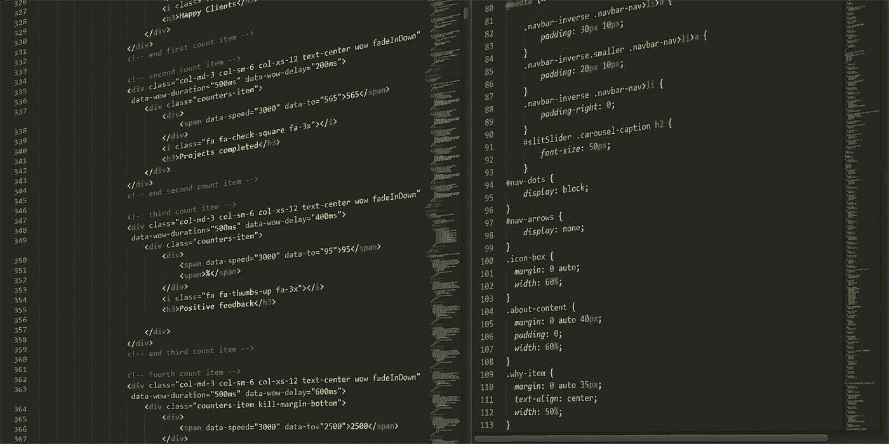

# 儿童是如何影响编码行业的，成年人能提供什么帮助

> 原文：<https://medium.datadriveninvestor.com/children-changing-the-coding-industry-d819a018b2a9?source=collection_archive---------18----------------------->

曾经有一段时间，只有少数人知道如何让电脑做一些事情。当第一台计算机被发明时，一个人会走过几米长的纯机械，按下几个按钮。几个小时后，他们就会有一些非常简单的计算结果，而我们今天几乎可以立即做到。随着技术的发展，许多人可以学习编码，并部署它，*和*立即看到结果。从来没有比现在更容易开始发展的时候了，所以很多 5-13 岁的孩子都在利用这一点。

不难看出年轻一代是如何跨多个层面接管编码的。“块编码”是编码的简化版本，全英国，也许是全世界的小学都在教它。随着时间的推移，我们看到人们在 6-9 年间转向 python 和 HTML 的基础。你会发现有些人已经学会了 NodeJS，但是很少有人真正表现出足够的兴趣来达到那个水平。很多人都在申请数据科学和工商管理等工作。而不是软件/web 开发。但是仍然有一些孩子把全部精力放在编码上，并且实际上正在影响代码的世界。

Tanmay Bakshi. Credits: CNBC

一个明显的例子是一个名叫 Tanmay Bakshi 的 14 岁少年。这位年轻的天才在 5 岁时开始 web 开发，并在 8 岁时发布了他的第一个 IOS 应用程序。当他发现 YouTube 时，他开始发布视频和关于如何编写这类应用程序的信息，以及网页。意识到知识的缺乏，他开始解释所有这些系统是如何工作的，并开始制作越来越多关于这些主题的视频(你可以在这里看到这些视频)。有一天，他在探索代码时，偶然发现了一个名为 IBM Watson 的系统，正如许多开发人员必须知道的那样，这个系统使用人工智能来创建有用的应用程序，这些应用程序可以部署用于有用的目的。他摆弄着这个系统，最终，他吸引了“大人物”的注意:主要的 IBM 官员和其他公司。他开始与他们合作，帮助开发像 IBM Watson 等系统。他对我们周围的编码世界做出了很大贡献，尤其是对那些对编码一无所知的人，他证明了编码世界没有年龄限制。

我自己，一个 13 岁的孩子，也试图在编码行业成名。我在 10 岁的时候开始了硬 web 开发，之前有过类似我上面提到的块编码系统的经验。这些基本的构建模块帮助我理解了编码的基础，因此是我当时感兴趣的一个很好的工具。如今，我已经学会了 JS，Python，NodeJS，这些作品。我的一个骄傲的时刻是开发了一个谷歌助手的动作，并收到了上面看到的 t 恤。我的行动被称为 Edzuki，与网站 [Edzuki](https://www.edzuki.com/) 合作，以创造一种更简单的方法在网站上找到相关的部分。但我最喜欢的是谷歌的人工智能 API，名为 [Tensorflow](https://www.tensorflow.org/) 。这是一个机器学习的人工智能系统，它与提供的数据进行交互，以创建一个模型，从中采取适当的行动。我边走边学，并且总是愿意学习更多的科技知识，尽管事实上在现代学校里机会很少。

这一趋势在两个例子中都存在。两人都很年轻，十几岁，但都在为他们周围的世界做贡献。但问题是，成年人能做些什么来确保下一代继续这一趋势呢？很简单。帮助，不要压制这些对代码的热情。配合孩子的兴趣。永远不要让孩子觉得这太难了，或者超出了他们的理解范围。未来掌握在他们手中。让他们抓住它。如果你和我一样是个孩子，正在探索各种选择，编码是一个很好的选择，有很多方法可以开始，并顺应发展趋势。孩子们必须学习，成年人必须教导，以保持编码的活力，而不是求助于我们已经预先构建好的系统为我们做所有编码的方法。我的父母总是帮助我，其他人应该总是支持他们的孩子，学生等。就像他们对我一样。最后，永远记住:

> 不共享的知识仍然是未知的