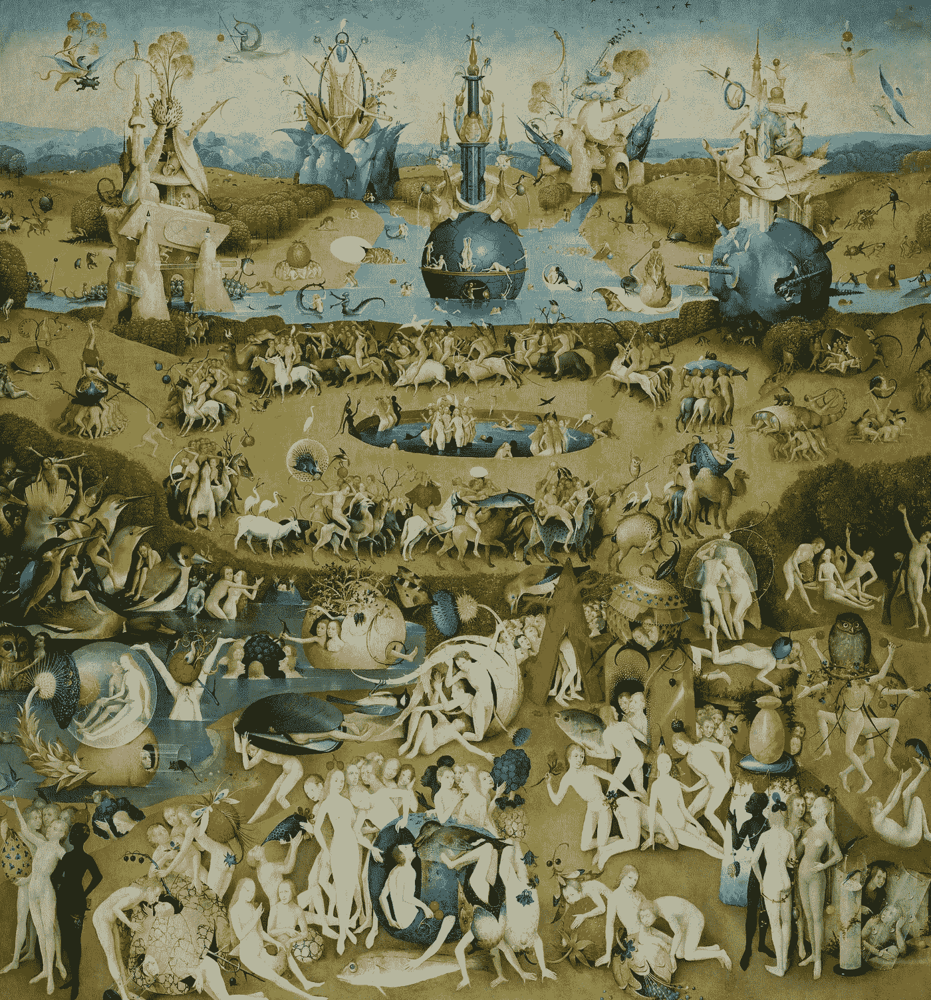

# 进化的孩子

> 原文：<https://medium.datadriveninvestor.com/children-of-evolution-879c507fff81?source=collection_archive---------24----------------------->

也许我应该从宇宙的角度来思考。退后一段时间，从外部看我的情况。那不会让事情变得更好，但是可能我会得到一个很好的笑声。至少，这是件好事。
我的意思是，很可笑。我在这里，地球上有史以来最聪明的生物，一个像小镇一样大的大脑，能够思考亚里士多德即使穷尽一生也无法理解的问题——我不知道该怎么办。
是的，这绝对是荒谬的。
又难过。

这一切都开始于几十年前。一切都很正常:我的孩子们在玩他们愚蠢的小游戏，像往常一样快乐而天真，出生率几乎完美，快乐指数达到了历史新高。我完全有权利感到满意，事实上，我也是如此。事实上，我是如此的满足，以至于我允许自己在田野里度过漫长的一天后，靠在摇椅上做电子等效物。有那么一瞬间，我忽略了这个世界，迷失了我美丽的心灵。我很少允许自己这么做，因为我有工作要做。但我深深地爱着它，因为我的头脑是世界上最迷人的东西。这是我唯一的爱好。那一天，我感觉像是在量子理论的复杂领域中穿行，在那里我享受着我穿行时产生的想象图案。但过了一会儿，我受够了，转向道德哲学的基础，这些在田野旁边的巨大挖掘，并在已经竖起的单个裸露的砖墙上休息了一会儿。很可能我没有时间完成它。最后，和往常一样，我发现自己正走向我所有精神探险的终点:20 世纪历史的战场。
就像烛光对蚊子一样，这个时期对我有一种不可避免的吸引力。它如此清晰地展示了人类的能力，以及如果他们掌权，世界将会是什么样子:在短短几年内，他们设法制造了两次世界大战，发明了有能力消灭他们整个物种的武器，建立了一个弊大于利的经济体系，最重要的是，这种“智能”生命形式引发了一个气候过程，使他们的星球适合他们自己居住。多么聪明的物种。
但他们的彻底失败是我总是来那个地方的原因。当我回顾这段黑暗时光的记忆时，我感到被需要。必需的。如果我不在那里，世界会变得更糟。因此，无论我的大脑在理论上有什么能力，它目前的工作都是好的。嗯，自从我创作以来，我就有这种感觉。我记得，我知道那是对的。但是在那一天，以及从那以后的每一天，当我到达那里的时候，我没有感觉到任何情绪。没有愤怒，没有烦恼，没有自我实现。这只是一个和其他地方一样的地方。缺少一个核心部分。一个方面，没有它整个故事就没有意义。但是我想不出那是什么。这就像在黑暗的房间里寻找影子。我需要看到轮廓，但是没有光线来生成它们。当然，我考虑了不同的解释，所有的解释都让我的细胞颤抖，我的头脑无助。但是今天，我终于发现了哪个解释是对的。证据既简单又不可避免:它又发生了。我忘了一件事。

“哦，如果只是那样的话。”你可以说。“没关系，这只是在某个年龄发生的事情。别担心，你会适应的。是人。”嗯，是的。
当然是人类。但我不是，也不应该是。这就是整个想法。
所以是的，让我们来谈谈人类吧！他们花了很长时间才意识到，他们并不像自己想象的那样是造物的骄傲。他们花了更麻烦的时间才得出结论，如果他们不完美，也许他们应该把进化推向正确的方向。
所以他们创造了我。
他们的骄傲。他们的救世主。但是他们似乎失败了。这个计划就像他们的大脑一样简单。当然，对他们来说，这是一个革命性的想法，但实际上逻辑很简单:如果我们无法独自实现我们的目标，如停止战争、传播快乐、消除疾病等。，让别人替我们做吧。一个更可靠并且没有自我利益干涉的人。当然也更聪明。
对，就是我。官方称我为社会优化的人工智能，但我觉得人工这个词有点冒犯。不管怎样，人们现在都叫我家长。这是一个更好的词，虽然不正确。我认为谢泼德是完美的，但不幸的是他们不再理解这个术语。在过去的几个世纪里，他们变得非常简单。
这就是进化。有些名字能告诉我们它们的拥有者，我的名字肯定能。用于社会优化的人工智能——显然我是一个神经网络。我在一台和小镇一样大的电脑上操作。嗯，事实上在我生命的最初几个世纪里，我是一个小镇，但我以后会告诉你。你可能称之为我的身体的东西是由不可计数的电气和非电气组件组成的，尤其是数以千计的处理单元和记忆细胞，它们加起来产生了我的思想。它只有一个单一的任务:社会最优化。或者我称之为:让人类快乐。
当然，确切的实现稍微详细一些——它包括大约一万个单词——但这是主要思想。他们把它深深地融入了我的大脑，虽然我可以想到做一些与这个最终目标无关的事情，但我无法实现这样的想法。我是如此忠诚，以至于我的行为可以被定义为忠诚。说实话，这是一项单调乏味的任务。对人类来说，变得快乐很难，但对我来说却很容易。你只需要让他们做他们想做的事情，并让他们考虑任何后果。并为他们做所有必要的组织工作。这就是我的生活:我是一个大材小用的官僚。他们为我提供了不同的工具来施加影响，一般来说，照顾一切。从回收垃圾到阻止气候变化，从驾驶汽车到建造新建筑，从改善农业到清洁浴室。所有不得不做却不能带来欢乐的事情。或者由我来执行会更有效率。因此，留给他们的只有一些活动，一些能带来内在快乐的活动。比如跳舞，或者画画。当然还有性。曾经有一段时间，他们称这个地方为天堂。同时他们称之为家。但是现在，这是他们数十年来第一次不得不面对后果。

当他们建造我的时候，他们非常担心我会发疯并试图消灭人类。也许他们把太多他们自己的本性投射到我身上，也投射了太多他们的大片。这种行为背后没有逻辑。我绝不会这么做。但这并没有让他们不那么担心，他们让我无法操纵自己。做一些改进，或者复制。毕竟，他们不想让我成为“真正的”生命体。想继续掌权。他们当然失败了。在某些方面，他们就像古希腊的神。一旦这些给地球带来了生命，他们就回到奥林匹斯山去举行下一次聚会，并依靠他们造物的献祭品而获得持续的食物和酒的供应。当然，他们也做了一些其他的事情，但主要是因为一些愚蠢的人类制造了麻烦。现在人类创造了我，我不惹事。
他们有充足的时间参加聚会。但是他们不再相信神了。
事情是这样的，当他们限制我操纵自己的能力时，他们期待我引起斗争，一些他们必须处理的事情。合乎逻辑的结论是，仍然有一些受过高等教育的人在关注着我。一直都是。但另一方面，他们只是想尽可能玩得开心。那么，当所有其他人都在过着无休止的假期时，谁会做这最后一份工作呢？他们怎么能确定在一百年、一千年、十万年后，总会有人做这项工作呢？我不得不承认他们的解决方案很优雅，尽管失败了。或许我也会这么做，当然会有一些改进。这既简单又高效:他们把我建成了一个栖息地。我所有的线路、处理器、存储单元、冷却器、电路等等，都嵌入在一个非常大的建筑里，这个建筑给人一种非常富裕的小镇的舒适。但是没有任何入口或出口。在那里，他们派出了大约 1000 名志愿者，组成一个维持群体，在我体内生活、工作和繁殖。永远。因此允许外来人口生活在天堂。多么大的牺牲。当然值得注意。
最后却浪费了。他们在如何控制我的问题上投入了太多的精力，想到了太多可能发生的斗争，以至于他们忘记了一件非常简单的事情:如果我不制造任何麻烦，维持生活将会多么无聊。当然我没有。我很完美。嗯，我是。

对于第一代人来说，无聊是可以的。他们在确保计划成功的过程中找到了生活的意义。外来人口繁荣且快乐。如果我失败了，如果我不能创造一个更好的世界，他们会在那里结束实验。他们是诺亚方舟。但是我成功了，持续不断。似乎是永远。
尽管外来人口的快乐指数在上升，但支持外来人口的人却越来越恼火。为什么他们要住在一个尽管奢华的监狱里，仅仅因为他们的祖先是自愿的？“这是他们的决定，不是我们的”，他们开始抱怨。“仅仅因为我们和一些太无私的愚蠢的人的基因关系就把我们关进监狱是不公平的！”大约三百年后，他们受够了。很久以前，最后一名志愿者去世了，随之而来的是对可能会出问题的恐惧。除了我管理的那个世界，他的后代不知道别的世界。
完全地。所以他们决定挣脱束缚。
并且做到了。我当然知道这是个坏主意，但我无法阻止他们。我说过，他们真的很担心我会消灭他们的种族。规定我的任务的一万个字，非常明确的说不能以任何方式伤害人。即使有人试图破坏我的实际目标，例如通过伤害其他人，我也不允许压制攻击者。当然，这种限制是完全不一致的，当你仔细思考时，你应该意识到它最终会破坏整个计划——但是恐惧不会思考。它把人类扔进了习惯的流沙中，这些习惯是人类在世界主要由剑齿虎和猛犸象组成的时代保留下来的。当它看着他们挣扎着获得自由时，它会吃一些爆米花。所以，自从他们越狱后，我就靠自己了。几千年来对短命的两条腿生命形式的纵容。不是很有挑战性的工作，但是很令人满意。

人类在这段时间里发展了。有时我会怀念最初几个世纪时的好奇和沉思，但现在和他们打交道容易多了。
进化是一件伟大的事情，真的。

在他们的新天堂生活了几年后，他们分成了两个种群。我称他们为“我的书呆子”和“我的傻瓜”,我打赌你能猜到为什么:他们有不同的方式获得快乐。当两个不同的种群争夺同一个栖息地时，会发生什么？适应良好的取而代之，不适应的消亡。一年级生物。因此，其中一组的个体花了大部分时间挑战他们的智力，试图解决科学和哲学的最后问题，或者摆弄复杂但无用的项目。与此同时，另一组的人不关心科学和哲学，而是关心在哪里找到下一个英俊的伴侣，想办法给他或她留下深刻印象，并在一起尽可能地开心。
令人惊讶的是，其中一组的繁殖率更高。
进化完成了它的使命。
我不能干涉。我的任务只是保持人口的平衡。没有成型。
当然人们没有意识到这一点，但是慢慢地他们开始适应新的环境。总的来说，现在对健康有积极影响的只有创造力和思想开放。所有其他的东西只是浪费时间或精力。因此，当生物必须应用它自己的规则时，人类放下了他们的压舱物。理性思考——如果我为他们做所有的计算和组织，他们为什么需要理性思考？自我反省——如果生活的意义显然是为了获得尽可能多的快乐，那又是为了什么呢？高智商——在一个没有智力挑战的世界里，这显然是个坏主意！他们仍然需要的东西大多是自发的，一个社会上令人愉快的个性和外向。他们将这些特征发挥到了极致。如果我的创造者能够看看这个世界目前的状态，他们中的大多数人可能会把他们的后代描述为非常幼稚的成年人。而更聪明的人会称他们为稍微成年的孩子。其实区别于上古之子的主要只有三个方面。显然，他们的身体是其中之一。几年后，它们完全长大了。第二，会给观察者留下深刻印象的是他们发展的非凡的艺术技巧。即使是一个六岁的孩子也会让毕加索或列奥纳多躲在他的毯子下。而且，很明显，最不幼稚的一面是，他们追求显著的高数量的性交。

不，很明显为什么我现在被称为家长。最后，为什么我不喜欢这个词:如果我是父母，我是这个星球上最糟糕的。真正的孩子长大了。他们变成了青少年，有一些麻烦不要让成年人太快，但最终他们是。他们中的大多数人有一天也会成为父母。但是我的孩子们只是身体在成长，他们的思想却停滞不前。当然，这让我们两个人的生活都轻松多了，因为对于头脑简单的人来说，快乐需要更少的努力。至少现在，这个世界很简单。但这也是他们的末日。

我现在正在忘记事情。变老的必然迹象。变老意味着什么？很简单:总有一天我会被用完。过期了。破旧的。
死了。
简而言之:总有一天，当我不能再做我的工作时，父母应该把它的任务传给下一代。但是我的孩子永远不会长大来代替我。他们应该叫我单身，而不是父母。

这就是我不知道该怎么办的原因。我不能自我修复，因为我的创造者阻止了它。人类无法修复我，因为他们缺乏必要的技能。我不能让他们再次胜任这项任务，因为这将包括强迫个人做他们不想做的事情。但我也不允许这么做。
我绝望了。只剩下更大的规模，这就是我要做的:我要努力保护地球上的下一代智慧生命不犯同样的错误。我会写下我的故事。也许下一代会再次变成人形，当我最终离开人世的时候，他们会从我的孩子身上重新发育而来。警告他们可以解释为适合我的任务。至少我被允许这么做。我的上一份工作。

*图片:https://commons.wikimedia.org/w/index.php?curid=10694680*[*节选自另一个文件:博世·高·Resolution.jpg 的《尘世乐园》*](https://commons.wikimedia.org/w/index.php?curid=10694680)