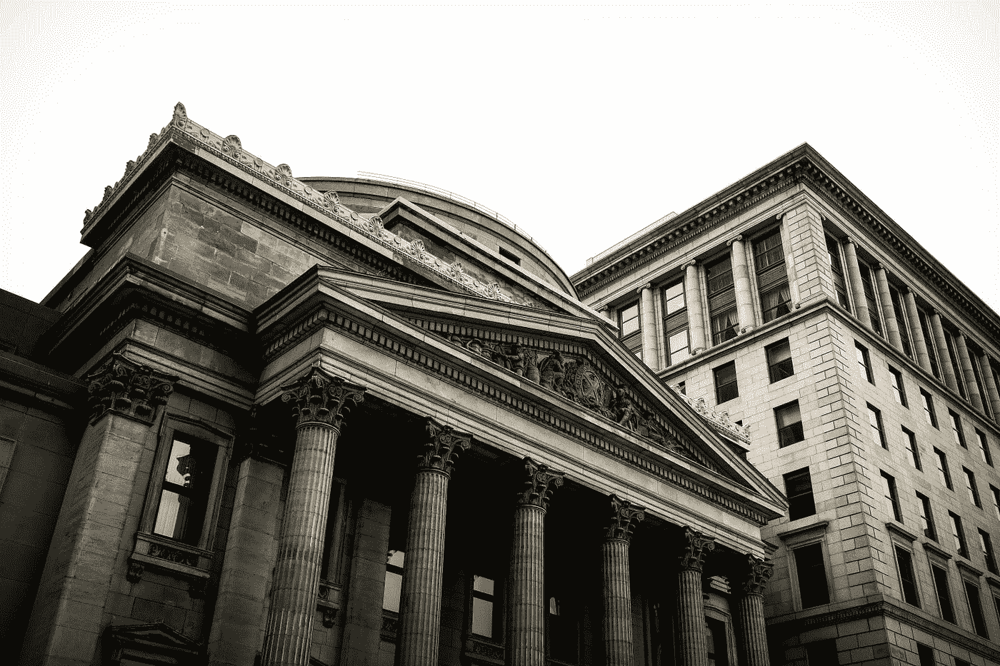
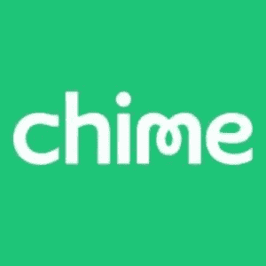

# Challenger Banks 的有效性下降

> 原文：<https://medium.datadriveninvestor.com/chime-goes-down-as-do-challenger-banks-validity-111c3d75aebd?source=collection_archive---------3----------------------->

Photo by [Etienne Martin](https://unsplash.com/@etiennemartin?utm_source=medium&utm_medium=referral) on [Unsplash](https://unsplash.com?utm_source=medium&utm_medium=referral)

几个月前，我写了一篇关于挑战者银行崛起的文章。这些挑战者银行已经能够通过将自己推销为储户可以信任的公司来吸引客户——这是大银行在大衰退的余波之后无法说服许多人的。

在过去的 24 小时内， [Chime](https://www.chimebank.com) ，拥有超过 500 万客户的最大挑战者银行之一，由于服务中断而停机。据报道，该公司的第三方支付处理器 Galileo 经历了一次操作事故，导致支付结算问题。这个问题已经得到了解决，但不是在一整天之后。截至发稿时，公司网站仍处于关闭状态。

 [## 分散金融的出现|数据驱动的投资者

### 当前的全球金融体系为拥有资源、知识和财富的人创造了巨大的财富

www.datadriveninvestor.com](https://www.datadriveninvestor.com/2019/03/14/the-emergence-of-decentralized-finance/) 

这场灾难不仅让 500 万人无法获得他们的钱，还玷污了 Chime 的遗产，并应该对 challenger banks 的商业模式提出一些质疑。

挑战者银行给自己贴上了科技公司而非金融服务公司的标签，主要是因为它们能够通过这样做绕过监管标准。这一直是现任者的一个主要抱怨，在这样一个 500 万人被困的事件发生后，很难说在这种模式下，一些监督和反应可能是必要的。

这种规模的灾难的影响有可能影响更广泛领域的市场偏好和估值。

金融科技在投资界尤其[炙手可热](https://medium.com/clays-thoughts/top-banks-are-doubling-down-on-fintech-59b10082642c)，大量资本来自私募股权和战略机构投资者。尤其是在私募股权市场，金融科技公司的估值是基于增长潜力，而不是其他因素。像这样的事件极大地损害了像 Chime 这样的估价的合理性和合理性。

Chime 此前在 3 月份筹集了 2 亿美元的 D 轮融资，对该公司的估值为 15 亿美元。截至发稿时，Chime 为大约 500 万客户提供银行服务。执行一些简单的数学运算会告诉你，一个 Chime 客户的价值大约是 300 美元——无论如何都不是一个低数字，但也没有今天其他一些金融科技消费公司那么高。

为了让这个数字有意义，你必须先了解 Chime 是如何赚钱的。

Chime 作为一种免费的银行选择吸引了消费者；消费者可以免费使用这个平台，公司通过交易模式赚钱。更具体地说，Chime 与 Visa 合作，一旦 Visa 提成，它就向商家收取交换费。简而言之，每次你用 Chime 卡付款时，Chime 都会从你支付的商家那里收取一小部分费用。

该公司没有透露他们收取多少费用，但标准的交换费由总交易的百分比加上固定金额(2%+0.10 美元)组成。假设标准的 Chime 交易是 20 美元，那么这就是 0.50 美元。再次假设 Visa 收取 80%的费用(给予或接受)，这使得 Chime 从其客户的每笔交易中获得 0.10 美元。使用这种数学方法，为了证明 300 美元的 LTV 是合理的，Chime 客户必须用他/她的 Chime 卡进行 3000 次以上的购买。

这些单位经济学还不错，一辈子 3000 笔交易看起来很合理。然而，该业务的潜在成功取决于客户经常使用他们的 Chime 卡，像昨天发生的事件将对顶线产生影响。不仅有理由认为获得新客户将变得更加困难，而且现有客户在未来使用 Chime 卡购物时也会三思而行(如果他们还在附近的话)。

金融科技公司和挑战者银行以自己是值得信任的公司而自豪。在 Chime 最近的惨败之后，这种信任已经消失了。如果失去了竞争优势，如何差异化？