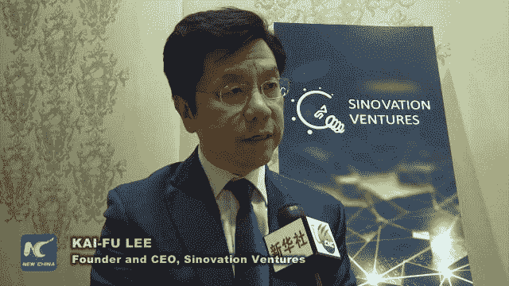
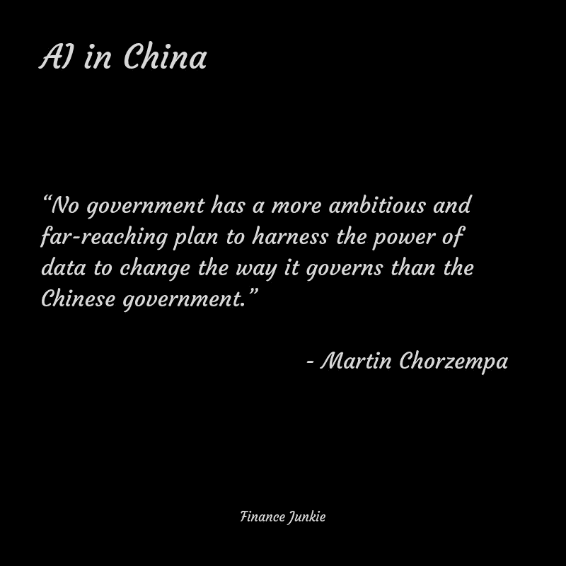
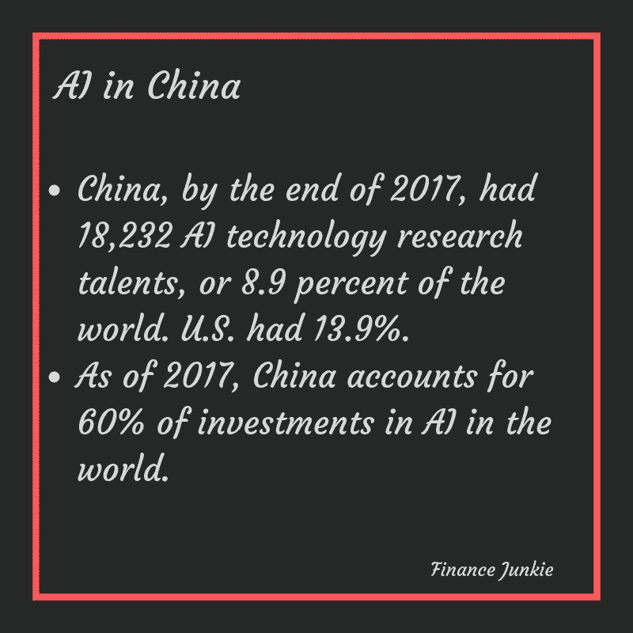
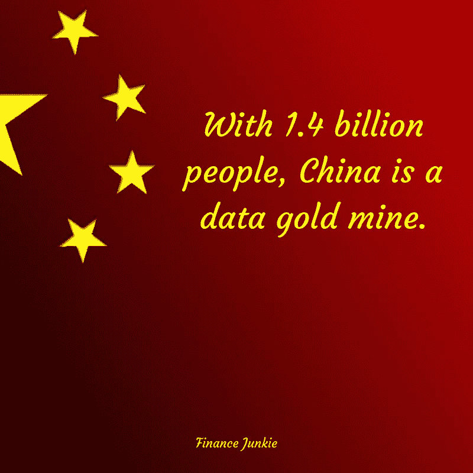

# China can beat US, Courtesy of AI

> 原文：<https://medium.datadriveninvestor.com/china-can-beat-us-courtesy-of-ai-2ef82f0e602b?source=collection_archive---------30----------------------->

> **“Data is the new oil.” — Clive Humby**

I am an AI aficionado. Ever since I saw [this](https://www.youtube.com/watch?v=9CO6M2HsoIA) eight minute video about using Artificial Intelligence in weapons, I just can’t stop thinking about our future. The video, titled “Slaughterbots”, was released around the end of 2017\. My friend and I, we talked for hours about the possibilities of AI, debated the rights and wrongs of it. And we still do.

No matter how much I talk or read about AI, I just can’t get enough of it and it is not just me who feels this way. China, one of the world’s fastest growing economies, is planning to become a world leader in AI by the year 2030\. Anyone who knows a thing or two about AI will know that when it comes to AI, data is the most important asset you can have. In our world, the more oil (Crude Oil) you have, the higher your net worth will be. Mohammad Bin Salman can vouch for that. In the world of Artificial Intelligence, the more data you possess, the better off your product will be. And China, has a lot of data.

The quantity of data that China possess is simply mind-boggling. For example, WeChat, China’s biggest online messaging app, alone has [one billion monthly active users](https://www.businessinsider.com/wechat-has-hit-1-billion-monthly-active-users-2018-3). It should be noted that the Tencent owned messaging service counts monthly active users as user accounts rather than individuals. It is common for an individual in China to have multiple accounts on WeChat for different purposes.

> **Roughly 83% of smartphone users in China use WeChat. That is about 580 million. Just imagine the amount of data they can possibly generate.**

In mobile payments spending, China is way ahead of U.S, beating its rival by a ratio of 50 to 1\. Almost anything and everything an individual needs to do can be done via WeChat. You can send messages, share your location and photos with friends, pay bills, get your digital version of government-issued id cards, etc. Of course, you can’t write or send anything that is politically sensitive or critical of the Chinese government. Interestingly, [you can’t send money worth 6.4 yuan or 89.64 yuan](https://qz.com/418882/with-its-bizarre-numerical-wechat-ban-the-chinese-government-has-reached-peak-tiananmen-paranoia/) around June 5th of every year. June 5th, 1989 was the date of the infamous suppression of Tiananmen Square protests by the Chinese government. Utter madness!

微信和支付宝等移动支付平台拥有用户所做一切的数据。这有助于他们在客户需要之前就了解他们需要什么。全球 7 大人工智能公司(阿里巴巴、百度、腾讯)有 3 家在中国。中国科技公司商汤科技(SenseTime)已经成为全球最有价值的人工智能初创公司，总估值超过 45 亿美元。前谷歌中国总裁、现任 Sinovation Ventures 董事长兼首席执行官李开复在他的新书《人工智能的超能力》中将中国称为数据的沙特阿拉伯。

李先生是非常正确的，因为中国拥有海量的公民数据，这要归功于其薄弱的隐私法，这曾被视为对东亚国家发展的挑战。政府掌握了 14 亿公民的消费习惯、社交媒体使用、旅行数据等数据。在中国政府的帮助下，中国的初创公司似乎已经准备好与硅谷的对手展开竞争。

从 2013 年到 2018 年 3 月，中国已经在人工智能技术上投资了 270 亿美元，这大约是[在全球人工智能](http://www.globaltimes.cn/content/1110703.shtml)投资总额的 60%。截至 2017 年底，中国拥有 18，232 名人工智能技术研究人才，占全球的 8.9%，仅次于美国的 13.9%。然而，中国设法在人工智能论文数量上击败美国。

截至 2017 年，中国贡献了人工智能研究论文总数的 27.68%，超过了美国的贡献。

《纽约时报》最近的一篇[文章](https://www.nytimes.com/2018/11/25/business/china-artificial-intelligence-labeling.html)提到中国的廉价劳动力可能有助于加速其在人工智能领域的发展。事实上，人工智能已经创造了一个新的行业，可以创造成千上万的就业机会。他们称之为数据工厂，是帮助人工智能理解产品或事物甚至人的样子的公司。毫无疑问，人工智能可以非常聪明。然而，在这个时间点上，它仍然需要人类的帮助才能变得更好。人工智能中有一些部门可能不需要人类干预就能在未来变得更好。但是，那是以后的事了。

标记者，即识别事物并将它们提供给人工智能的人，对技术的发展非常重要。没有他们的帮助，人工智能可能会变得愚蠢和毫无意义。中国，作为一个人口大国，拥有大量的廉价劳动力。当你加上中国拥有的大量数据时，它本质上增加了就业人数，成为一个只能成功的致命组合。

普华永道[估计](https://www.pwc.com/gx/en/issues/analytics/assets/pwc-ai-analysis-sizing-the-prize-report.pdf)到 2030 年，人工智能可能为全球经济贡献 15.7 万亿美元。这比世界上人口最多的两个国家中国和印度目前的产出总和还要多。据估计，其中约有 7 万亿美元将流向中国。

在全球经济机器似乎出现放缓迹象之际，中国宣布，它不会坐视不管。相反，这个共产主义国家决定以前所未有的速度前进。现在，该是美国清醒过来并采取行动的时候了。