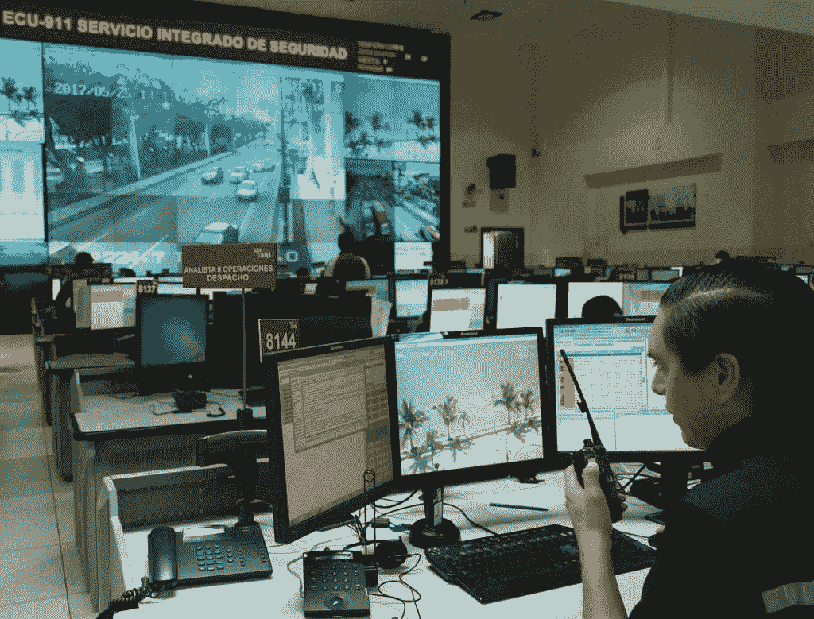
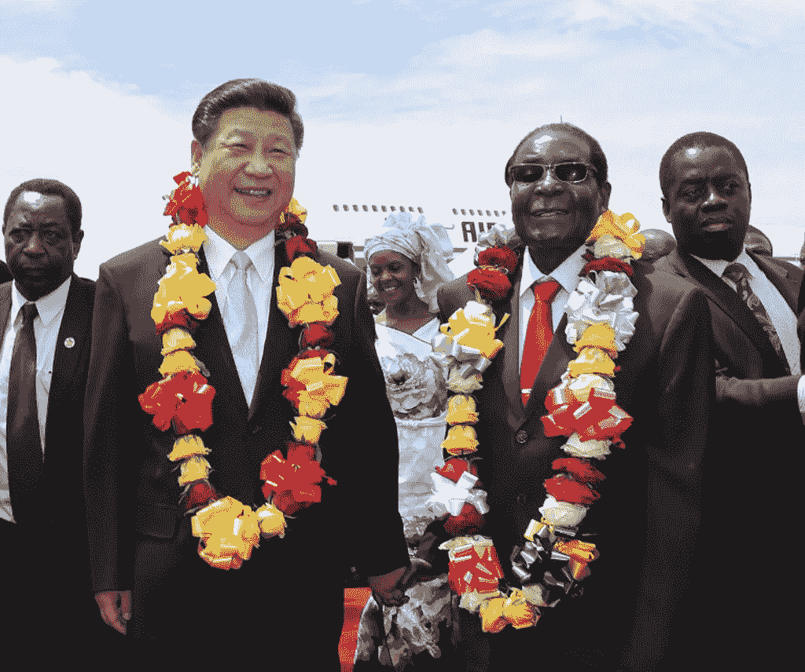

# 中国正在输出其监控技术和压制意识形态

> 原文：<https://medium.datadriveninvestor.com/china-is-exporting-their-surveillance-technology-and-repressive-ideology-5d99aa7e90ae?source=collection_archive---------3----------------------->

(Source: Mary Wolff, Kairos)

中国的监控和面部识别技术可以说是世界上最先进的。中国政府已经制定了计划，将这些技术作为其新生的社会信用体系的支柱来实施；一种根据公民的行为对其进行排名的方法，这些行为总是在监控下被观察，并使用面部识别技术进行识别。

然而，这种技术不再仅仅出现在中国，因为中国开始进行国际交易，为世界各地的其他政府安装监控系统。厄瓜多尔是受益于中国监控的国家之一，很快可能会受益于面部识别技术。厄瓜多尔有一个新的监控系统，ECU-911，旨在扩大自动化警务和降低犯罪率。这个价值 2 亿美元的系统几乎完全由中国国家控股的中国对外经济贸易委员会和华为创建，并由中国贷款资助，以换取厄瓜多尔向他们提供主要出口产品:石油。 ECU-911 遍布全国；[超过 4300 个摄像头悬挂在屋顶和电线杆上，向指挥中心反馈，指挥中心有数千名员工监控录像。](https://www.newsmax.com/evanellis/china-surveillance-latin-america-cameras/2019/04/12/id/911484/)

 [## 准备在 2019 年改变世界的技术-数据驱动的投资者

### 很难想象一项技术会像去年的区块链一样受到如此多的关注，但是……

www.datadriveninvestor.com](https://www.datadriveninvestor.com/2019/01/17/the-technologies-poised-to-change-the-world-in-2019/) 

它始于 2008 年奥运会期间一个厄瓜多尔代表团参观北京的监控系统。他们观察到，中国人能够通过 30 万台相机调查 1700 万人。厄瓜多尔人想把这项技术带回他们自己的国家；特别是因为它符合国家安全的新的优先事项。[2011 年 1 月，科雷亚总统将监控列为厄瓜多尔的优先事项。不久之后，厄瓜多尔政府高级官员前往中国，接受适当监控技术的培训，而中国则派遣工程师前往厄瓜多尔，教授他们的同行如何操作新系统。](https://www.nytimes.com/2019/04/24/technology/ecuador-surveillance-cameras-police-government.html)

ECU-911 系统似乎成功地实现了其宣传的降低谋杀率和轻微毒品犯罪的使命，因为随着该系统的建立，犯罪率已经降低。然而，厄瓜多尔公民表示，暴力袭击仍在摄像机下发生，而警方没有任何反应。这可能是因为资源有限。在一个小小的基多警察局，只有大约 30 名警察在执勤。在切换到另一台摄像机之前，他们只花几分钟检查一台摄像机的镜头。这些官员还负责响应紧急电话；比查看监控录像更紧急的事情。由于他们只花几分钟的时间回顾每一段录像，所以他们不太可能在镜头前捕捉到犯罪行为，所以很多人会看不到。

An ECU-911 Station in the town of Samborondón (Source: *Juana von Buchwald, El Universo****)***

此外，该系统的资源正被转移从阻止犯罪，而不是[被用于塞纳因，厄瓜多尔的主要情报机构，骚扰和跟踪科雷亚政府的对手而闻名。](https://www.nytimes.com/2019/04/24/technology/ecuador-surveillance-cameras-police-government.html?action=click&module=RelatedLinks&pgtype=Article)这类似于中国使用监控手段，通过在社会信用体系中扣分来压制持不同政见者。这方面的一个例子是，厄瓜多尔一名公民兼情报官员公开批评前总统科雷亚及其政府马里奥·帕兹米尼奥。帕兹米尼奥先生经常被秘密警察护送，他们驻扎在他家对面的公寓里。然而，他声称，当 ECU-911 摄像机挂在他家外面的柱子上时，秘密警察的存在减少了。这一点，再加上摄像头可以看到他公寓内的全景，让他可信地怀疑 ECU-911 系统被用来监控科雷亚的政治对手，比如他自己。[纽约时报记者参观了塞纳因的总部，并能够证实他的怀疑，因为他们在屏幕墙](https://www.nytimes.com/2019/04/24/technology/ecuador-surveillance-cameras-police-government.html?action=click&module=RelatedLinks&pgtype=Article)上看到了来自 ECU-911 系统的镜头。帕兹米尼奥先生解释道:

> “ECU-911、情报秘书处以及那些监视和迫害政治或社会行为者的人之间有直接的合作。”

厄瓜多尔不是唯一一个拥有中国建造的监控系统的国家。ECU-911 系统的复制品已经出售给安哥拉、玻利维亚和委内瑞拉。委内瑞拉官员甚至访问了厄瓜多尔，了解他们的新监控系统。就像 2008 年厄瓜多尔人离开北京时的感受一样，他们对这个系统印象深刻，并希望建立一个自己的系统。[他们创造了一个比厄瓜多更大的版本，增加了 30，000 个摄像头，这是由乌戈·查维斯的情报主管带头发起的。](https://www.nytimes.com/2019/04/24/technology/ecuador-surveillance-cameras-police-government.html?action=click&module=RelatedLinks&pgtype=Article)

如今，中国正与全球其他威权、共产主义政府合作建设大规模监控系统，我们有理由担心世界上将出现大规模压制言论自由和隐私的新现实。在他的研究中，公关。博伊西州立大学公共服务学院的 Steven Feldman 发现[中国正在向至少 54 个“世界上政府类型从封闭专制到有缺陷的民主国家”出口配备人工智能的监控技术。](https://www.newsweek.com/china-ai-surveillance-technology-world-1403762)

中国与安装这些技术的国家的政治和经济关系的增长已经很明显。乌拉圭就是一个例子，中国捐赠了 2000 多台监控摄像机用于控制阿根廷和巴西之间的边界。这笔捐款加强了两国的联系，乌拉圭和中国于 2016 年 10 月建立了战略伙伴关系，并于 2018 年 8 月签署了乌拉圭加入中国“一带一路”倡议的谅解备忘录，尽管两国地理距离遥远。鉴于中国专制的共产主义政府和乌拉圭代议制民主之间固有的紧张关系，这种关系是奇特的。事实上，[乌拉圭是拉丁美洲最民主和自由的国家，根据自由之家 2019 年世界自由地图，乌拉圭在世界上排名第八。](https://freedomhouse.org/report/freedom-world/freedom-world-2019/map)可以假定，这种关系一定是互利的。乌拉圭从这笔交易中获得了免费的监控摄像头，但如果不是为了施加政治影响和传播他们的意识形态，中国的动机是什么？

像乌拉圭一样，[津巴布韦也与中国签署了一项协议，将面部识别和先进的监控技术带到他们的国家，并加入他们的一带一路倡议。](https://www.albawaba.com/news/china%E2%80%99s-newest-global-export-policing-dissidents-1139230)与乌拉圭不同，津巴布韦被自由之家列为“不自由”国家，有着独裁主义和侵犯人权的历史。尽管如此，津巴布韦前总统罗伯特·穆加贝在 2015 年被授予孔子和平奖；中国的诺贝尔和平奖。津巴布韦与中国更密切的关系以及他们的新技术创新将很有可能受到这种侵犯人权模式的影响。现在，津巴布韦和其他与中国打交道的国家有可能从他们的新威权伙伴那里得到他们想要的:在他们的社会信用体系中复制中国，或者使用监控录像监视厄瓜多尔等政治异见人士。

Chinese President Xi Jinping being greeted by (then) President Mugabe in Zimbabwe in 2015 (Source: eNCA)

对于中国对其提供监控、人工智能和面部识别技术的国家的政治影响力日益增长的问题，没有简单的行动方针。尽管中国在拉丁美洲和世界其他国家的参与程度令人担忧，但在现阶段，认为这些行动可以撤销似乎是不现实的。相反，更有效的办法是国际社会监督中国与这些国家的关系，并为人工智能、面部识别和监控等新兴技术开发最佳治理实践。这可能是一个国际机构的任务，如联合国。联合国甚至在海牙的联合国区域间犯罪和司法研究所内设立了一个新的单位，负责监测人工智能等新技术对全球安全的威胁。

随着中国的压制性意识形态和技术影响力成为一股全球性力量，全球社会也必须联合起来制定行动和应对方案。需要为新技术和新兴技术制定法规，公司和政府需要对收集数据的人的隐私负责，并且必须在整个过程中保持透明度。诚然，技术创新迅速，新兴市场的扩张速度如此之快，以至于自上而下的缓慢决策过程跟不上。这并不意味着不应该做出努力，并尽快跟上世界上的新技术，如监控、人工智能、面部识别及其对社会的影响。相反，世界领导人需要超越他们，提前规划我们的城市和社会将如何利用新技术运行。