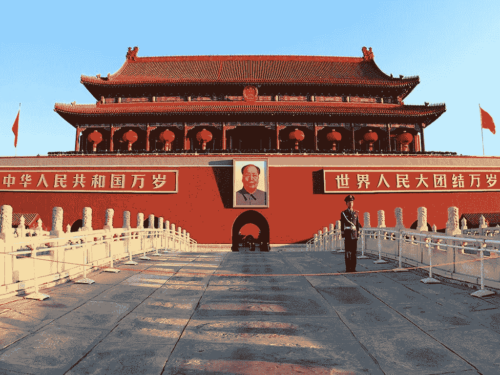
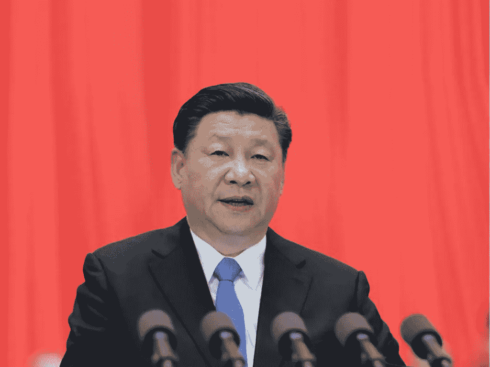
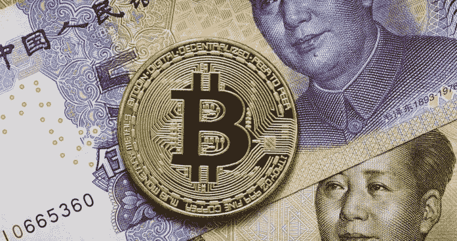

# 中国负债累累&这对加密货币意味着什么

> 原文：<https://medium.datadriveninvestor.com/china-is-in-debt-what-this-means-for-cryptocurrencies-626c580f304e?source=collection_archive---------11----------------------->

Chinese portrait gallery seemed to offer little by way of variety.

这是深夜脱口秀节目中经常重复的一句话——因为美国欠中国人太多，所以中国实际上拥有美国。这个笑话的唯一问题是它已经过时了——不是因为它不再好笑(T2 可能仍然如此)——而是因为中国和美国一样负债累累。中国曾是世界银行，拥有巨额外汇储备，但自 2008 年金融危机以来，其外债规模达到了前所未有的水平。从中央王国的大规模基础设施项目，到非洲和其他发展中国家的大规模发展援助(通常经济效益有限或不明确)，中国一直在大举支出。虽然媒体很快报道了中国如何通过支出增加其全球影响力，但它却迟迟没有意识到大部分支出都是信贷。就像一个购物者，尽管已经刷爆了所有现有的信用卡，仍然继续疯狂购物，中国今天是一个非常负债的国家。

## 橱窗里的那个债务人是多少钱？

官方数据显示，中国的未偿外债为 1.9 万亿美元，对于一个 13 万亿美元的经济体来说，这只是九牛一毛，但这个标题明显低估了中国的实际债务状况和隐藏在表面之下的潜在风险。截至 2018 年第三季度，中国短期债务占 1.9 万亿美元总额的 62%(这是基于中国官方数据)，这意味着今年需要支付或展期 1.2 万亿美元。很有可能，中国人将会延期偿还这笔债务。随着中国经济开始放缓，中国外债的增长速度令人瞠目——2018 年为 14%，自 2017 年初以来为 35%。与中国的外汇储备相比，外债不再是微不足道的，外债占中国 3 万亿美元外汇储备的近三分之二，这一数字自两年多前以来几乎没有变化。换句话说，中国一直在借债，但从一段时间前开始，它似乎停止了储蓄。更令人担忧的是，其中很大一部分债务是短期债务，从 2016 年 3 月的 26%增加到 9 月的 39%。

This is your brain on debt.

And because Chinese economic data has always been more “interpretive” than “reflective,” it’s true debt load may be far heavier than admitted. According to a report by Daiwa Capital Markets last August, China’s external debt was estimated at between US$3 trillion to US$3.5 trillion. With other analysts estimating the figure to be between US$4 trillion to US$4.5 trillion. Part of the reason for such variance in estimations is that China also borrowed through financial centers such as Hong Kong, New York and islands in the Caribbean, none of which are considered the pinnacles of transparency.

To make matters worse, Chinese companies raced to borrow in dollars when there was a 3% to 5% spread between Chinese and U.S. interest rates and when it was widely assumed that the yuan would continue to strengthen. Even Chinese Bitcoin traders started to deal in yuan, convinced that their bet would pay off. Borrowing offshore became cheaper for Chinese companies and offered the prospect of likely currency gains. Many of these companies invested in capital stock and production stock and inventory, anticipating renewed growth. But since the hawkish Jerome Powell moved into the Federal Reserve, the spread in official short-term yields has evaporated to almost zero and the yuan has been battered against a rising dollar, buoyed by rising interest rates. For many Chinese companies today, the headwinds of a U.S.-China trade war, slowing domestic and global consumption and a depreciating yuan in the face of dollar-denominated debt means that refinancing their loans has become not just difficult, but risky to boot. Against this backdrop, China’s central bank has moved in to shore up some of the largest state-owned enterprises, pouring liquidity into these systemically and strategically important enterprises, but at the same time putting further downward pressure on the yuan.

Chinese President with a penchant for microphones, Xi Jinping.

And at a time when China should be tightening its belt, it’s been instead spending billions on a spectacular belt. Chinese President Xi Jinping’s Belt and Road Initiative — an ambitious (and extremely pricey) transport corridor from China, across the continents that China is attached to, has been borrowing dollars on international markets, lending the greenbacks around the world for everything from ports in Sri Lanka to industrial parks in Ethiopia. And given the patchy credit history of many of the countries that China has lent to (in an effort to shore up its global influence), China has not been reducing the risk of its lending, but actually gearing it upwards.

随着 2019 年和 2020 年成为中国偿还债务的高峰年，中国面临美元融资压力。在从中国人民银行的外汇储备中提款和在国际市场上购买美元的腹背受敌之间，中国只有糟糕的选择。在你说“危机”之前，中国在香港只有 6170 亿元人民币(900 亿美元)的离岸存款可以用来购买美元，这个数字随着人民币贬值而稳步减少。中国也不可能强迫企业将债务调回国内，因为这将给人民币带来更大的下行压力。

在很长一段时间里，中国被描绘成节俭的国家，而中国人则被描绘成储蓄者，而美国人则宁愿用自己的最后一毛钱借钱来挥霍，而不是储蓄。然而今天，事实正好相反。美国家庭(很大程度上要感谢 2008 年的金融危机)比以往任何时候都更加资本化。银行监管意味着美国金融机构现在比以往任何时候都更强大，美国人今天的储蓄远远超过 2008 年之前的水平。相比之下，强大的中国政府放任影子银行业横行，押注于世界会认为中国外债水平低、外汇储备多。然而在现实中，自 2017 年初以来，中国的外债平均每季度增加 700 亿美元，随着中国和全球经济增长预计放缓，北京不太可能放缓债务热潮，尽管它几乎承担不起增加债务的代价。

Coming soon to a developing country near you — Chinese investment!

北京不得不继续借债的主要原因之一是它与中国人民的默契——只要中国共产党继续提供美好生活，他们就不会走上街头。但对于夹在中间的数百万中国工人来说，这种美好生活越来越难以实现。在中国的工业中心地区，劳资纠纷和纠纷变得越来越频繁，拖欠工资也是如此。作为回应，北京方面一直在安排工人参与从肯尼亚到阿塞拜疆的项目，修建铁路、工业园区、工厂以及其他一切。但已经有数十名中国富人偷偷将资金转移到海外，主要是美元和其他货币，但也有少量的比特币、房地产、艺术品和其他收藏品，所有这些都是为了确保在不可避免的情况下，他们在海外有足够的安全。

一位要求匿名的中国南方工业城市深圳的比特币交易商表示，

> “去年我的生意很糟糕，但到了 11 月，事情真的开始好转，2018 年最后两个月(对比特币的)需求可能超过了 2018 年前六个月。”

对比特币区块链的快速浏览似乎支持了这位中国交易员的观察。尽管加密货币交易所(其中大多数都有了解客户的要求)的交易在 2018 年大幅下降，但比特币区块链的比特币交易量实际上有所增加——这支持了一个理论，即比特币的大部分交易是在交易所外和场外进行的，由个人中介提供便利。

Mao Zedong remained unimpressed by new coinage.

中国人早已习惯了场外比特币交易。自 2017 年以来，加密货币交易所在中国被禁止，甚至在禁令颁布之前，中国比特币交易者更喜欢在场外交易，而不是在交易所交易，一些买家认为与交易对手的个人关系是信任他们的关键。在一个“关系”在做成事情时仍然非常重要的国家，难怪交易对手更喜欢在交易所外交易比特币。除了个人接触，场外交易也要谨慎得多，不太可能引起北京方面的愤怒。中国政府长期以来对 BTC 恨之入骨，因为它挫败了政府制定的资本管制，模糊了价值转移，并规避了经济控制结构。

过去几个月比特币的相对稳定性(在 4000 美元左右徘徊)也有助于其成为中国公民促进资本外逃的一种手段。但在你开始再次大举押注比特币之前，中国人重新进入比特币的部分原因是它的相对稳定性。此外，中国人购买比特币并不是为了“hodl”这种数字资产，相反，它只是一个促进最终购买美元的渠道，这给比特币美元升值带来了下行压力。

对中国人来说，比特币(至少目前如此)是达到目的的手段，而不是目的本身。有迹象表明，人民币将继续面临压力，更严格的资本管制的前景最近变得定期执行(此前人们观察到的违反比执行更多)，比特币突然成为一个可行的替代选择。再加上大多数中国人已经习惯于处理数字支付(通过微信支付和支付宝)，不难看出为什么中国人在紧要关头会愿意适应比特币来满足自己的需求。中国人总是适应性强，鉴于他们动荡的历史，适应性是生存能力的同义词，比特币或加密货币只是他们庞大工具包中的另一个工具，以确保他们的存在永久化。