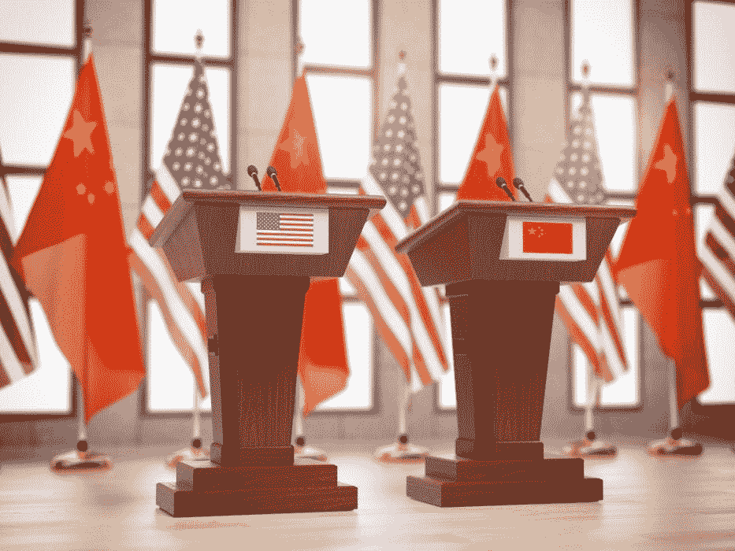
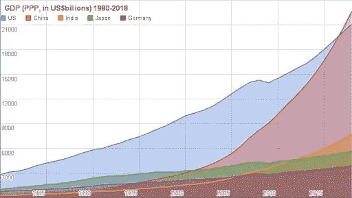
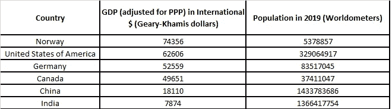

# China Must Economically Surpass America

> 原文：<https://medium.datadriveninvestor.com/china-must-economically-surpass-america-29c7fd9ee2b?source=collection_archive---------5----------------------->

If our goal is for every person on the planet to live well, we should encourage less developed countries to increase their citizen’s purchasing power.

For the longest time, the West has looked at China’s economic development as a threat to the Western way of life. China has 4.3 times more population than the United States of America, so they have the potential to surpass us in the sheer amount of consumption, therefore it is only a question of time before China produces more than the USA. The main concern over this isn’t because China’s economy is growing faster than America’s but because China is led by a “forever-term” socialist political party. We fear a quasi-dictatorial ruler in President Xi Jinping will have way too much influence over the global economy at that stage.

I admit this is a concern. But if we set aside political ideologies for a moment, and think of the people living on the planet, most of the world’s population, including the Chinese, have been living in economic starvation compared to Europe and North America.

 [## Doing Business in China: How to optimize your operations | Data Driven Investor

### China is a popular business hub for both local and foreign companies. Setting a physical presence in a country that…

www.datadriveninvestor.com](https://www.datadriveninvestor.com/2019/03/17/doing-business-in-china-how-to-optimize-your-operations/) 

The point is everyone in the world wants to have purchasing power and live well. Why would a family in Shanghai deserve less than a family in Detroit? After all, we are all human. We all need to eat healthy food, to sleep and to feel safe. Ideally, every nation in the world should work towards the same GDP per capita (derived from purchasing power parity (PPP)). This GDP per capita number would show the average value of goods that are produced, on average, by citizens of each country. Thus, if purchasing power is roughly the same everywhere in the world, allowing for international trade, every family should be able to acquire what they need no matter where they live.

[**Related Article: How Long Can the U.S. Bull Market Last?**](https://www.datadriveninvestor.com/2019/07/05/how-long-can-the-u-s-bull-market-last/)

This is an ideological wish. But if an idea makes sense and benefits us all, it is worth building towards.

Below is a comparative table of GDP (adjusted for PPP) per capita for a select group of nations [as calculated by the International Monetary Fund in 2018](https://en.wikipedia.org/wiki/List_of_countries_by_GDP_(PPP)_per_capita):

根据世界经济联盟的一份报告，他们预计中国将在 2029 年超越美国，按购买力平价调整后的中国人均 GDP 不到美国的三分之一。这意味着，尽管中国的经济实力将超过美国，但中国个人在全球市场上的购买力仍在下降。事实上，[国际货币基金组织和世界银行都认为中国是世界上最大的经济体](https://datacatalog.worldbank.org/dataset/gdp-ranking-ppp-based)，如果考虑购买力平价的话。你可以使用上面的表格自己计算。把调整后的人均 GDP 乘以人口得出一个 GDP 总量，看哪个国家的数字最高。

鉴于中国和美国的政治差异，这听起来很可怕，但中国正在经济排名上攀升，因为他们在高等教育、基础设施和技术方面的投资比美国多得多。过去几年，中国的经济增长是美国的三倍。或许拥有统一的愿景和投资策略有其好处。中国人民是真正的赢家，我们不应该采取行动来阻碍这一进程。恰恰相反！

尽管有政治因素，我们应该鼓励各国努力实现所有公民的平等购买力。处于有利地位的国家应该帮助提升其他国家经购买力平价调整后的 GDP，使之与自己的 GDP 相匹配。担心宗教狂热、盗版和恐怖主义？增加这些国家人民的购买力，我们会注意到所有这些情况都在急剧减少。吃饱肚子、受过良好教育、有合适的家和公用设施的人不会在公共场所被炸死！这在任何国家、任何种族、任何宗教团体都是如此。

我认为这是一种思维方式，可以帮助我们走向一个更美好、更和平的世界。

我不知道你怎么想，但我觉得在这里生活得很好很不舒服，而其他人只是碰巧出生在其他国家，仍然必须在 2019 年乞讨食物。我不认为国家应该在经济稳定和财富方面竞争。我认为国家之间应该互利合作，为了互利而互相扶持。

我们确保自己拥有所需的最好方法是确保全球其他人也拥有他们所需的东西。我们的世界从未如此紧密相连。我们应该明智一点，像现在这样行事。

如果假以时日，我们达到一个世界上大多数人都有相似购买力的水平，美国将会在中国和印度之后排名第三。这是一个不错的位置。

*原载于 2019 年 9 月 20 日*[*【www.datadriveninvestor.com】*](https://www.datadriveninvestor.com/2019/09/20/china-must-economically-surpass-america/)*。*