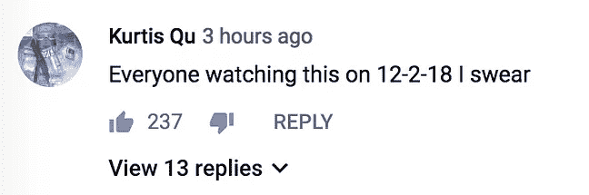
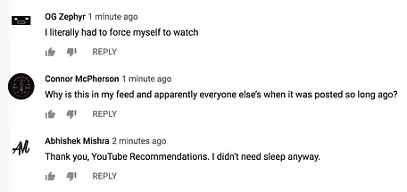
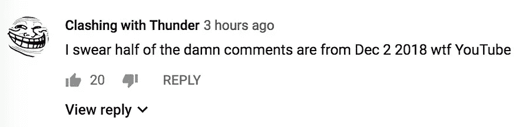
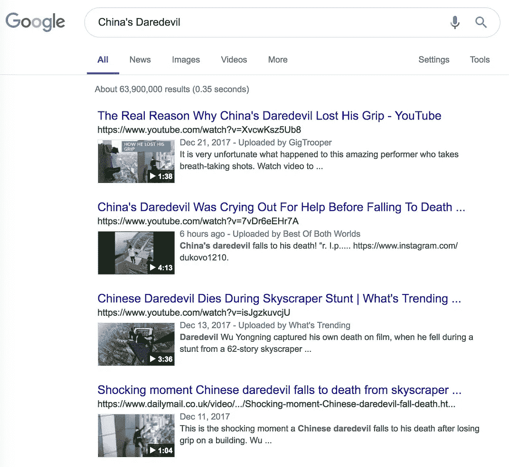
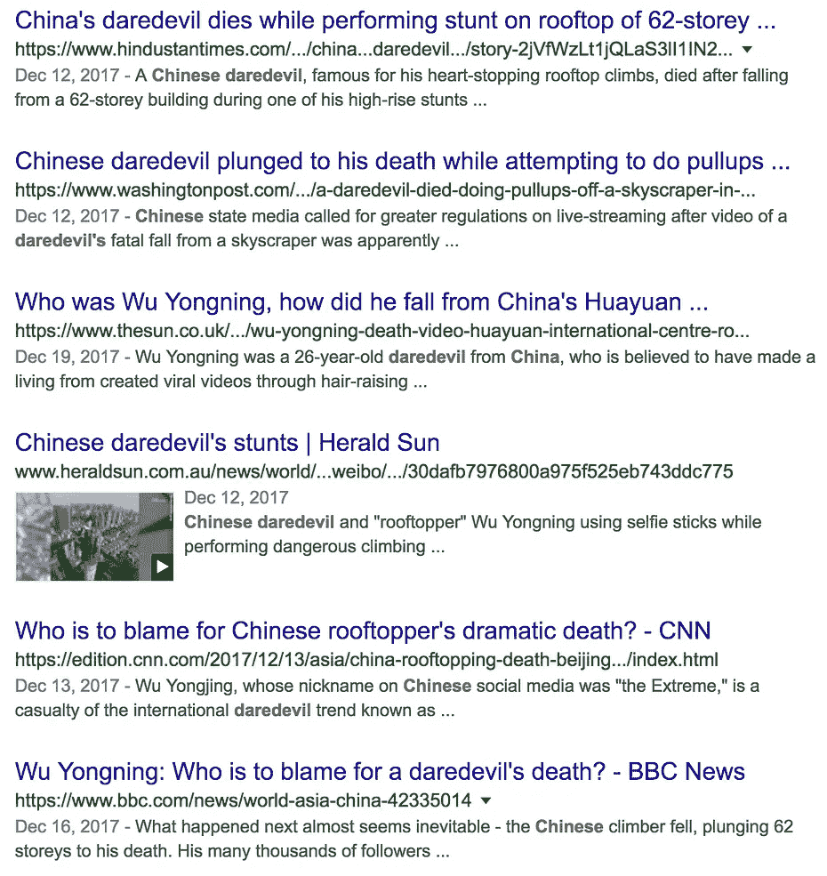

# 中国的超胆侠:算法的暗示艺术。

> 原文：<https://medium.datadriveninvestor.com/chinas-daredevil-the-suggestive-art-of-algorithms-30a8400bab7a?source=collection_archive---------9----------------------->

## “中国的超胆侠”YouTube 推荐的奇特案例。

Photo by [Dennis Kummer](https://unsplash.com/@dekubaum?utm_source=medium&utm_medium=referral) on [Unsplash](https://unsplash.com?utm_source=medium&utm_medium=referral)

## 为什么“中国的超胆侠”视频突然出现在你的 YouTube 推荐中。

《盗梦空间》 ,多么奇妙的电影体验啊，我们许多人看了之后都感到困惑、好奇，怀疑这是不是一场梦。

这一天我一直记得的一个主要观点是*“催眠后暗示”——如果你不熟悉这个观点，或者想了解更多；我会在下面留下一个链接。*

 [## 催眠暗示作用

### 催眠暗示有语言和非语言两种。这篇综述讨论了催眠暗示的类型和催眠暗示的作用。

johnmongiovi.com](http://johnmongiovi.com/pages/hypnotic-suggestion) 

催眠师和魔术师都采用这种技术，但它已经找到了进入更深层次的人工智能算法的方法。

让我们来测试一下，

以下是今天发生的事情，如果你是其中一员(包括我自己、我的同事和我的一群朋友)，正在浏览 YouTube 你可能看过一部关于中国超胆侠的视频推荐。

该视频详细描述了发生在 **2017** 的一场事故，一个人在一场跑酷表演中不幸丧生。

上传于**2017 年 12 月**；通过一个名为“GigTrooper”的频道。

该视频突然开始增加浏览量，尽管在该剪辑的评论部分很明显没有什么活动；直到最近。

有问题的视频，参考下面的评论。

**Source: GigTrooper / YouTube.**

**Comments from the video highlighting the odd recommendation.**

作为一个实验，我也留下了一条评论(后来才删除，因为这件事关系到一个死亡事件)，只是简单地问**“还有谁在看完这个之后搜索了‘跑酷失败’？”。**

回应令人震惊，许多人甚至强调，我们似乎能够读懂彼此的想法——不完全是。

我们没有读懂对方的想法，我们是类似“催眠后暗示”现象的受害者。

这段视频捕捉到的是失败、死亡、恐惧、焦虑、激动，但最重要的是，这是一个可怕的错误行为。

它植入了一个简单的“*暗示*”，因此取决于你的个性暗示程度——你可能会在不久后搜索**“跑酷失败”**。

我的朋友和同事也被迫这样做。

问题来了。没有一个人回应说，“太可怕了！我不想看跑酷失败。那些人死了

我们只是被灌输了一个建议，就像吸毒者一样，我们不得不毫无悔意地去追求它。

我们跟踪了一个连锁反应，仅仅是通过一个看似随机的视频提示发生的。

经过调查，点击进入渠道**“gig trooper”**揭示了渠道的进一步信息，相当耐人寻味；让我们看一看。

**该频道共有 28 次视频上传，最近一次是在两天前。**

[**Source**](https://www.youtube.com/channel/UCSqTvFl6_d31Ocb6sFY5GQQ/videos)**.**

平均观看次数**(不包括中国超胆侠的视频)；**显示视频平均浏览量在 **21 次(最低)**和 **319K(最高)之间。**

中国超胆侠视频的浏览量为**260 万，成为唯一的异常。**

有趣的不仅仅是上传时间和突然的浏览量，该频道只有不到**4000 名订户**，几乎没有高质量的上传。

[Source](https://www.youtube.com/channel/UCSqTvFl6_d31Ocb6sFY5GQQ/about).

频道上的活动不一定是一致的，而且也不能证明突然的峰值是合理的。

那么这里发生了什么，这是因为对中国超胆侠的突然兴趣还是 YouTube 的算法利用了 ***【暗示行为】——****甚至可能是该频道的一种推广策略。*

*值得注意的是，该频道似乎没有一致的 ***【内容主题】***——至少可以说，上传的内容似乎相当随意；我让你来判断。*

*在谷歌上进一步搜索 ***【中国的超胆侠】*** 可以发现，围绕该主题并没有太多的近期活动或发展来证明该视频的浏览量突然飙升是合理的。*

****

***Google Search results for “China’s Daredevil” all seemingly fall into the 2017 timeline.***

*有必要质疑这份建议书的有效性，*

*因为就在一年前的这个月，视频被上传了。*

> *对中国超胆侠的突然兴趣纯粹是巧合吗？*
> 
> *或者*
> 
> *利用“暗示行为”是否只是另一种算法异常？*

*现在，想想这个——如果一个视频建议可以引发这样的反应，那么社交媒体“ ***还会建议*** ”你做什么呢？*

*这里也发表[。](https://www.datadriveninvestor.com/2018/12/02/chinas-daredevil-the-suggestive-art-of-algorithms/)*