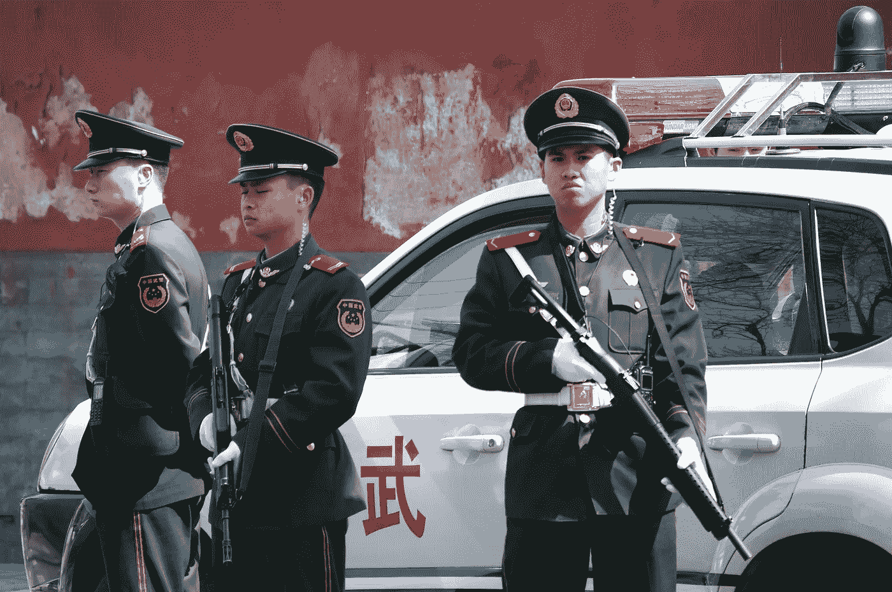
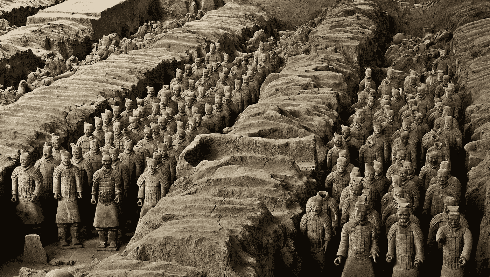
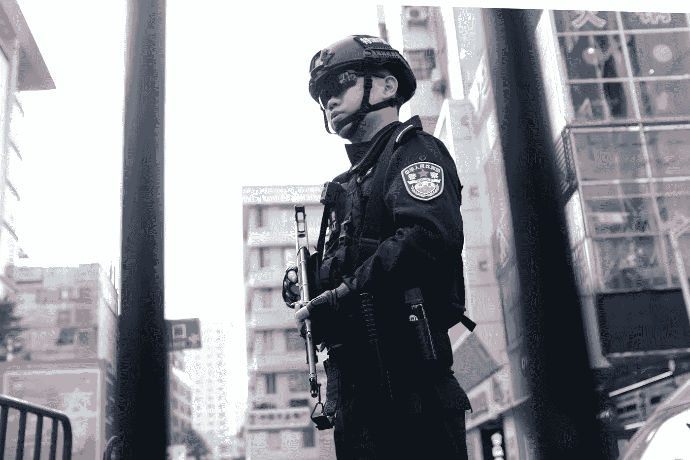

# 中国的影子银行业&加密的机会

> 原文：<https://medium.datadriveninvestor.com/chinas-shadow-banking-sector-crypto-s-opportunity-b727189adb48?source=collection_archive---------4----------------------->

## 越来越多的迹象表明，中国的二级银行面临压力，当地居民开始怀疑，他们的钱放在数字货币中会不会更安全。

Pretty to look at, a nightmare to shovel. (Photo by [Fabian Mardi](https://unsplash.com/@fabianmardi?utm_source=unsplash&utm_medium=referral&utm_content=creditCopyText) on [Unsplash](https://unsplash.com/s/photos/snow?utm_source=unsplash&utm_medium=referral&utm_content=creditCopyText))

1929 年深秋，当一场小雪开始降落在约翰·克雷格的农场时，这是事情将会不合季节的第一个信号。

这个季节的第一场雪提前了整整一个月，这对克雷格来说只是事情将要发生意想不到的转折的第一个信号。当克雷格走进刘易斯顿市中心，去当地银行取款时，门口已经挤满了人，这是事情将要发生奇怪而不幸的转折的又一个迹象。

克雷格不知道的是，他将发现他在当地储蓄所的存款即将被冻结，他正站在美国历史上最严重的银行挤兑的边缘。

对于今天的数百万美国人来说，银行存款不安全是一个陌生的概念。

自从富兰克林·罗斯福总统创建了联邦存款保险公司(FDIC)以来，这句话“就像银行里的钱一样好”，在大萧条后的几代人当中一直被人当真。

在中国并非如此。

## 也许比床垫更安全

直到最近，中国还没有一个功能相当于 FDIC 的机构，但是随着中央王国的二级银行开始出现压力，中国的中央银行，中国人民银行(PBoC)，[于今年 5 月下旬成立了一家存款保险基金管理公司](http://www.chinadaily.com.cn/a/201905/31/WS5cf0802fa3104842260bed19.html)，资本总额为 14 亿美元。

 [## Azbit 旨在连接传统金融和加密货币|数据驱动的投资者

### Azbit 是下一个提供交易平台的加密项目，该平台提供保证金和算法交易。一样多…

www.datadriveninvestor.com](https://www.datadriveninvestor.com/2019/03/20/azbit-aims-to-connect-traditional-finance-and-cryptocurrency/) 

说中国人民银行的联邦存款保险公司资金不足是一种委婉的说法。

虽然很难说到底有多少钱在中国的影子银行部门流动，但就在去年，[估计约有 10 万亿美元](https://www.bloomberg.com/news/articles/2018-11-30/a-guide-to-china-s-9-trillion-shadow-banking-maze-quicktake)可能是潜伏在账簿之外的无声杀手。

这些中国鸡中的一些可能会得到报应。

上个月，又有一家中国银行倒闭，还有两家不得不由中国人民银行纾困。诚然，这些是规模较小的地区性银行，但这也正是大萧条前夕发生的事情。

On the banks of the Bund in China’s financial hub of Shanghai. (Photo by [Yiran Ding](https://unsplash.com/@yiranding?utm_source=unsplash&utm_medium=referral&utm_content=creditCopyText) on [Unsplash](https://unsplash.com/s/photos/china-bank?utm_source=unsplash&utm_medium=referral&utm_content=creditCopyText))

另外两家中国地区性银行的储户忧心忡忡，他们认为床垫是比银行账户更安全的血汗钱存储方式，担心在大规模的银行倒闭中失去存款，于是急忙取出存款。

在世界其他任何地方，这些失败都会导致全国性的金融崩溃恐慌。但是中国不仅仅是世界上的任何一个地方。

北京方面通过对媒体的严格控制，相对成功地遏制了任何潜在的恐慌，而银行业一直在经历一场痛苦但非常必要的清理。

## 银行的警棍

根据一份政府声明，上个月，该国东北工业区的一家银行敦促储户“避免盲目提取现金造成不必要的损失”。

六百多名警察也被派往东北的六个银行分支机构，逮捕被称为“在互联网上公开散布谣言”的人

那些“谣言”是关于这些地区性中资银行的财务健康状况。

中国的经济奇迹，让历史上最多的人摆脱了贫困，是有据可查的。过去几年里，中国面临的下行压力没有得到很好的记录。

随着中国经济增长放缓至近 30 年来的最低水平，越来越多的中国小型银行步履蹒跚，北京方面试图摆脱增长放缓的困境和断裂的金融体系的束缚。

Bank teller was unimpressed by your attempts to make a withdrawal. (Image by [Gaston Laborde](https://pixabay.com/users/glaborde7-998034/?utm_source=link-attribution&utm_medium=referral&utm_campaign=image&utm_content=754567) from [Pixabay](https://pixabay.com/?utm_source=link-attribution&utm_medium=referral&utm_campaign=image&utm_content=754567))

在这种背景下，中国的生活成本上升，工资却跟不上。

越来越多的中国家庭被迫减少支出，将更多收入用于抵押贷款和债务偿还。

但多年来在国内外基础设施和雄心勃勃的项目上的支出，已经让中国的金融体系背负了价值数万亿美元的债务，其中大部分债务流向了非生产性投资或只有在未来几十年才能看到回报的投资。

由于大部分债务都隐藏在账目之外，很难说在广阔的领域里，致命的债务地雷藏在哪里。

## 清理

尽管中国官员目前正试图清理银行系统，但这一过程已经给全国陷入困境的银行敲响了警钟。

随着中国经济以极快的速度增长，中国各银行大举放贷，北京方面利用银行体系作为刺激经济增长的一种方式。

在缺乏监管和监管监督的情况下，中国银行业的发展在很大程度上不受监管，而且势头不减。

今年 9 月，中国央行行长易刚承认，

> "过去几年，一些银行盲目扩张."

银行扩张的一部分也包括故意视而不见的因素，中国各地数百家较小的银行将其贷款重新包装为投资，掩盖关键的财务披露，并将资金贷给信用记录不良或与银行本身有密切个人关系的借款人。

Two years ago, Shuqing Guo, one of China’s top banking regulators pledged to rein in the worst excesses of China’s banking industry.

Line for the bank teller took a lot longer than expected. (Image by [christels](https://pixabay.com/users/christels-3741991/?utm_source=link-attribution&utm_medium=referral&utm_campaign=image&utm_content=1864972) from [Pixabay](https://pixabay.com/?utm_source=link-attribution&utm_medium=referral&utm_campaign=image&utm_content=1864972))

Before long, online lenders that once offered tantalizing returns went out of business and companies started to default on their bonds.

Banks were instructed by regulators to stop hiding bank loans and as the tide receded, it soon became apparent which Chinese banks were swimming without a bathing suit.

And things really started to surface towards May this year. Around the time that the PBoC set up its FDIC equivalent, Chinese regulators seized a bank for the first time in over twenty years.

Baoshang Bank, a little-known bank in northern China, was put into receivership. The bank was once a cog, in a vast network of investments controlled by Jianhua Xiao, a Chinese tycoon that was ensnared in President Xi Jinping’s anti-corruption purge.

Baoshang Bank had made several large loans to other companies within Xiao’s financial empire that were never paid back, yet during this entire time, the bank kept its doors open to depositors.

Then in July, China’s biggest bank, the state-owned Industrial & Commercial Bank of China and two investment firms, had to shore up another embattled lender, the Bank of Jinzhou, which had doled out loans to two of its biggest shareholders, carmaker Hawtai Motor Group and Baota Petrochemical Group, which had also run into financial difficulties.

Just a few weeks later, a unit of China’s sovereign wealth fund had to inject cash into struggling Hengfeng Bank, based in the coastal city of Yantai. Two of Hengfeng Bank’s former chairmen are now under investigation for corruption.

To be sure, Chinese tycoons have long been using banks within their control, as their own personal ATMs. Long-term loans with easy rates and flexible repayment schedules were the norm for these well-banked businessmen.

Chef was frying up some favorable loans. (Image by [Pexels](https://pixabay.com/users/Pexels-2286921/?utm_source=link-attribution&utm_medium=referral&utm_campaign=image&utm_content=1835369) from [Pixabay](https://pixabay.com/?utm_source=link-attribution&utm_medium=referral&utm_campaign=image&utm_content=1835369))

Scores of Chinese tycoons sipping on thousand-dollar bottles of Maotai (a highly-prized grain-based spirit) at lavish business banquets, with such delicacies as shark’s fin and sea cucumber, boasted to fellow tycoons about how they treated banks within their control as their own personal kitties.

And while the Chinese economy was growing at breakneck pace, it was easy to paper over the quality of these soft loans that Chinese tycoons were giving themselves.

But as economic growth started to slow in China and in the throes of the current trade war with the United States, many of these loans are now starting to falter as banks struggle.

Ordinary savers are now starting to notice and have begun wondering about the safety of their own deposits.

## No Good Answer

Yet the harsh crackdown that Chinese authorities are pursuing, to quell rumors about the viability of Chinese banks, may have unintended consequences.

Early last month, Chinese police said they had arrested a young woman who had spread rumors online that Yichuan Rural Commercial Bank, a tiny lender in the central province of Henan, was going bankrupt.

Soon after, scores of depositors were seen lining up at the bank’s branches to withdraw their money.

Despite repeated statements by the bank as well as Chinese regulators confirming that the bank was solvent, on October 30, authorities announced an investigation into the bank’s former chairman Fengli Kang.

When rumors circled around Yingkou Coastal Bank, a lender in China’s northeastern industrial heartland, the police were called in yet again and swarmed depositors at the bank’s branches, who were looking to withdraw their deposits.

Some issues with making a withdrawal. (Photo by [Vincent Chan](https://unsplash.com/@okcdz?utm_source=unsplash&utm_medium=referral&utm_content=creditCopyText) on [Unsplash](https://unsplash.com/s/photos/china-police?utm_source=unsplash&utm_medium=referral&utm_content=creditCopyText))

But police in riot gear can only do so much to quell bank runs.

China is caught in a Catch-22, where harsh crackdown on criticism of banks, can be viewed as a tacit admittance that there is indeed something wrong.

Even as authorities are looking for ways to tighten rules on lending, slowing economic growth has meant that they have also had to make it easier for banks to raise money, including allowing them to issue perpetual bonds (bonds which typically have no maturity dates) and preferred stock, a type of equity very similar to debt.

Last month [*Bloomberg News*](https://www.bloomberg.com/news/articles/2019-11-11/china-s-shifting-approach-to-bank-bailouts-quicktake) further reported that Chinese regulators are mulling a bailout package that would bolster smaller lenders, but whether or not such a move would shore up confidence is harder to say.

Against this backdrop, more tech-savvy Chinese have been pouring into cryptocurrencies, both as a way to diversify out of the Chinese yuan, but also as a way to avoid bank deposits altogether.

According to a 26-year-old computer scientist who lives in the port city of Dalian, in China’s heavily industrialized northeast seaboard,

> “I’ve been buying (crypto) via OTC and putting a lot of it in cold wallets, I’ve been trying to teach my parents about it as well and while they are still wary, they are slowly coming round to it.”

The concept of digital money is not new to the Chinese who have used ubiquitous digital payment systems such as Alipay and WeChat Pay for years.

Alipay and WeChat Pay are used across age groups and socio-economic backgrounds, but the tech companies which provide the payment service are not banks.

Which is why weakness in China’s banking sector may cause some, even those who are in the older generation, to re-evaluate the safety of putting *all* of their money into Chinese banks.

And as smaller banks across China have come under pressure, local interest in cryptocurrencies has surged, which is why Chinese regulators, following President Xi Jinping’s pronouncement on how blockchain technology is a key technology for China to pursue, have had to tighten the noose on cryptocurrency companies.

Beijing cannot be seen to be condoning cryptocurrencies, at a time when local banks are already coming under increasing pressure from both depositors and faltering loans.

一些中国人已经开始担心，如果一场壮观的银行倒闭波及整个金融体系，他们将无法获得银行存款。

但中国监管机构对银行的救助可能会产生完全相反的效果，因为这可能会向储户发出信号，表明中国的银行确实存在严重问题，并可能导致意外的银行挤兑。

在接受《巴伦周刊》采访时，前财政部长亨利·保尔森就 2008 年金融危机阐述了这一点。

> “他(巴尼·弗兰克)说，我们无法让国会采取行动，除非他们确信雷曼兄弟将会破产，而且它的破产将严重损害我们的经济。当然，拉响警报会导致公司立即倒闭。”

换句话说，中国政府宣布将支持其银行，这将向储户发出一个信号，即 T2 确实出了问题——没坏的东西不能修补。

这就和航空公司的飞行员不会通过个人广播系统宣布，“女士们，先生们，我是你的飞行员。我只想告诉大家，这里一切都很顺利，没有必要恐慌。”

仅仅宣布没有必要恐慌就能很快引发恐慌。

这就是为什么中国在这个特殊时刻打击加密货币并非巧合。

虽然加密货币可能不会带来任何收益，但中国人知道，它们至少在数字上相当于塞满钱的床垫——前提是你管理好自己的私人钱包——里面的东西都是你的。