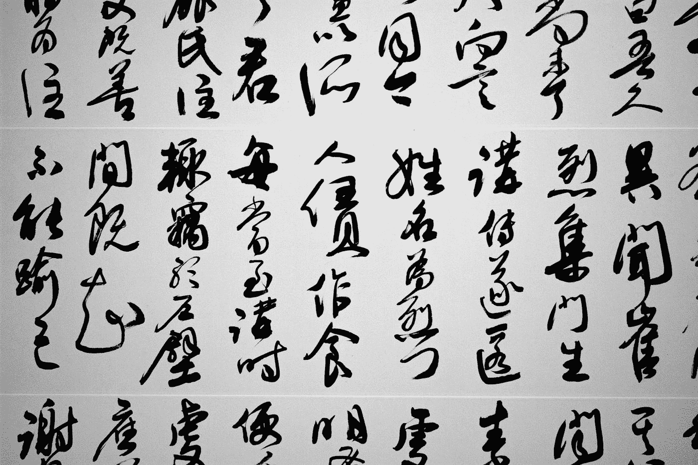
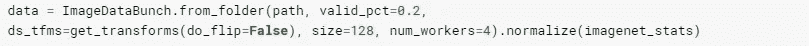
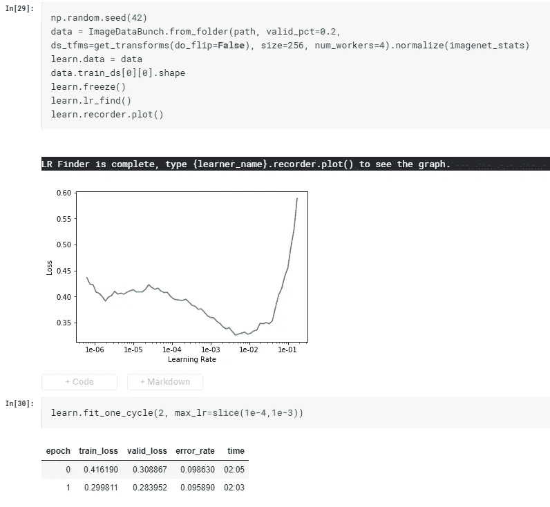
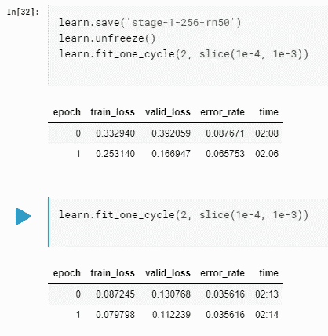

# 我如何训练计算机学习书法风格:第二部分

> 原文：<https://medium.datadriveninvestor.com/chinese-calligraphy-classifier-fine-tuning-cbfbf0e304d8?source=collection_archive---------2----------------------->

## 用 fast.ai 库构建深度学习模型:渐进式调整大小

Photo by [Kon Karampelas](https://unsplash.com/@konkarampelas?utm_source=medium&utm_medium=referral) on [Unsplash](https://unsplash.com?utm_source=medium&utm_medium=referral)

我想为我的[程序员实用深度学习](https://course.fast.ai/) fast.ai 课程完成/润色的项目发布一系列帖子。由于我在 ML/DL 领域相当生疏，我希望我所面临和克服的挑战对其他经历相同旅程的人有价值。

型号[1](https://medium.com/@lymenlee/deep-learning-models-by-fast-ai-library-c1cccc13e2b3)[1a](https://medium.com/datadriveninvestor/chinese-calligraphy-classifier-fine-tuning-cbfbf0e304d8)

## 让它变得更好

在我的[上一篇](https://medium.com/datadriveninvestor/deep-learning-models-by-fast-ai-library-c1cccc13e2b3)文章中，我解释了我使用 fast.ai 库解决这个图像识别问题的方法。正如你所看到的，一旦我们将数据降低到 fast.ai `ImageDataBunch`，代码相当简单，我们实现了 90%的准确率，考虑到我们数据的质量(从谷歌/百度搜索中随机下载，没有进行太多数据清理)，这是非常令人印象深刻的。现在，我们能做得更好吗？

 [## DDI 编辑推荐:5 本让你从新手变成专家的机器学习书籍|数据驱动…

### 机器学习行业的蓬勃发展重新引起了人们对人工智能的兴趣

www.datadriveninvestor.com](https://www.datadriveninvestor.com/2019/03/03/editors-pick-5-machine-learning-books/) 

> 事实证明，我们可以！

怎么会？我们之前的渠道中有两件事可以改进:

1.  图像预处理调整
2.  模型训练微调。

让我们潜入更深的地方。

## 图像预处理调整

R 还记得当我们将数据导入 fast.ai `ImageDataBunch`时，我们使用了以下代码:

请注意，在我们的图像预处理，即`get_transforms`功能，我们没有给它任何参数，只是使用了默认值。默认情况下，将尝试应用各种图像增强技术来更好地概化图像数据集，如翻转、扭曲、旋转、裁剪等。这很好，很快。人工智能库帮助我们为大多数情况做了“最佳实践”。但是在我们的例子中，一些默认可能不那么有效。

最大的一个是‘翻转’。因为我们是在尝试对书法艺术品进行分类，而在现实生活中，它绝不会随意左右或上下翻转。因此，让图像随机翻转不会反映现实生活中的情况，因此不会有助于我们的训练准确性。

为了解决这个问题，我们对代码进行了如下调整:

请注意，我们将`do_flip=False`传递给了`get_transforms`函数，从而告诉模块在导入过程中不要随意翻转我们的图像。

## 模型训练微调

N 现在图像预处理完成。我们可以重新构建模型训练，以避免过度拟合并实现更好的准确性。fast.ai [程序员实用深度学习](https://course.fast.ai/)课程[第三课](https://course.fast.ai/videos/?lesson=3)中介绍了这种方法。

> 我们不是直接从 256x256 的图像尺寸训练模型，而是逐渐放大图像尺寸。更具体地说，我们将首先训练一个 CNN 来对 128x128 大小的图像进行分类，一旦我们达到最佳精度，我们将使用迁移学习并继续在相同的数据集上训练模型，除了 256x256 图像大小。我们将 128×128 图像尺寸训练称为“阶段 1 ”,将 256×256 图像尺寸训练称为“阶段 2”

在我们的第一阶段训练(我的[上一篇文章](https://medium.com/datadriveninvestor/deep-learning-models-by-fast-ai-library-c1cccc13e2b3)离开的地方)之后，我们有一个训练过的 CNN 模型，叫做`learn`，它是“不自由的”,达到了大约 85%的准确率。

Accuracy 86% after training a 128x128 image size CNN.

现在我们需要再次冻结网络，创建一个 256x256 图像大小的新`ImageDataBunch`，并重新开始相同的训练过程。

在找到最佳学习率后，我们用另外两个时期训练 CNN，已经达到 91%的准确率。然后我们会做同样的“解冻”并继续训练。

解冻后，我们再用 4 个时期训练模型，准确率突破到 **96.5%** 。观察到`valudation_loss`已经超过`training_loss`，提示过度拟合的迹象。我们将在这里停止训练。

这种简单的技术也被来自 [fast.ai](https://www.fast.ai/2018/08/10/fastai-diu-imagenet/) 的[杰瑞米·霍华德](https://medium.com/u/34ab754f8c5e?source=post_page-----cbfbf0e304d8--------------------------------)称为**渐进调整大小**，并帮助他的团队[在 *DAWNBench*](https://www.theverge.com/2018/5/7/17316010/fast-ai-speed-test-stanford-dawnbench-google-intel) *的一场速度训练比赛中击败了谷歌，训练 IMAGGNET 的时间长达* ***18*** *分钟和****【40 美元*** *亚马逊*

## 把它包起来

Photo by [Franki Chamaki](https://unsplash.com/@franki?utm_source=medium&utm_medium=referral) on [Unsplash](https://unsplash.com?utm_source=medium&utm_medium=referral)

通过两个简单的调整，我们成功地将精确度提高了 6.5%左右，进入了最先进的结果范围。主要要点:

1.  在进行图像预处理时，确保处理后的图像仍然能够正确地代表真实生活中的数据。
2.  逐渐增加训练图像大小的原因是:通过给被训练的模型一个 4 倍大的数据集，实际上意味着给模型一个全新的数据来训练，避免过度拟合。
3.  从较小尺寸的图像开始训练也有利于更快的训练和更快的实验。这通常会带来更好的结果。

中国书法分类器到此为止。希望看完这两篇文章，你也学到了一二。我们试图获得一些特定书法家的“真”和“假”作品，看看我们是否可以建立一个“真或假”的分类器。这将是非常有趣和非常有价值的下一步。如果我们取得了真正的进展，我会回来报道并写更多的文章。但在那之前，我们将继续把这个训练有素的模型投入生产，并围绕它开发一个网络应用。敬请关注。

欢迎任何反馈或建设性的批评。你可以在推特上找到我，或者在我的博客网站上找到我，wayofnumbers.com。

如果你没有看过我关于这个话题的第一篇文章，这里有链接:

 [## 我如何训练计算机学习书法风格:第一部分

### 用 fast.ai 库构建深度学习模型

medium.com](https://medium.com/datadriveninvestor/deep-learning-models-by-fast-ai-library-c1cccc13e2b3)