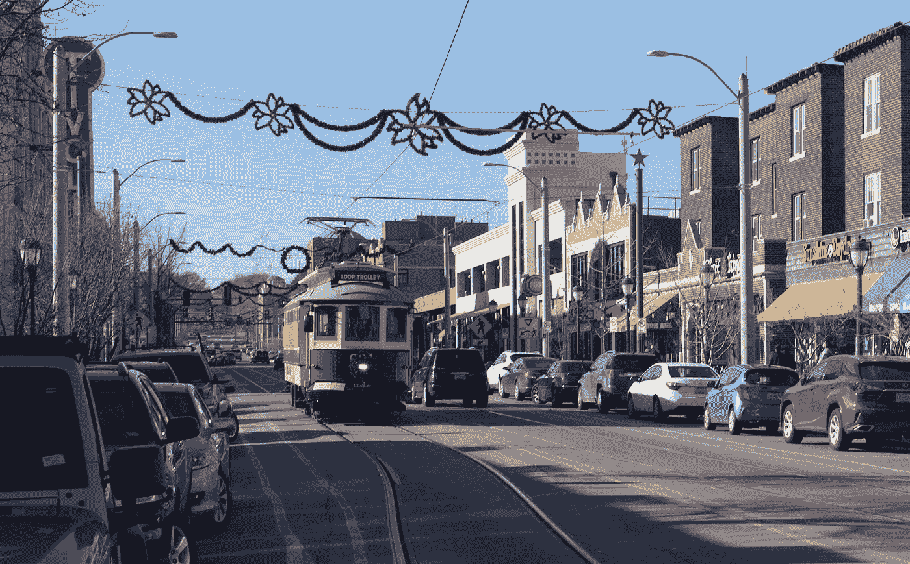
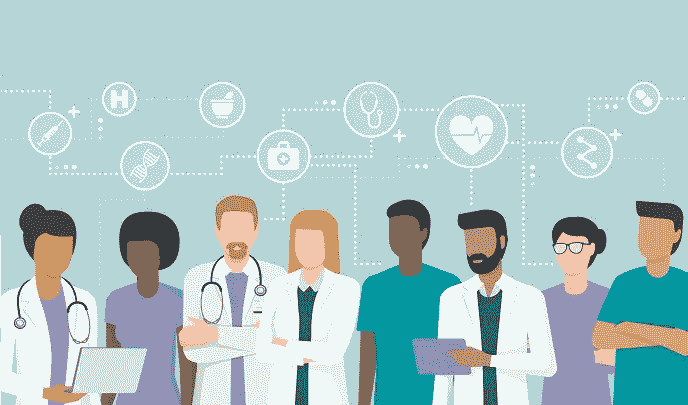
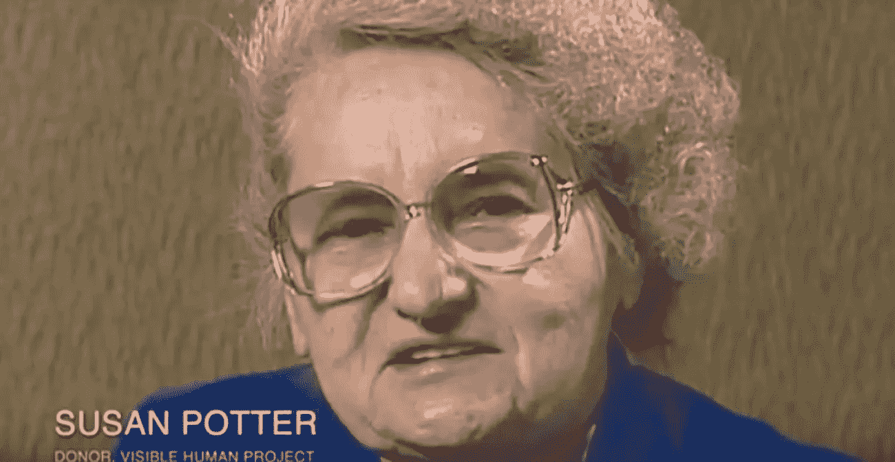
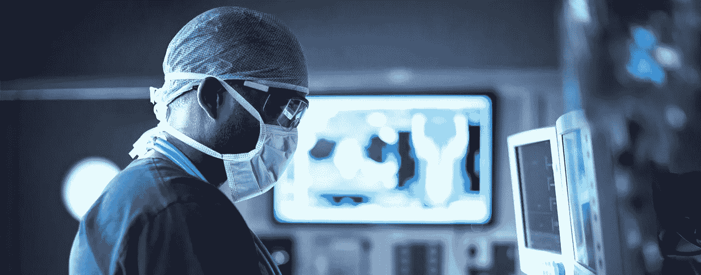
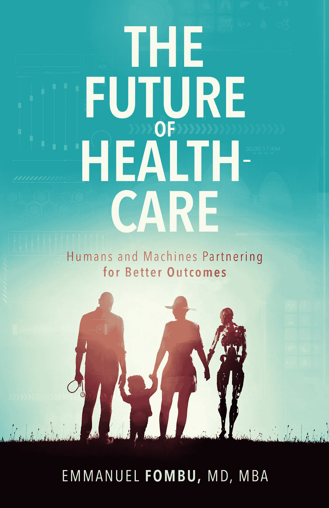

# 中国糖尿病、德尔玛大道和苏珊·波特

> 原文：<https://medium.datadriveninvestor.com/chinese-diabetes-the-delmar-boulevard-and-susan-potter-ae1dccbbda25?source=collection_archive---------13----------------------->

> “你的饮食，加上环境和生活方式因素，会像你的基因一样导致疾病。”
> 
> *——伊曼纽尔·丰布*

有一个问题，我们大多数人在看医生时都会被问到。那个问题是:“你有家族病史吗？”

甚至当我们和朋友交谈时，他们也会问我们同样的问题。假设你正经历胸痛或癌症恐慌，人们问的第一个问题是你是否有这种特殊情况的家族史。

 [## 大笔资金和尖端技术:人工智能/人工智能投资将如何革新医疗保健…

### 在过去几年人工智能(AI)和机器学习(ML)的显著发展中…

www.datadriveninvestor.com](https://www.datadriveninvestor.com/2018/03/22/big-money-and-cutting-edge-technology-how-investment-in-ai-ml-will-revolutionize-the-healthcare-industry/) 

这是我一直在思考的事情，即使作为一名医生，当我被要求问我的病人这个问题时。我开始问自己，“这个问题和任何特定病人的健康有什么关系？”

我的祖母出生在非洲中部一个美丽的国家，叫喀麦隆。她成长在一个女性不一定受教育的时代。喀麦隆以生产高质量的雪茄包装纸而闻名，我的祖母喜欢充分利用它们。我记得有时候我躲在房子后面，看着她抽烟，同时留意着我妈妈。我不得不看着她，因为她不想让我妈妈知道。

不幸的是，她十多年前在华盛顿 DC 地区去世了。她患有高血压、糖尿病和心力衰竭，所以如果我妈妈去看医生，医生问她是否有糖尿病家族史，她必须说有。

但是对比一下我妈妈。她现在已经退休了，但是她一生都很活跃，所以她经常锻炼，不像我的祖母。她接受了博士学位的教育，因此大部分时间都在西方长大。尽管退休了，她仍然起床去跑步(实际上比我更活跃)，她没有糖尿病和高血压。所以对她来说，问她是否有家族病史有什么意义呢？

导致疾病的原因不仅仅是写入我们 DNA 和基因的东西。为了突出这一点，你可以看看中国过去四十年的糖尿病发病率。它们从 1980 年的 0.67%上升到 1994 年的 2.50%，2002 年的 5.50%和 2011 年的 9.70%。在那段时间里，我们的集体 DNA 没有改变，那么是什么改变了呢？

在中国，我们可以追溯到随着中国变得越来越富裕，越来越多的人获得垃圾食品和加工食品所发生的事情。你的饮食，加上环境和生活方式因素，会像你的基因一样导致疾病。

# 德尔玛大道

这也不仅仅发生在中国。让我们把它带回美国，更确切地说，带回美丽的密苏里州圣路易斯市。那里有一条名为德尔玛大道的街道，沿着种族和社会经济的界线将这座城市从东到西分割开来。在这条线以北，大部分是非裔美国人，与这条线以南相比，人们受教育程度较低，家庭收入较低。这条线以北的糖尿病和癌症发病率明显更高，这有助于证明社会经济决定因素在我们的医疗保健中发挥着重要作用，不仅仅是我们的基因。我在这里说的是完全相同的城市，但差异是相当惊人的。

即使是同卵双胞胎也有不同的表达方式，尤其是长大后。这意味着你可以有两个双胞胎，他们暴露在不同的环境因素和不同的食物中。我们可以有一个肥胖的人和一个不肥胖的人，这适用于从身高到压力影响的所有事情。

你的基因不是注定的。仅仅因为有患某种特定疾病的风险，并不意味着你会患上这种疾病。还有许多其他因素在起作用。我们已经知道这一点，但尽管如此，当我们设计临床试验时，我们在设计时考虑了这个完美的世界，有完美的纳入和排除标准。

如果你参与了这个领域，那么你可能已经听到了现实世界循证临床试验的呼声。控制药品使用权的付款人转过身来说，“如果你只是在这个受控的环境中测试了你的产品，你想让它在现实世界中使用，你需要向我展示它在现实世界中是有效的。”

这就是为什么我对数字健康技术如此兴奋，比如可以在现实世界中捕捉数据的传感器和可穿戴技术。技术是我们唯一能获取这些数据的东西。否则，我们将被迫依赖这些在完美世界中进行的测试。

最重要的是，如果我们能在真实世界的环境中获取数据，那么我们就能制定程序来帮助控制消极的行为模式。如果我们能控制这种行为，我们就能看到更好的病人结果。

# 反应医学

今天，我们的医疗保健系统专注于一种叫做反应医学的东西。发生的情况是，患者出现疾病症状，他们寻求治疗，然后他们希望好转。

这种方法的问题是浪费和低效，事实上这可能是我们当前医疗保健系统高成本的很大一部分原因。我提倡预测医学的新时代，它使用我们今天可以利用的所有技术，从电子健康记录(EHRs)的数据到可穿戴设备的睡眠数据。最终，当我们有足够的数据时，我们可以提前预测疾病，并在它们成为问题之前拦截或治愈它们。

人工智能和其他互联设备可以让我们作为一个行业变得更加积极主动，并让医疗保健远离疾病护理。今天，我们称人们为病人，因为他们已经生病了。我希望看到这样一个世界，人们将医疗保健视为日常事务，而不是等到生病。医生不应该只是坐在办公室里等着治疗病人。他们应该利用他们所拥有的知识来教育大众如何保持健康，因为这是未来医疗保健的工作方式。

今天，我们知道医疗保健有多贵，人们的寿命只会越来越长。如果我们让人们活得更长，病得更重，我们目前的医疗保健系统将不再是可持续的——如果它甚至可以说是可持续的话。

# 苏珊·波特

在《自然》杂志的一月版上，聚焦于医学的未来，他们谈到了一个叫苏珊·波特的女人，她把自己的身体捐献给了科学。她去世后，她的身体被数字化，以便世界各地的医学生可以根据她的身体扫描研究解剖学和生理学。

有人把自己的身体捐献给科学并不新鲜。数百年前，人们就在捐献他们的身体进行解剖，我们中的许多人都是器官捐献者(如果你不是，也许你应该是)。新的概念是我希望在未来几年看到更多的:捐赠我们的数据。

我以自己为例。我不知道我祖母的全部健康史。我没有我妈妈，我爸爸和我爷爷的医疗记录。我连自己完整的病史都没有。如果有人问我之前提出的那个问题(你有什么糖尿病或高血压家族史？)，我不知道我奶奶的糖尿病或者高血压是遗传的还是环境生活方式因素造成的。

如果我们将这些数据捐赠给医学科学变得司空见惯，我们将开始拥有在一段时间内收集的数据，以便我们可以正确地跟踪疾病历史。我们将第一次能够建立模型来预测疾病并了解风险因素。

这个概念可以归结为创造一个数字版的我们。就我而言，我在几个月前开始了这个过程，当时我花钱进行了基因组测序。几天前我拿到了结果，稍后我会分享这些结果。我发现的一个关键问题是，我有一种基因，这种基因使我患高血压的风险更高。我也很“幸运”,成为地球上少数几个拥有可以从尿液中嗅出芦笋味道的基因的人之一。一项我从来不知道自己拥有的重要生活技能。

# 预防医学

现在我知道我有更高的高血压风险，我正在改变我的生活方式。例如，今天我午餐想吃油炸的东西，但是我选择了沙拉。我希望你们都能和我一起创造数字版的自己。你可以运行不同的模拟，更多地了解你的身体是如何工作的。例如，你可以对自己的基因组进行测序，或者使用 Fitbit、Garmin 或 Apple Watch。甚至你的智能手机也可以跟踪你的活动和睡眠，它们可以帮助你更好地了解对你来说最好的选择。

例如，我想知道如果我今天去散步，或者昨晚喝了酒，会对我的健康产生什么影响。如果我吃一些炸鸡或练习瑜伽，我想看看它如何实时增加或减少我的疾病风险。有了我们可以利用的所有技术，我们应该能够提前预测疾病，并因此改变我们的生活方式。

这就是我所说的预防性药物的含义。开放电子病历将是一个开始，因为将我们的数据汇集在一起可以让我们活得更长，更健康，这是由预测医学驱动的。我们还需要更多的人来给自己排序，因为对数据库做出贡献的人越多，我们就能对整个人类有更多的了解。

生活是一次旅行，所以虽然我们生来就有一套特定的基因，但这只是提供了一个基线。如果你给自己排序，并了解你的风险因素是什么，那么你就可以开始看到你的决定如何将你置于更高和更低的风险中。这是一个持续的过程，如果我们想活得更长更健康，这就是我们应该的生活方式。

# 想了解更多？

我在我的书《医疗保健的未来:人类和机器合作获得更好的结果》中更多地谈到了新技术及其对医疗保健行业的影响。点击此处为自己购买一份。