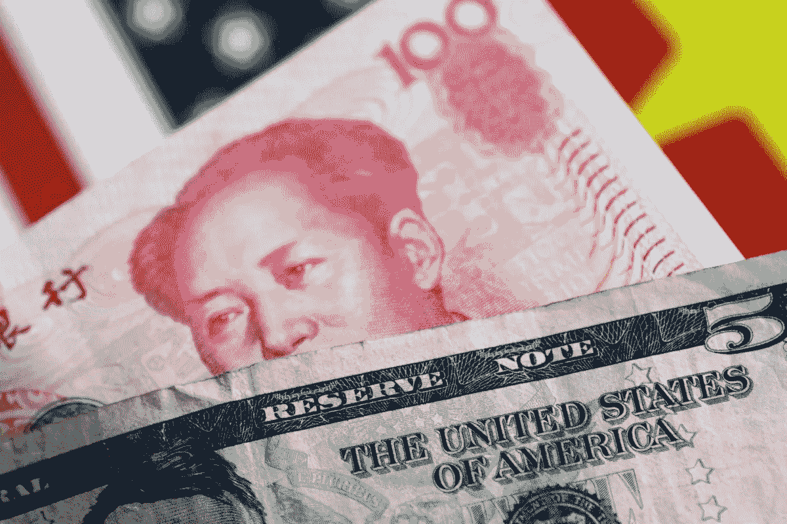
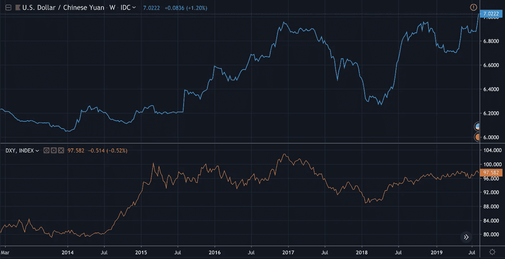

# 人民币:货币操纵还是市场诱导的贬值？

> 原文：<https://medium.datadriveninvestor.com/chinese-yuan-currency-manipulation-versus-market-forces-2230e199cca?source=collection_archive---------6----------------------->

中美贸易争端已经升级，美国财政部除了在 2018 年 3 月首次对 2500 亿美元征收 25%的关税外，还对价值 3000 亿美元的中国产品征收 10%的额外关税。尽管承诺恢复购买大豆和高粱等农产品，但美国政府-出于大多数人不知道的原因-选择升级贸易战。因此，曾经的贸易和技术战争也被称为货币战争。但后者被误导了，被夸大了，支持这一论点的论据是不完整的，有些没有根据。

# ***G20 发生了什么？***

两个超级大国在 20 国集团峰会上达成的停战协议似乎很肤浅。随着贸易战的进行，挑战不再是确定与贸易相关的问题，如强制技术转让、[、知识产权盗窃、](https://www.prosperousamerica.org/top_ten_cases_of_chinese_ip_theft)、对国有企业的补贴以及旨在为中国国内企业提供不公平优势的其他非关税壁垒。然而，特朗普政府总是不太可能实施这样一项全面的贸易协议，因为特朗普政府的不妥协和对短期和以选举为中心的胜利的偏好一直专注于农产品，而不是中国经济模式的长期结构性变化。相反，任何贸易协定的实施都应该是任何政府的主要争论点，但在特朗普政府下，这总是不太可能。

 [## 在中国做生意:如何优化您的运营|数据驱动的投资者

### 中国是一个受本地和外国公司欢迎的商业中心。在一个国家设立实体存在…

www.datadriveninvestor.com](https://www.datadriveninvestor.com/2019/03/17/doing-business-in-china-how-to-optimize-your-operations/) 

# ***人民币再创新低？***

在最近的升级之后，人民币汇率跌至新低，引发了全球股市的进一步担忧以及美国对汇率操纵的指控。在 2005 年中国转向有管理的汇率之前，人民币是固定的，这使得中国经济没有多少空间让人民币充当减震器和缓解经济冲击的结构调整。在更发达经济体的呼吁下，中国放开了经常账户，转向自由浮动汇率。这不是外汇固定解释了最近人民币贬值的关键和什么是被视为心理 7.00 水平。

Source: [Trading Economies](http://Is China a Currency Manipulator?   The Sino U.S. — China trade dispute has escalated, with the U.S. treasury imposing 10% additional tariffs on 300bn worth of Chinese products in addition to the 25% tariffs first imposed on $250bn worth of Chinese imports. Despite promising to resume purchase of agricultural products such as soybeans and sorghum amongst others, the U.S. administration — for reasons unbeknownst to most — chose to escalate the trade war. As such, what was once a trade and technology war is seeming into a currency war. But this is misguided, overstated and incomplete.    What happened at G20?   The truce agreed by both superpowers appeared shallow. The challenge is not identifying trade-related issues such as forced technology transfers, intellectual property theft, subsidies to state-owned enterprise and other non-tariff barriers designed to provide Chinese-based companies with an unfair advantage. However, implementing such an encompassing trade deal was ever unlikely by the Trump administration whose intransigence and preference for short-term and election-centric wins has focused on agricultural products. Rather, the implementation of any trade agreement should have been the main point of contention for any administration, but this is unlikely under the current president.   Chinese Yuan hits new lows?   Prior to 2005 when China moved to a managed exchange rate, the Yuan was fixed, which allowed the Chinese economy little room for its foreign exchange to serve as a shock-absorber and ease the structural adjustment. Following calls by more advanced economies, it liberalised its current account and moved to a free-floating exchange rate.   Meanwhile, the Chinese Yuan fell below its key and psychological level of 7.00 against the dollar following the recent tariffs on $300bn worth of Chinese products. This puts the total Chinese products under U.S tariffs to $550bn. It is only normal that the Chinese Yuan depreciates as economic theory dictates that currencies help economies cushion shocks! China is no different, not least because of its less rigid exchange rate.   Furthermore, the Chinese economy grew by 6.2% in Q2, its slowest level in 27 years, compounded by a structural slowdown as it transitions from an investment to a consumer driven economy. This is only normal, as the economy matures and more advanced exports and the service sector drive its competitiveness. Hence, the trade-induced depreciation and other structural factors drive explain the current Yuan weakness, making claims of currency manipulation grossly overstated and incomplete.    The Dollar strength is explained by a variety of factors      Meanwhile, the U.S. dollar is justifiably strong. Despite lowering interest rates at its most recent meeting, interest rates in the U.S. are higher than most Central Banks in the World bar the emerging world. Furthermore, the U.S. economy is still strong, albeit slowing unemployment is at record low and the impact of the procyclical fiscal stimulus linger. This is compounded by the IMF’s recent World Economic Outlook, which revised up U.S. GDP growth by 0.3 ppt to 2.6% for 2019 and 1.9% for 2020\.   The U.S. economy has performed favourably throughout its trade dispute with China, in spite of U.S stock indices hitting new lows on Monday. Furthermore, a twin deficit has done little to hamper the dollar’s status as a safe haven asset, and this is palpable following its trade dispute with China. Additionally, the USD has also strengthened is also compounded by concerns on global growth. Prior to the 2008 crisis, investors fled into dollar assets in preparation for the GFC, so the FED’s position as the global lender of last resort have provided shielded any trade-induced corrections.   Can this change?   It can be argued that an ageing population, current account and fiscal deficit as well as a more multipolar trading environment will test this. Despite interregional trade supporting globalisation, intra-regional trade continues to account for a significant portion of total trade. China, for one, trade substantially with it Asian neighbours whose digital and physical infrastructure it continues to build. As trade becomes increasingly cleared in the Yuan, Euro, Pound, Yen, it is difficult to see its safe haven properties persist, at least to the same extent.   Meanwhile, the Yen, Swiss Franc and Gold remain important hedges for investors looking to insulate their portfolios against global financial, economic and political risk. The extent to which these price-in geopolitical uncertainty depends on a range of other factor such as the probability of a recession. When the latter looks less unlikely, the dollar can usually see more consistent flows.    The Chinese economy is more exposed to the trade war in the short term.   As the currency depreciation and economic slowdown in China have shown, Chinese operations are more exposed to the trade war over the short term as their supply chains rely on technologically-advanced chips, semi-conductors and software. Meanwhile, U.S. companies rely on China’s ever-growing and wealthy middle class to buy their products. Apple and Tesla are prime examples. This explains the why the bulk of 0.3% downward revisions in the IMF’s recent global outlook accrue to emerging markets, whose markets and supply chains are increasingly linked with China.        A weaker Yuan can support bilateral trade, only somewhat      It might be easy to view a weaker yuan as the trigger for greater Chinese export competitiveness, but debt servicing cost will be more costly for dollar-denominated debt. This explains the recent stock market turmoil in Shanghai. Nevertheless, a transient boost to trade is not unlikely for Asian countries and some Latam countries, which will serve as a substitute for goods, services or intermediate products that were previously purchased from the U.S. Furthermore, slowing growth in the two largest economies suggest lower import demand, which is unlikely to change significantly vis-a-vis a weaker yuan.       The dollar exchange rate is particularly salient for global trade, and a stronger dollar will hurt global exports. This is owing to a substantial portion of global trade being invoiced in dollars and also sticky prices as a result of dollar invoicing. Meanwhile short-term competitiveness for Chinese stock indices and exports is not unlikely, but other EMs might see a slower rate of passthrough as price-stickiness of dollar-invoiced trade could prevent an immediate boost to trade.       Can the U.S. treasury intervene?        Despite wrongly labelling China a currency manipulator, the treasury is unlikely to redress what it sees as a competitive devaluation from China.  The challenge for the U.S treasury is how to temper the affinity for the dollar as investors balance geopolitical risks against yields. Intervening in FX markets is, however, possible but will certainly be financially costly and counterproductive owing to the reasons outlined below.      1) Despite having twin deficits, the dollar is still the main reserve currency, supported by its characteristics as the lender of the last resort.       2) Secondly, a significant portion of trade is invoices and cleared in dollar, which gives it significant “hold properties” during uncertain times such as a trade war or geopolitical uncertainty.       3) The dollar continues to hold safe haven properties, whether underpinned by a higher interest rate differential or not remains to be determined.      Currency manipulation claims are overstated and oblivious to other drivers.      The Chinese are unlikely to allow a significant depreciation of their currency as this will compound concerns of debt sustainability. Meanwhile, FX related debt and the cost of self-insurance suggest emerging markets central banks will have perform a fine balancing act. The recent decision by the Fed to lower interest rates was the bell weather for other central banks to follow suit, this might no longer be the case as trade-induced currency depreciations will cause inflation to rise. At the very least, Emerging Market central banks might rethink their presupposed easing paths. As I argue here, Central Banks might not be converging just yet, but the uncertain nature of the trade war might test this.)

与此同时，在最近对价值 3000 亿美元的中国产品征收关税后，人民币兑美元汇率跌破了 7.00 的关键心理水平。这使得美国关税下的中国产品总额达到 5500 亿美元。经济理论表明，在金融或经济紧张时期，货币往往会起到减震器的作用，因此人民币贬值是正常的。中国也不例外，尤其是因为它的汇率不那么僵硬。

此外，中国经济在 Q2 增长了 6.2%，这是 27 年来的最低水平，而在从投资型经济向消费驱动型经济转型的过程中，中国经济出现了结构性放缓。这很正常，因为经济越来越成熟，更先进的出口和服务部门推动其竞争力向前发展。因此，贸易引发的贬值和其他结构性因素解释了最近的人民币疲软，使得货币操纵的说法被严重夸大和不完整。

令中国问题雪上加霜的是其经常账户盈余，从占 GDP 的 10%缩减至 0.5%。因此，中国央行不太可能寻求货币贬值，因为这将导致资本外逃，并提高美元计价债务的成本。这不仅对中国的银行来说是个不祥之兆，还会让债务可持续性的担忧越来越强烈。此外，中国将需要利用国际债务市场为其经常账户融资，人民币贬值将使这一问题复杂化，因为它使外国计价的债务成本更高。

# ***美元走强是由多种因素解释的***

与此同时，美元有理由保持强势。尽管在最近的会议上降低了利率，但美国的利率高于世界上大多数央行，除了新兴世界。此外，美国经济活动强劲，尽管正在放缓，失业率处于创纪录低位，顺周期财政刺激的影响继续存在。国际货币基金组织(IMF)最近的《世界经济展望》(World Economic Outlook)将美国 GDP 增长上调 0.3 个百分点，至 2019 年的 2.6%和 2020 年的 1.9%。

尽管美国股指周一创下新低，但美国经济在与中国的贸易争端中表现良好。此外，双赤字几乎没有削弱美元作为避险资产的地位，这一点在与中国的贸易争端后显而易见。此外，对全球经济增长的担忧也加剧了美元的走强。在 2008 年危机之前，投资者涌入美元资产，为 GFC 做准备，因此美联储作为全球最后贷款人的地位为任何贸易诱导的修正提供了保护。

# ***这能改变吗？***

可以说，人口老龄化、经常账户和财政赤字，以及更加多极化的贸易环境将对此进行检验。尽管区域间贸易支持全球化，但区域内贸易仍占贸易总额的很大一部分。举例来说，中国与其亚洲邻国有着大量的贸易往来，中国还在继续建设这些邻国的数字和实体基础设施。随着贸易越来越多地以人民币、欧元、英镑和日元结算，很难看到人民币的避险属性继续存在，至少在同等程度上是如此。

与此同时，对于寻求将投资组合与全球金融、经济和政治风险隔离的投资者来说，日元、瑞士法郎和黄金仍是重要的对冲工具。这些资产计入地缘政治不确定性的程度取决于一系列其他因素，如经济衰退的可能性。当后者看起来不太可能时，美元通常可以看到更稳定的流动。

# ***中国经济短期内更容易受到贸易战的影响。***

正如中国货币贬值和经济放缓所表明的那样，华为和中兴等中国企业在短期内更容易受到贸易战的影响，因为它们的供应链依赖于来自美国的技术先进的芯片、半导体和软件。与此同时，美国公司依赖于中国不断增长的富裕中产阶级购买他们的产品。苹果和特斯拉是依赖中国消费者的公司的典型例子。这解释了为什么国际货币基金组织最近的全球展望下调 0.3%的大部分来自新兴市场，这些市场和供应链与中国的联系越来越紧密。

# ***较弱的人民币只能支撑双边贸易，多少有些***

人们可能很容易将人民币贬值视为中国出口竞争力增强的导火索，但对于以美元计价的债务来说，偿债成本将更高。这解释了最近上海股市的动荡。然而，对于与中国贸易密切的亚洲和一些拉美经济体来说，贸易的短暂提振并非不可能，中国将取代以前从美国购买的商品、服务或中间产品。此外，这两个最大经济体的 GDP 放缓表明进口需求下降，这在人民币疲软的情况下不太可能发生显著变化。美元汇率对全球贸易尤为重要，美元走强将损害全球出口。这是因为全球贸易的很大一部分是以美元计价的，而这往往是不确定的，因为大多数国家的货币对美元走软的反应要比美元走软的反应慢。与此同时，中国股指和出口商品的短期竞争力在短期内并非不可能。

# ***美国财政部能干预吗？***

尽管美国财政部错误地将中国列为汇率操纵国，但它不太可能纠正它所认为的中国的竞争性贬值。尽管这种观点直接违背了两个经济体所面临的经济现实。美国财政部面临的挑战是，在投资者权衡地缘政治风险和收益率之际，如何缓和对美元的吸引力。然而，干预外汇市场是可能的，但由于下面概述的原因，肯定会在财政上代价高昂并产生反作用。1)尽管有双赤字，美元仍然是主要的储备货币，这是由它作为最后贷款人的特性决定的。因此，尽管美联储降低了利率，但很难看出近几个月人民币如何贬值。

2)其次，很大一部分贸易以美元计价和结算，这使其在贸易战或地缘政治不确定性等不确定时期具有重要的“持有属性”。

3)美元继续持有避险属性，是否受到较高利差支撑仍有待确定。在地缘政治不确定时期，加上对全球贸易担忧，其避险属性尤为突出。

# 货币操纵的说法被夸大了，而且忽略了其他驱动因素。

中国不太可能允许人民币大幅贬值，因为这将加剧对债务可持续性的担忧。与此同时，外汇相关债务和自我保险的成本表明，新兴市场央行将不得不进行微妙的平衡。美联储最近降低利率的决定是其他央行效仿的信号，但这种情况可能不再发生，因为新兴市场货币的贸易诱导货币贬值将导致通胀上升。至少，新兴市场央行可能会跟随美联储的宽松倾向，重新思考其预设的宽松路径。正如我在这里论证的那样，各国央行可能还没有趋同，但贸易战的不确定性可能会检验这一论断。

基于美国强劲的经济活动、高于大多数央行的利率以及美元的避险属性，将中国列为汇率操纵国是不完整的，而且有些误导。所有证据都表明，是市场力量，而不是央行的外汇干预，推动了最近的贬值。美元的避险属性、看似强劲的经济和利差解释了美元的强势，关税以及中国经济的结构性放缓解释了人民币的弱势。