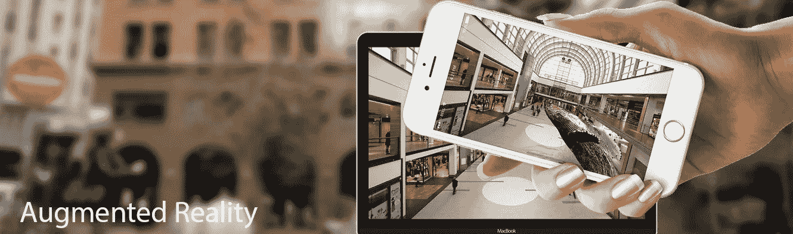
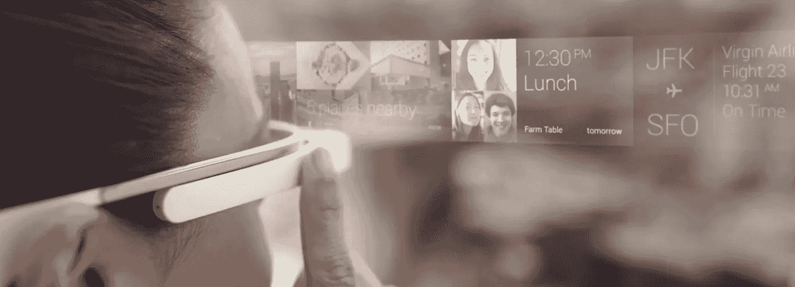
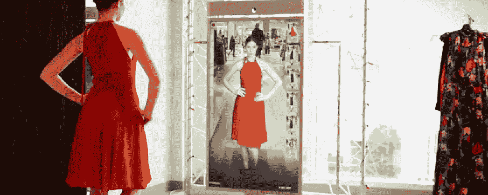

# 选衣服不穿…

> 原文：<https://medium.datadriveninvestor.com/choose-your-clothes-without-wearing-3215f53a357a?source=collection_archive---------3----------------------->

现在，如果我们想买一件衣服，我们想去一家服装店，穿上它，看看它是否适合我们。在这篇文章中我介绍了 ***AR*** ( *增强现实*)从家里挑选适合自己的衣服。这是我在 Medium 的第 10 篇文章。

我们每天都在购物，但是买衣服太费时间了。如果顾客去商店买衣服，那么他/她会在商店里看到太多的衣服，店主不方便重新包装衣服。因此，我想介绍一下布料购物中的 ***AR*** 。这是在理念层面，在我们团队 ***Codezillas*** 。

shopkeeper pack clothes

## 增强现实

单词“augment”的意思是增加、扩展或使更好。*增强现实* ( ***AR*** )是*虚拟现实* ( ***VR*** )的一种形式，其中使用虚拟元素增强现实世界，通过使用视觉设备叠加在现实世界的视图上，创建一种好像他们在同一空间的错觉。 ***AR*** 设备有显示器、输入设备、传感器和处理器。这些设备可以是眼镜、游戏机、显示器、头戴式显示器、隐形眼镜和智能手机。 ***AR*** 系统还可以通过声音和触觉反馈进行增强。

***AR*** 是 ***VR*** 的一种形式，但是很不一样。*虚拟现实*是一个完整的视图，而 ***AR*** 只是将虚拟物体添加到真实视图中。 ***AR*** 是直播。它的工作原理是看到真实世界在那一刻的样子。 ***AR*** 改变用户看到的现实世界空间，改变用户的现实。一种类型的 ***AR*** ，用户观看添加了虚拟元素的真实世界的记录。很多体育赛事使用这种类型的***AR***；当在电视上观看比赛直播时，观众可以在比赛场地的顶部看到比分。

另一种形式的 ***AR*** 允许用户通过显示现实世界中虚拟物体的显示器实时查看他们的环境。谷歌眼镜就是一个例子。它就像一副普通的眼镜，但也有一个小屏幕，用户可以在上面发送照片，查看天气，查看 GPS 方向等。利用物体识别和 ***计算机视觉*** ，可以使真实物体与虚拟物体进行交互，供用户进行交互。例如，移动应用程序可以用来查看现实世界中家具的虚拟版本，向他们展示在他们的房子里会是什么样子。他们可以看到自己的实际房间里摆满了他们在屏幕上选择的虚拟家具，因此他们可以决定它是否适合那个房间，以及他们是否喜欢它在那个房间里的外观。另一个例子是扫描*的产品或特殊代码(如 UPC 符号)，以显示关于产品的更多信息，如评论或未打开包装内的内容。*

**

*google glass*

*我们的团队 ***Codezillas*** 想针对这个问题创建一个系统。我们的系统有两个界面。一个是给店主的，另一个是给顾客的。在我们的系统中，店主会更新每个款式中的每种颜色的布料。然后，顾客将通过应用程序选择服装。如果他们想试穿衣服，应用程序中有一个摄像头按钮，如果他们触摸该图标，应用程序会自动打开摄像头，选定的衣服将通过 ***AR*** 和 ***AI*** 来适应他们的身体。顾客可以在家里订购衣服，也可以去商店购买，这对于网上购物非常有用。在这里，顾客不能通过 ***AR*** 检查他们的尺寸，但是顾客可以选择适合他们的颜色/图案/型号。 ***人工智能*** 是用来识别人是否合身的衣服。*

**

*[Amazon Go](https://medium.com/codezillas/amazing-amazon-go-d435c9dc117f) 和一些智能店铺推出了这项技术，名为“ ***智能镜子*** ”。顾客可以通过这项技术在商店里挑选衣服。这里有一个像镜子一样的装置，上面有摄像头和显示器。它将显示两个图像，一个是当前布料，另一个是顾客想要试穿的布料。当你去商店的时候，你可以使用这个设备，但是在我们的系统中，顾客可以在家里选择他们的衣服。*

**

*Smart Mirror*

****感谢您阅读至此。如果你喜欢这篇文章，请分享、评论并发表👏几次(最多 50 次)。。。也许会对某个人有帮助。****

****关注我的***[***Twitter***](https://twitter.com/TheSabesan)***和 Medium 如果你将来对这些更深入、更翔实的文章感兴趣的话！****