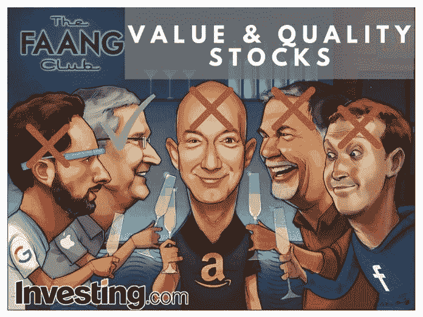
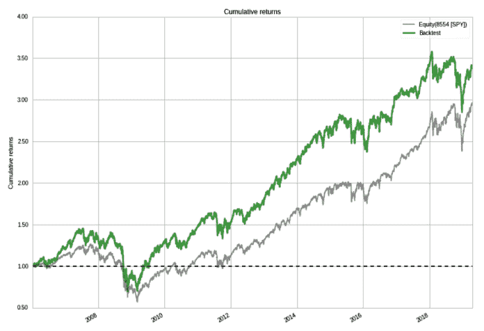
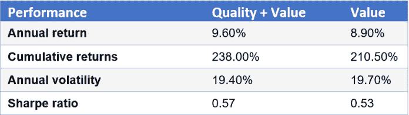

# 选择表现优异的高质量价值股票

> 原文：<https://medium.datadriveninvestor.com/choosing-high-quality-value-stocks-that-outperform-data-driven-investor-d74d905d8692?source=collection_archive---------8----------------------->

investing.com

谈到投资，每个人都喜欢谈论迷人的股票，如 FAANG 股票(脸书、苹果、亚马逊、网飞、谷歌)。这些股票受到投资者的高度关注，也是聚会上的热门话题。然而，现在是持有这些股票的最佳时机吗？

如果你相信价值投资，可能不会，因为这些非常受欢迎的股票相对于它们的收益来说相当昂贵。

 [## 股票市场投资的机器学习——数据驱动的投资者

### 当你的一个朋友在脸书上传你的新海滩照，平台建议给你的脸加上标签，这是…

www.datadriveninvestor.com](https://www.datadriveninvestor.com/2019/01/30/machine-learning-for-stock-market-investing/) 

在我的[上一篇文章](https://www.facebook.com/notes/pyinvesting/will-value-investing-make-you-rich/1263642630470735/)中，我写了选择便宜股票的价值投资主题如何跑赢昂贵的股票。我们还讨论了价值投资如何受到价值陷阱等风险的影响，在价值陷阱中，由于公司未能改进和创新，廉价股票继续保持廉价。

# **我们能做得更好吗？**

在这篇文章中，我研究了如何通过筛选优质股票来改善我们的价值投资策略。通过选择既便宜又高利润的股票，有可能提高我们策略的表现。

# **我们如何挑选优质价值股？**

从 500 只股票的投资宇宙中，我选择了 50 只具有最低市盈率(PE 比率)和最高股本回报率(ROE)的股票。

市盈率是股票调整后的收盘价除以每股收益(EPS)。较低的市盈率意味着股票的交易价格相对于其收益来说较低。**便宜的股票市盈率低。**

该公司的净资产收益率是其净收入除以其平均总普通股权益。这是一个衡量公司每一美元资本能产生多少利润的指标。高净资产收益率意味着公司效率很高，因为它能够用相对较少的资本创造利润。**优质股票净资产收益率高。**

为了选择股票，我根据股票的逆市盈率(因为我们希望市盈率低的股票排名高)和 ROE 对宇宙中的每只股票进行排名。接下来我取每只股票的市盈率排名和 ROE 排名的平均值。这给了我一个综合了价值和质量因素的总体信号。

# **风险管理**

我对投资组合中的 50 只股票进行加权平均，以降低投资组合的集中风险。这将防止我的投资组合在任何一只股票崩盘时遭受重大打击。

此外，选择每个部门中信号最强的股票，使得没有一个部门的权重超过投资组合的 20%。这降低了行业风险，并使我们能够根据价值和质量信号来隔离超常表现的来源。

我不希望该策略表现优于或劣于大盘，因为它过度投资于单一行业，而是因为该策略投资于所有行业的廉价优质股票。

# **性能**

回溯测试结果显示，质量价值策略的累计回报率为 238%，自 2006 年以来超过标准普尔 500 基准近 50%。

Cumulative returns vs S&P 500 benchmark

更重要的是，通过将质量因素纳入我们的纯价值投资信号，我们的策略表现有所改善！质量价值策略的年回报率为 9.6%，而纯价值策略的年回报率为 8.9%。

除了增加策略的回报，质量价值策略的波动性较低，为 19.4%，而纯价值策略的波动性为 19.7%。这意味着战略的**风险已经降低**。

因此，通过将质量因素与我们的价值因素相结合，该策略的**风险调整回报增加了**。因此，在同样的风险水平下，质量价值策略可以获得更高的回报。这反映在质量价值战略的夏普比率较高，为 0.57，而纯价值战略的夏普比率为 0.53。

Comparison of Quality + Value vs pure Value strategy

# **结论**

通过将质量因素与我们最初的价值投资策略相结合，我们的回溯测试表明，我们能够获得更高的风险调整后回报。这是因为我们的优质价值策略中的股票既便宜又高利润。

虽然沃伦·巴菲特曾经说过，以合理的价格收购一家优秀的公司比以合理的价格收购一家一般的公司更好，但我认为以合理的价格收购一家优秀的公司更好。

# 我们连线吧！

如果你觉得这个故事对你有帮助，并且你想收到未来的更新，请考虑之后的[。](https://medium.com/@ivannfok)

*原载于 2019 年 5 月 7 日 https://www.datadriveninvestor.com***。**