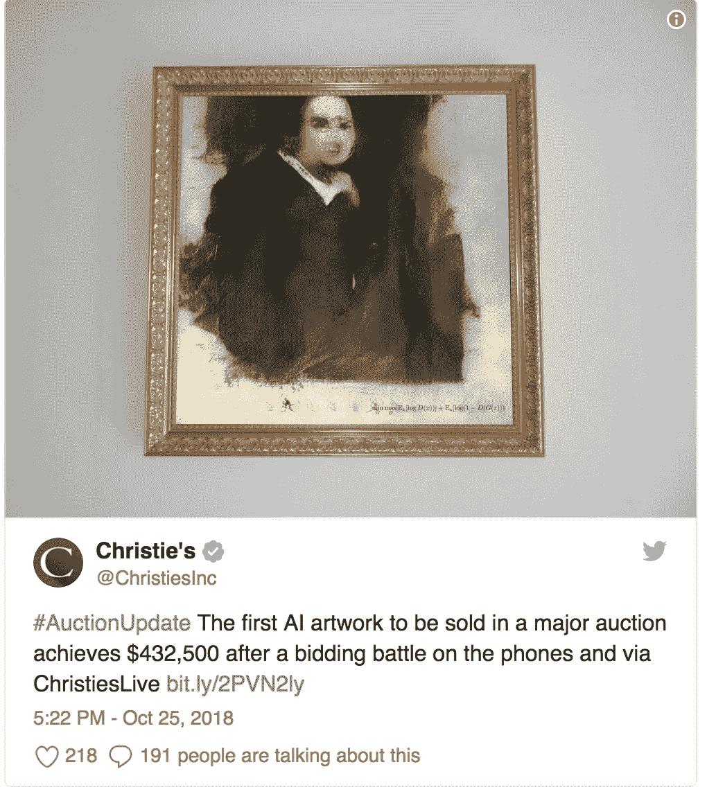

# 佳士得以 432，500 美元的价格出售了第一幅人工智能肖像，超过了 1 万美元的估价！

> 原文：<https://medium.datadriveninvestor.com/christies-sells-its-first-ai-portrait-for-432-500-beating-estimates-of-10-000-69ca9c92b059?source=collection_archive---------17----------------------->

这张图片是使用机器学习算法创建的，只是简单地扫描了历史艺术品！虽然简单，但想到在:D 艺术展上使用人工智能的潜在未来机会，还是令人兴奋

人工智能艺术，是的，它会比我们想象的更快成为一种普通的艺术。与油画类似，帆布画似乎是另一种艺术创作方式，从技术角度来看非常有趣。艺术家会不会不再是只有手工才能的人？在不久的将来，IT 呆子会成为另一个艺术创造者吗？期待了解艺术市场将如何被新技术颠覆！人工智能现在在艺术行业找到了自己的位置，我想它会永远留在这里。最近，佳士得拍卖了第一件人工智能作品。这幅名为《爱德蒙·贝拉米肖像》的油画以 43.25 万美元的价格售出。你能想象当价格超过 40 万美元，而印刷品的预期价格估计在 7，000 美元到 10，000 美元之间时有多惊讶吗！

这件艺术品是由明显公司创作的。明显的三个成员，三个朋友，25 岁的法国学生，使用一种类型的机器学习算法(称为 GAN-generative adversarial network)创建了这张杰出的图片。该网络在一个历史肖像数据集上接受训练，然后它试图创建自己的肖像。他们把图像打印出来，装框，用甘的部分算法签名。

然而，这不是故事的结尾，它更有趣，背后还有一些争议。The Verge 报道称，Belamy 的印刷品实际上并不完全是由 Obvious 从头开始创作的。他们承认，他们使用了另一位人工智能艺术家 19 岁的罗比·巴拉特(Robbie Barrat)的部分代码，所以不太清楚借用了多少。理论上，Barrat 可以对 Belamy 提出所有权要求，因为他的代码是在开源许可下共享的。不管故事如何结束，人工智能艺术品将会越来越频繁地出现在市场上。

*原载于*[*https://investingimposition . com/2018/11/09/christies-sells-its-first-ai-portrait-for-432500-beating-estimates-of-10000/*](https://investinginpassion.com/2018/11/09/christies-sells-its-first-ai-portrait-for-432500-beating-estimates-of-10000/)