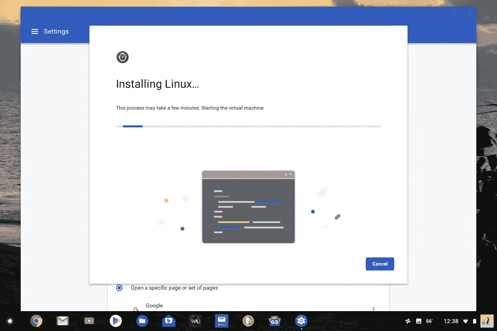
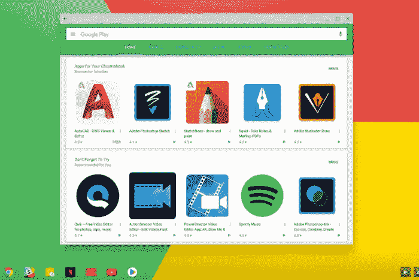

# Chrome OS:最好的日常用户操作系统

> 原文：<https://medium.datadriveninvestor.com/chrome-os-the-best-everyday-user-operating-system-98087c34de22?source=collection_archive---------20----------------------->

在 2009 年谷歌决定用 Chrome 操作系统进入笔记本电脑市场之前，有三个主要竞争对手:Windows (7)、Mac OS X 和 Linux。这个很久没变了，除了 Chrome OS 的推出。有史以来最“动力不足、最弱”的操作系统。

那么，为什么我会认为这个操作系统对普通用户来说是最好的呢？这是因为每一个其他的操作系统都有一些重大的缺陷，妨碍了它的实际应用。
- Windows 10 已经变得越来越漏洞百出，处理起来简直是一场麻烦
-Mac 系列产品继续变得更加昂贵，同时每个设备版本都有一个重大缺陷
- Linux 对大多数人来说仍然难以使用

另一方面，Chrome 操作系统很简单。很优雅。这是大多数人想要/需要的一切。它可以浏览网页，速度极快(尤其是就它的价格而言)，非常便携，而且不会在向你灌输更新信息的同时删除用户文件。如果需要的话，它现在可以运行 Android 应用程序，并且通过增加 Debian shell 来兼容 linux 应用程序。它功能强大、价格合理，并且能做它应该做的事情，甚至更多。

Installing the Debian shell can be done in just a few clicks

那现在怎么办？你是应该去当地的百思买还是去亚马逊买一台便宜的 chromebook 来取代你去年买的笔记本电脑呢？
没有。
虽然它对大约 95%的笔记本电脑用户来说很棒，但并不适合所有人。它不能编辑视频或非常详细地创建图像。它并不具备所有应用程序的兼容性，而且 chrome OS 仍然有一些你可能不得不应对的怪癖。它并不兼容 Adobe 和 Office 等所有应用程序，也没有能力做一些人用笔记本电脑做的事情。有一些应用程序崩溃和兼容性问题(特别是 Linux 应用程序)，但大多数购买 chromebook 的人不会安装这些应用程序。他们将用它来浏览网页，观看网飞和 YouTube，可能还会阅读书籍。如果那是你做的，那么当然，这是给你的。

The play store on Chrome OS is powerful, but be careful for app compatibility issues.

谁知道呢，也许你的下一台笔记本电脑就是 chromebook。它比大多数 Windows 笔记本电脑便宜，但比市场上的任何其他产品都要好。