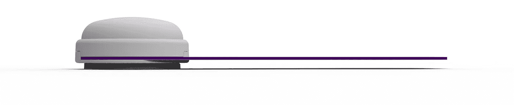

# 慢性疼痛患者可能会觉得阿片类药物弊大于利！

> 原文：<https://medium.datadriveninvestor.com/chronic-pain-patients-may-feel-opioids-do-more-damage-then-good-354c303e99a1?source=collection_archive---------6----------------------->

由 [Bhargav Srinivas Veriketi](https://www.phyzio.co/author/bhargav/)

你是否经历过疼痛，并考虑过服用药丸(止痛药)来缓解疼痛？你有没有想过你为什么消费它，它能对你做什么？

**什么是阿片类药物，我们为什么要食用它们？**

阿片类药物，通常被称为[麻醉药](https://en.wikipedia.org/wiki/Narcotic)，是一种包含强力处方止痛药的药物，如羟考酮、氢可酮、[芬太尼](https://medlineplus.gov/druginfo/meds/a605043.html)和[曲马多](https://medlineplus.gov/druginfo/meds/a695011.html)。非法药物海洛因也是一种阿片类药物。
阿片类[药物](https://www.drugabuse.gov/drugs-abuse/opioids)用于在您遭受重大伤害或手术后，或因癌症等健康状况引发剧烈疼痛时减轻疼痛。一些医疗服务提供者开出它们来治疗慢性疼痛。用于缓解疼痛的处方阿片类药物在短期服用时通常是安全的，并且由医疗保健提供者开具，但慢性疼痛不是急性的，并且持续时间长。长期服用阿片类药物会对我们的身体产生不利影响。

**阿片类药物如何影响我们？**

服用阿片类药物的人有成瘾和过量的风险。阿片类药物在治疗慢性疼痛时伴随着大量的副作用和并发症。服用阿片类药物的常见副作用包括[镇静](https://www.asahq.org/whensecondscount/anesthesia-101/types-of-anesthesia/ivmonitored-sedation/)、头晕、恶心、呕吐、便秘、身体依赖、耐受性和呼吸抑制。身体依赖和心理成瘾是临床关注的问题，可能会妨碍正确的处方和不充分的疼痛管理。不太常见的副作用可能包括胃排空延迟、痛觉过敏、[免疫](https://www.dictionary.com/browse/immunologic)和激素功能障碍、肌肉僵硬和[肌阵挛](https://www.mayoclinic.org/diseases-conditions/myoclonus/symptoms-causes/syc-20350459)。使用阿片类药物最常见的副作用是便秘(发病率非常高)和恶心。

在美国，阿片类药物过量每天导致超过 115 人死亡。2016 年，超过 42，000 人死于阿片类药物，是 1999 年的 5 倍。原因？自从几十年前这些强效止痛药中的几种以药丸形式出现以来，医生们一直在开超过病人需要的处方。

**慢性疼痛的解决方案是什么？**

多年来，慢性疼痛的治疗选择包括建议休息和不活动。然而，锻炼在减轻慢性疼痛的严重性方面可能有特定的益处，以及与改善整体身心健康和身体功能相关的更普遍的益处。不同的身体活动和锻炼干预在减轻疼痛严重程度方面非常有效。日常锻炼对日常生活、生活质量和人类健康有积极的影响。

**但是疼痛呢，如何应对呢？**

对于许多经历慢性疼痛的人来说，大麻二酚(CBD)油作为一种缓解疼痛的天然方法已经逐渐受到欢迎。大麻二酚是在[大麻](https://www.drugabuse.gov/publications/research-reports/marijuana/what-marijuana)植物中发现的一种化合物，有时被吹捧为治疗关节炎和背痛等常见疾病的止痛药的替代品。然而，有一些证据表明大麻二酚可能会影响人体的内源性大麻素系统(一种细胞间通讯的复杂系统)。除了对记忆和情绪等大脑功能有贡献外，内源性大麻素系统还影响我们感受疼痛的方式。

 [## 信息图:大麻的业务-数据驱动的投资者

### 仅在 2017 年，美国就销售了价值超过 8 亿美元的合法大麻产品。生长在 19 个州…

www.datadriveninvestor.com](https://www.datadriveninvestor.com/2018/09/25/infographic-the-business-of-hemp/) 

菲齐奥

神经刺激是另一种有助于缓解慢性疼痛的方法。Phyzio 设备就是其中之一，它有助于使用神经刺激来提供即时疼痛缓解，并且还有一个内置的教练，可以帮助推荐、跟踪和分析疼痛缓解练习。该设备作为一个袖珍理疗师，有助于轻松应对疼痛。

**外卖**

慢性疼痛是阿片类药物消费量增加的最常见原因。如果您患有慢性疼痛疾病，并且无法通过标准治疗来控制疼痛(或者希望避免其他药物的副作用)，您可以考虑使用 CBD 油来缓解疼痛，或者使用 Phyzio 来彻底解决您的疼痛。

来源:

[https://www.ncbi.nlm.nih.gov/pmc/articles/PMC5461882/](https://www.ncbi.nlm.nih.gov/pmc/articles/PMC5461882/)
https://www.phyzio.co/chronicpain/