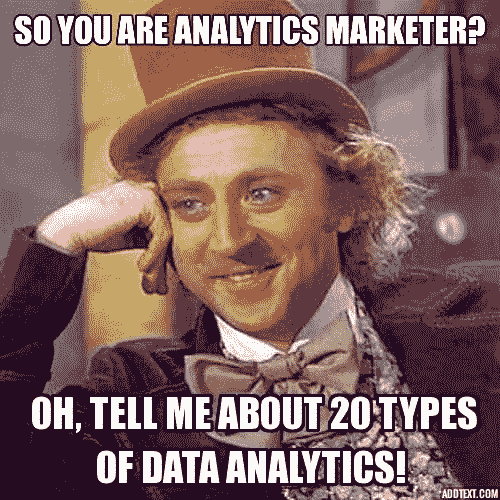

# 公民分析——一切从一个问题开始

> 原文：<https://medium.datadriveninvestor.com/citizen-analytics-it-all-starts-with-a-question-249fd0b64ad9?source=collection_archive---------0----------------------->

无论你是一个漫不经心的观察者还是数据分析领域经验丰富的专业人士，这些天谈论的不同类型的数据分析的数量肯定会让你头晕。以下是分析师、记者和常驻数据科学家经常提到的几种主要类型(每种类型都有几种不同的命名方式):

*   诊断分析
*   描述性分析
*   规定性分析
*   预测分析
*   探索性分析
*   视觉分析

诸如此类……在这一点上，当我们看到它时，我们大多数人都知道它——一种“疯狂”的营销:

## 描述性与预测性与规范性

这三个通常被誉为数据分析的主要类别。**描述性分析**是回顾过去并告诉你已经发生的事情，**预测性分析**应该告诉你未来会发生什么，而**规定性分析**应该告诉你在你的业务中应该具体做些什么。

然而，如果你仔细观察，**这三者的区别仅仅在于它们解释现有数据分析的方式**，换句话说，它们如何使用实际数据分析的结果。很明显，因为我们不能分析未来的数据，所以这三种方法都是基于对现有数据的分析来回答强调这些分析类型之一的一些问题。

一旦获得了这个答案(即，我们弄清楚了过去发生了什么)，我们就可以从统计上将其推断到未来(**预测用法**)，并且潜在地将这个未来数据推断映射到业务术语(**规定用法**)。抛开说明性使用的准确性和整体价值不谈，预测性分析和说明性分析都只不过是主要数据分析完成后的一个额外步骤。

本质上，描述性、预测性和规范性数据分析基本上是相同的过程，只是最终结果的解释和呈现方式有所不同。

> **我们只能分析现有的数据**。之后，我们可以从中得出不同的结论——已经发生了什么，可能会发生什么，以及我们可能需要如何做出反应。

## 一切都从一个问题开始

在 [DataLingvo](https://www.datalingvo.com) 我们相信任何数据分析都是从一个… **问题**开始的。简单或复杂，频繁或临时，自发或精心计划，重要或只是要测试的直觉—关于数据的问题是什么触发了数据分析。

想想每次你打开谷歌分析仪表板，Salesforce.com 报告窗格，Tableau IDE 或启动 SAS。即使你只是对你的 AdWords 活动进行日常监控，你也是在回答一个简单的问题:“从昨天开始，我的 AdWords 活动有什么重大变化吗？”你不会直接问这个问题，但是你现在看到的 AdWords 仪表盘只是一个回答这个常见(日常)问题的便捷方式。

> 能够轻松地就您的任何业务数据提出问题，并获得您可以有效解释的答案，这是我们从今天收集的所有业务数据中获取业务价值的核心能力。

我认为我们过度复杂化了数据分析的意义，对终端用户没有明显的好处。这种过度的复杂化创造了人为的搁置和产品分类，仅仅是为了搁置和分类本身。

一切都从一个问题开始。数据分析是一个能给你答案的系统。就这么简单。