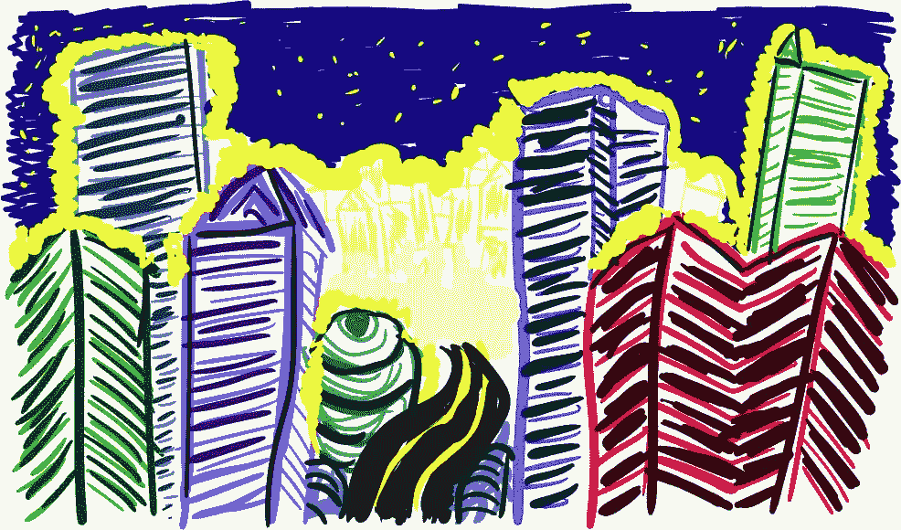

# 城市流行音乐:日本经济奇迹被遗忘的原声音乐

> 原文：<https://medium.datadriveninvestor.com/city-pop-the-forgotten-soundtrack-to-japans-economic-miracle-15afbd8012ef?source=collection_archive---------3----------------------->

## 这个故事讲述了 80 年代在日本诞生的一种享乐主义风格的迪斯科-放克-爵士乐如何在互联网的帮助下被遗忘，然后被恢复。

她当时 59 岁，当巨大的波音 777 飞机穿过厚厚的云层降落在希思罗机场时，她被绑在座位上。细雨悬挂在城市的高楼之间，夹杂着尾气，让一切看起来阴沉沉的。所以——又是英格兰。

当飞机降落时，机舱扬声器里飘出了一首来自她家乡的老歌，这首歌最近在世界的另一端重现。山下达郎的《火花》。那阳光、乐观的旋律总是让她不寒而栗，但这一次它比以往任何时候都更强烈地打击了她。她望着外面的乌云，想着她在生活中失去的一切:一去不复返的时光，死去或失踪的朋友，她再也不会知道的感情。

当飞机滑行到登机口，其他乘客开始解开安全带时，她回到了涉谷。她能闻到街边食物的味道，感觉到周围人们兴奋的奔跑，听到他们的声音。她几乎可以看到闪烁的灯光和接二连三的品牌名称——日本的和西方的——被它们照亮了。1991 年秋天，很快她就 30 岁了。

就在我们忧郁的日本主角降落在希思罗机场的时候，一位名叫[詹姆斯·艾尔缀德](http://mostly-retro.com/2018/01/08/city-pop-big-in-japan/)的乐观的英国作家走进了东京的一家唱片店。在那里生活的几年里，他已经成为大东京地区唱片商店的专家。今天，他正在寻找 80 年代的日本城市流行音乐，而这家唱片店专营 80 年代的音乐。他满怀希望。

但当他念出一份他在网上听人津津乐道的艺人名单时——[【古谷仁美远山】](https://www.youtube.com/watch?v=Dryr5OdSBqA)[大林纯子](https://www.youtube.com/watch?v=Q2QUngVGxmE)[玉里小久](https://www.youtube.com/watch?v=QEtXh0pH7bA)……店主笑了起来。“没人关心那些艺术家！”他笑了。他解释说，不仅现在没有人关心他们，而且他们从来没有。它们充其量只是昙花一现。现在，对唱片店老板来说，他们的音乐已经被时间遗忘了——而且更好。詹姆斯·艾尔缀德从以欧洲和美国为读者群的互联网出版物上听说了这些艺术家，还听说了一份名为《东京之夜》的城市流行音乐汇编，这份汇编也是为欧洲人和美国人发行的。他本以为这些合集包含了日本 80 年代最珍贵的音乐作品。事实上，里面的艺术家相当于日本的番茄酱。

## 日本，1981 年

作为持续的战后工业投资和国家计划的结果，这个国家正处于金融梦乡。大部分资金来自索尼和松下等公司生产的高质量技术的出口，以及丰田、日产和本田生产的汽车。经济成功的浪潮产生了一个新的日本公民阶层。他们住在市中心，能买得起进口的日本不能制造的东西，比如香槟，他们的汽车里有华丽的音响。他们的生活水平是世界上最高的。

这是环境，和态度，来自哪个城市的流行泉。经济繁荣的年轻受益者需要在他们的汽车音响上听些东西，这与他们悠闲乐观的生活氛围相吻合。融合了迪斯科、放克音乐和爵士乐的享乐主义的城市流行音乐正是我们想要的。摇摆的节拍和爵士的合成声景。为跳舞和开车而创作的音乐；非常适合夜间在东京市中心巡游。沿着宽敞的街道，在巨大耀眼的广告牌下，穿过窗外五光十色的灯光交织成的挂毯，两旁是奢华的餐馆；每个人都在去往某个地方的路上，这个世界充满了希望。

1992 年，日本的资产价格泡沫破裂。由于几十年的增长和成功带来的过度自信，股市和房价已经大幅膨胀。日本人不得不控制他们的支出，就像经济一样，他们的生活变得不那么贪婪。八十年代让位于[失去的十年](https://en.wikipedia.org/wiki/Lost_Decade_(Japan))。经济停滞不前，工人工作越来越辛苦，而工资却越来越低，公开展示财富也不被人喜欢。城市流行音乐从东京消失了。就在日本短暂的经济奇迹从现实中消失的几个月前，另一件事诞生了。1991 年 8 月，蒂姆·伯纳斯·李在欧洲粒子物理研究所工作时编写的第一个互联网浏览器向公众发布。当日本经历了失去的十年，世界慢慢学会了如何使用互联网。1994 年，史密斯飞船的歌曲“Head First”成为第一首只从互联网上下载的歌曲。WAV 文件长 3 分 14 秒，在发布时花了一个半小时下载。向前跳跃 16 年左右到 2010 年，整个流派都在互联网的帮助下被创造出来。其中之一，vapor wave——名副其实，只存在了很短的时间——严重依赖于过时的日本音乐样本。城市流行音乐。不久之后，Vaporwave 的鉴赏家们就开始在东京的唱片店中搜寻古老的日本流行音乐。

他们在昏暗的房间里翻箱倒柜地找唱片，找到了金子。更辉煌的音乐充满了闪闪发光的吉他、闪亮的铜管乐器和高昂的萨克斯独奏，在 80 年代色彩斑斓的幻景消失的那一刻被日本听众抛弃了。西方的年轻人，生活在经济不景气的时代，很快就爱上了像山下达郎和吉田美奈子这样的艺术家。现在，城市流行音乐与其说是奢侈生活方式的配乐，不如说是一种逃避现实的方式。过时的录音质量将你带入一个富裕、安全和红色真皮汽车座椅的想象世界。

在一个肾上腺素激增的时代创作的音乐，在一个看似光明的未来找到了新的听众。忧郁的。其中最不可抗拒的放纵是对过去的怀念。

[*【怪异的西班牙】*](https://weirdspain.substack.com/) *是一份时事通讯，面向那些想要更深入了解他们的第二故乡及其人民的移民，以及世界各地想要更多了解这个神奇国家正在发生什么以及为什么会发生的西班牙爱好者。* [*在这里订阅，在你的收件箱里收到这些文章。*](https://weirdspain.substack.com/subscribe)