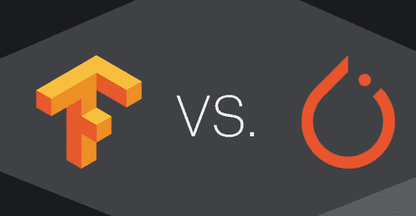
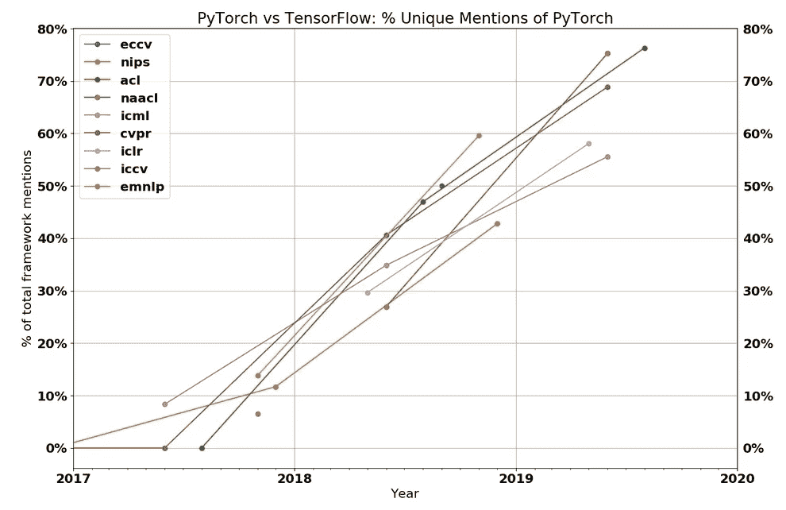
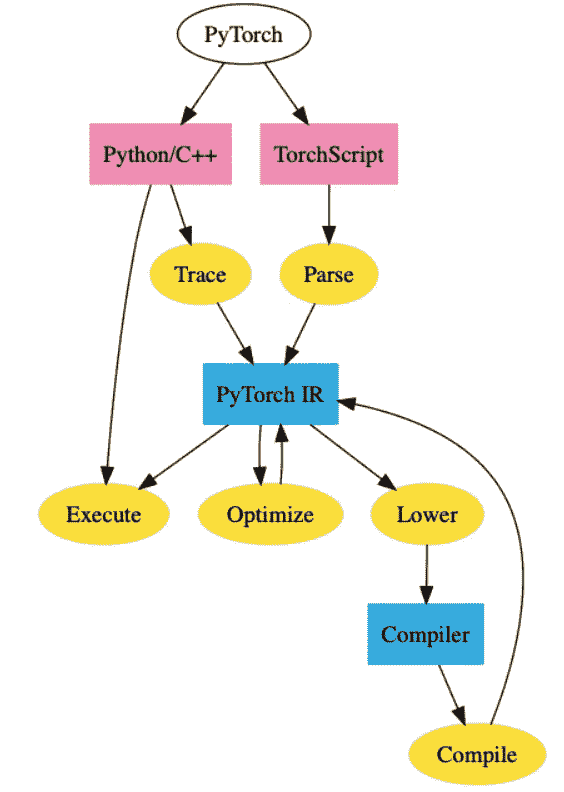
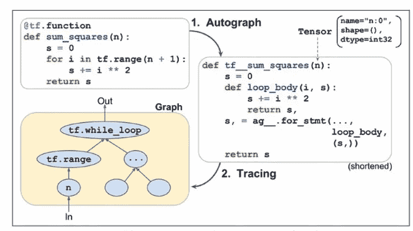

# 框架冲突

> 原文：<https://medium.datadriveninvestor.com/clash-of-frameworks-6346e3751817?source=collection_archive---------1----------------------->

Tensorflow v/s PyTorch

Source: Bing Search

M ost 深度学习应用运行在 TensorFlow 或 PyTorch 上。一项新的分析发现，他们有非常不同的受众。

Source:[thegradient.pub](https://thegradient.pub/state-of-ml-frameworks-2019-pytorch-dominates-research-tensorflow-dominates-industry/?utm_campaign=The%20Batch&utm_source=hs_email&utm_medium=email&utm_content=78158122&_hsenc=p2ANqtz-8gfh2Q3KNGKHJozhStTYrr8JUBDYH29stAUoP-x3nR8zamC22eG0bGguJEqgJuzzANV_KJAp0bibwZGPGfFN08JBmJVw&_hsmi=78158122)

2019 年，**ML 框架的战争还有两个主要竞争者:PyTorch 和 TensorFlow** 。分析表明，研究人员正在放弃 TensorFlow，成群结队地涌向 PyTorch。与此同时，在行业中，Tensorflow 是目前的首选平台，但这种情况可能不会持续太久。

 [## DDI 编辑推荐:5 本让你从新手变成专家的机器学习书籍|数据驱动…

### 机器学习行业的蓬勃发展重新引起了人们对人工智能的兴趣

www.datadriveninvestor.com](https://www.datadriveninvestor.com/2019/03/03/editors-pick-5-machine-learning-books/) 

# PyTorch 在研究领域日益增长的优势

上图显示了 PyTorch 论文与使用 Tensorflow 或 PyTorch 的论文之间的比率。所有的线**都向上倾斜**，2019 年的每一次重大会议都有**多数论文**在 PyTorch 实现。

CVPR、ICCV、ECCV —计算机视觉会议
NAACL、ACL、EMNLP — NLP 会议
ICML、ICLR、NeurIPS —通用 ML 会议

# 科研人员为什么爱 PyTorch？

*   **简约。**它类似于 numpy，非常 Python 化，并且很容易与 Python 生态系统的其他部分集成。例如，您可以简单地在 PyTorch 模型的任何地方添加一个 pdb 断点，它就会工作。在 TensorFlow 中，调试模型需要一个活动的会话，最终会变得更加棘手。
*   **伟大的 API。**大多数研究人员更喜欢 PyTorch 的 API，而不是 TensorFlow 的 API。这部分是因为 PyTorch 设计得更好，部分是因为 TensorFlow 因多次切换 API 而限制了自己(例如' layers '->' slim '->' estimates '->' TF . keras ')。
*   **性能。**尽管 PyTorch 的动态图给出的优化机会非常少，但有许多轶事报道称 PyTorch 与 TensorFlow 一样快(如果不是比 tensor flow 快)。不清楚这是不是真的，但最起码 TensorFlow 在这方面还没有取得决定性的优势。

# **调查结果:**

Horace He 使用代理数据来确定用户是来自研究机构还是商业团体。

*   为了代表研究界，他调查了 2018 年提交给五个顶级人工智能会议的摘要。他发现，一年来，使用 PyTorch 的研究人员平均增加了 275%，使用 TensorFlow 的研究人员平均减少了大约 0.5%。
*   为了跟踪商业用户，他分析了 3000 份工作列表。寻求 TensorFlow 经验的企业数量超过了寻求 PyTorch 经验的企业。他还调查了 LinkedIn 上的文章，发现支持 TensorFlow 的比例为 3230 比 1200。
*   TensorFlow 在 GitHub stars 方面也超过了 PyTorch，这些 GitHub stars 被编码人员用来保存存储库以备后用。他认为这是在生产中跟踪项目的一个关键指标。

**竞争优势:**

*   TensorFlow 拥有庞大、成熟的用户群，而行业通常对新技术的掌握较慢。
*   TensorFlow 比 PyTorch 效率高很多。即使模型运行时间的适度节省也能帮助公司的底线。
*   PyTorch 与 Python 巧妙集成，使得代码易于使用和调试。
*   根据何的说法，许多研究人员更喜欢 PyTorch 的 API，该 API 自 2016 年框架首次发布以来一直保持一致。

# 框架“融合”

# PyTorch 火炬报

PyTorch JIT 是 PyTorch 的中间表示(IR ),称为 TorchScript。TorchScript 是 PyTorch 的“图形”表示。您可以使用跟踪或脚本模式将常规 PyTorch 模型转换为 TorchScript。跟踪接受一个函数和一个输入，记录使用该输入执行的操作，并构造 IR。尽管简单明了，跟踪也有它的缺点。

Source: Bing Search

# 张量流渴望

在 API 级别，TensorFlow eager 模式本质上与 PyTorch 的 eager 模式相同，后者最初是由 Chainer 流行起来的。这给了 tensor flow py torch 热切模式的大部分优势(易用性、可调试性等。)

但是，这也给了 TensorFlow 同样的缺点。TensorFlow eager 模型不能导出到非 Python 环境，不能优化，不能在移动上运行等等。

这就把 TensorFlow 放在了和 PyTorch 一样的位置上，他们用本质上相同的方式来解决——你可以追踪你的代码(tf.function)或者重新解释 Python 代码(Autograph)。

Source: Bing Search

# ML 框架的当前状态

这样我们就达到了 ML 框架的当前状态。PyTorch 拥有研究市场，并试图将这一成功扩展到整个行业。TensorFlow 正试图在不牺牲太多生产能力的情况下，阻止其在研究领域的损失。PyTorch 要在行业中产生有意义的影响肯定还需要很长时间——tensor flow 太根深蒂固，行业发展缓慢。然而，从 TensorFlow 1.0 到 2.0 的过渡将是困难的，这为公司评估 PyTorch 提供了一个自然的切入点。

未来将取决于谁能最好地回答以下问题。

*   **研究员偏好会对行业产生多大影响？**随着当前一批博士开始毕业，他们将带着 PyTorch 一起毕业。这种偏好是否足够强烈，以至于公司会出于招聘目的选择 PyTorch？毕业生会创办建立在 PyTorch 之上的创业公司吗？
*   【TensorFlow 的渴望模式在可用性上能赶上 PyTorch 吗？我从问题跟踪者和在线社区得到的印象是，TensorFlow Eager 深受性能/内存问题的困扰，而 Autograph 也有自己的问题。谷歌将花费大量的工程努力，但 TensorFlow 背负着历史包袱。
*   【PyTorch 多快能进入生产状态？【PyTorch 仍然没有解决许多基本问题——没有好的量化故事，没有移动服务等等。在这些问题解决之前，PyTorch 甚至不会成为许多公司的选择。PyTorch 能提供一个足够有说服力的故事让公司做出改变吗？*注意:这篇文章发表的当天，PyTorch 宣布支持量化和移动。两者都还处于实验阶段，但是代表了 PyTorch 在这方面的重大进展。*
*   **谷歌在业界的孤立会对其造成伤害吗？谷歌推动 TensorFlow 的主要原因之一是帮助其蓬勃发展的云服务。由于谷歌试图拥有整个 ML 垂直市场，这激励了谷歌与之竞争的公司(微软、亚马逊、英伟达)支持唯一的替代机器学习框架。**

# 接下来呢？

在所有这些相互冲突的利益中，以及所有围绕机器学习投入的资金中，后退一步是很好的。我们大多数人从事机器学习软件不是为了钱，也不是为了协助我们公司的战略计划。**我们从事机器学习，因为我们关心**——关心推进机器学习研究，关心使人工智能民主化，或者也许只是关心构建酷的东西。无论你更喜欢 TensorFlow 还是 PyTorch，我们都只是试图让机器学习软件尽可能做到最好。

***务必阅读*** 中的完整源文章:

 [## 2019 年机器学习框架的状况

### 自从深度学习在 2012 年重新获得突出地位以来，许多机器学习框架都吵着要成为新的…

thegradient.pub](https://thegradient.pub/state-of-ml-frameworks-2019-pytorch-dominates-research-tensorflow-dominates-industry/?utm_campaign=The%20Batch&utm_source=hs_email&utm_medium=email&utm_content=78158122&_hsenc=p2ANqtz-8gfh2Q3KNGKHJozhStTYrr8JUBDYH29stAUoP-x3nR8zamC22eG0bGguJEqgJuzzANV_KJAp0bibwZGPGfFN08JBmJVw&_hsmi=78158122) 

继续读(_/\_)。

If liked :-)