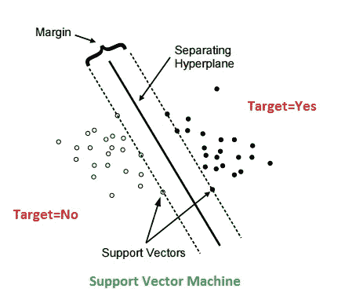
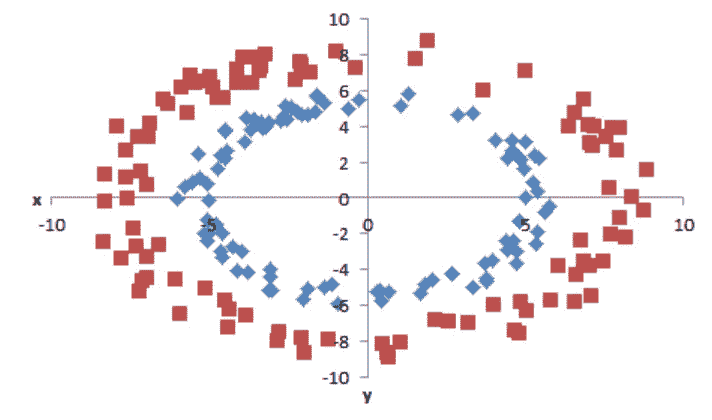
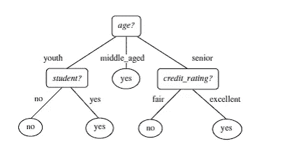
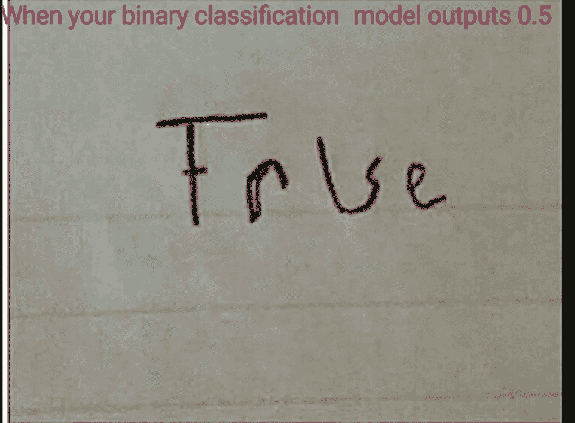
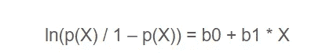
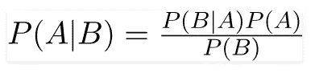
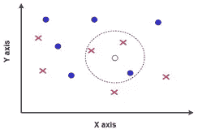

# 机器学习中的分类

> 原文：<https://medium.datadriveninvestor.com/classification-in-machine-learning-db33514c77ad?source=collection_archive---------12----------------------->

分类用于对不同的对象进行分类。这是机器学习中的一个监督问题(就像回归一样)，我们有一个带标签的数据集。如果想了解更多有监督和无监督的问题或者回归，可以参考我之前的文章。

 [## 机器学习中的回归

### 回归模型用于预测连续值。给定房子的特征，预测房子的价格，如…

medium.com](https://medium.com/datadriveninvestor/regression-in-machine-learning-296caae933ec)  [## 从机器学习开始

### 几乎每个想玩这项新技术的人都会想到这个问题。我自己也想知道…

medium.com](https://medium.com/datadriveninvestor/beginning-with-machine-learning-56b076aace1e) 

正如我们在之前的帖子中看到的，苹果的分类特征可以是颜色、形状和尺寸。机器学习中有不同的算法来解决分类问题。

**SVM**

在 SVM 或支持向量机中，我们通过用最优超平面分离类别来区分类别。*最优超平面是具有最大余量的平面。*

在该图中，可能有多个超平面分隔这些类，但是如上所示，最佳平面是具有最大余量的平面。定义超平面边缘的最接近超平面的点称为支持向量。因此，即使删除数据集中的所有其他点(除了支持向量)，超平面的位置也不会改变。这是因为平面到支持向量的距离保持不变。*总而言之，在 SVM，我们想要一个具有最大间隔的最优超平面来分隔类别。*

很多时候，数据不是线性可分的，因此不可能定义超平面。在该图中，数据点属于内环和外环两类。正如我们所看到的，这些类不是线性可分的，即我们不能定义一条直线来分隔它们。然而椭圆形或圆形的“超平面”可以很容易地将这两类分开。特征 x 和 y 可用于创建定义为***z***= sqrt(***x***+***y***)的新特征 z。

对每个数据实例应用核函数，以将原始非线性观察值映射到高维空间中，在该空间中它们变得可分离。这些函数可以是不同的类型。例如*线性、非线性、多项式、径向基函数(RBF)和 sigmoid。*

**决策树**

决策树有一个类似流程图的结构。这些分类器通过在每一步识别分裂节点来工作。

Decision Tree Example

这种分裂是由信息增益决定的。**具有最大信息增益的属性被识别为分裂节点。**信息增益越多，熵越少。熵代表数据的同质性。当一个集合只包含一个类的实例时，它的
熵为零。

下面简要描述了构建决策树分类器的步骤:

1.  计算目标变量的熵。
2.  然后，数据集根据不同的属性进行分割。计算每个分支的熵。然后按比例相加，得到分裂的总熵。从分割前的熵中减去得到的熵。结果是信息增加，或者熵减少。
3.  选择具有最大信息增益的属性作为分裂属性，并且在每个分支上重复该过程。
4.  熵为 0 的分支代表叶节点。熵大于 0 的分支需要进一步分裂。

决策树非常容易过度拟合。为了完美地拟合训练数据，有时会在很大程度上进行拆分。这导致分类器失去其泛化能力。并且该模型在测试数据集(看不见的数据)上表现不佳。

为了处理这种过度拟合，使用的方法之一是**修剪**。它可以从根或叶开始，并涉及到砍掉决策树的一些分支，从而降低复杂性。

*减少错误剪枝:*从叶子开始，每个节点用它最流行的类替换。如果不降低精度，则保留这种变化。

*成本复杂度修剪:*在这种情况下，总体目标是最小化成本复杂度函数。创建子树序列，其中 Tn 是仅由根节点组成的树，T0 是整个树。在步骤 *i* ，通过从树 *i-1* 中移除子树并用叶节点替换它来创建树。在每一步中，选择在成本-复杂性函数中*最小化*、*减少*的子树，因此是树的最弱链接。

丢失标签的处理也包含在决策树算法本身中。在寻找分裂的候选时，丢失的标签不会产生任何信息增益。因此可以放心地忽略它。现在考虑一个例子，性是分裂的节点。男性和女性有两种可能的值。现在，如果一个实例在性别列中缺少值，我们应该如何决定该实例属于哪个分支(有趣吧？:p)。这种情况的处理方法是将缺少值的实例发送到所有子节点，但权重减少。如果有 10 个实例包含“男性”，30 个实例包含“女性”，5 个实例缺少值。则所有 5 个缺失的实例将被发送到男性和女性子节点，对于“男性”节点，权重乘以 10/40，对于“女性”节点，权重乘以 30/40。

当在预测时，我们遇到决策树中的一个节点，该节点测试变量 A，并且对于该变量，在我们的实例中是一个缺失值，那么所有的可能性都被探索。

[https://www.facebook.com/convolutionalmemes/](https://www.facebook.com/convolutionalmemes/)

**逻辑回归**

逻辑回归是最常用的分类算法之一。不要被回归这个术语搞糊涂了。*预测违约类别概率的一种分类方法*。考虑一个例子，我们需要预测一个人的性别，男性还是女性(默认类别是男性 *)* 。这是一个二元分类问题。当我们应用逻辑回归时，预测该人是否为男性的概率(范围在 0 到 1 之间)。如果该值接近 0，则意味着该人是男性的概率接近 0，因此该类被给定为女性。采用阈值来确定类别。如果概率值小于阈值，则人被识别为女性或者男性(因为主要类别是男性)。

通过逻辑回归预测的值可以是-无穷大到+无穷大之间的任何值，因此对预测值应用 sigmoid/逻辑函数以将其压缩在[0，1]之间。

Logistic Function

上面的方程是逻辑回归的表示，其中右手边是线性方程(类似于线性回归)，b0 和 b1 作为系数，X 作为输入特征。这些系数是在训练过程中学习到的。左边的输出变量(y)是默认类别的赔率。赔率的计算方法是事件发生的概率与非事件发生的概率之比。p(X)是违约类的概率。

使用成本函数最大似然估计来计算系数。这种最小化算法用于优化我们的训练数据的系数的最佳值。最佳系数将产生一个模型，该模型将为默认类别预测一个非常接近 1 的值(例如男性),并为其他类别预测一个非常接近 0 的值(例如女性)。

应用逻辑回归时要记住的几点:

1.  离群值和错误分类的数据应该从训练集中删除。
2.  移除高度相关的特征，因为这会导致模型过度拟合。

**朴素贝叶斯**

朴素贝叶斯是一种基于贝叶斯定理的分类算法。*它有两个主要假设:I)每个特征独立于另一个特征，ii)每个特征被赋予相同的权重/重要性*

Bayes’ Theorem

我们所说的 P(A|B)是指，给定事件 B 为真，事件 A 的概率。一些流行的朴素贝叶斯分类算法是:

1.  高斯朴素贝叶斯
2.  多项式朴素贝叶斯
3.  伯努利朴素贝叶斯

**随机森林**

在这种分类算法中，它建立了决策树的集合，这有助于给出更准确的预测。每个决策树都有一个对输入变量进行分类的投票，多数类被分配给输入。由于涉及具有不同特征集的多个决策树，可以避免过拟合问题。

构建随机森林分类器的步骤是:

1.  选择 K 个随机特征，其中 k
2.  Identify n where n is the number of decision tree classifiers to be created by finding the best split node. Repeat step 1 and 2 to create several classification trees.
3.  To predict a input variable, take votes from each decision tree and assign the class with maximum votes.

Random forests usually performs good in all kinds of classification problems. It is able to handle missing features and categorical features.

**KNN**

KNN 代表 K 最近邻。这里的“K”是对输入变量进行分类时要考虑的最近邻的数量。k 个最近邻被识别，并且多数类被分配给输入变量。

KNN algorithm

在试图识别小圆的类别时，当 K=3 时，考虑 3 个最近的变量。由于红叉标记占大多数，小圆圈类被设置为红叉。

*本文是对分类算法的简要说明。如果你喜欢这篇文章，请不要犹豫，展示你的❤。如果您有任何反馈和意见，请随时发表评论。敬请关注更多关于 ML 的此类文章。直到那时快乐学习:)*