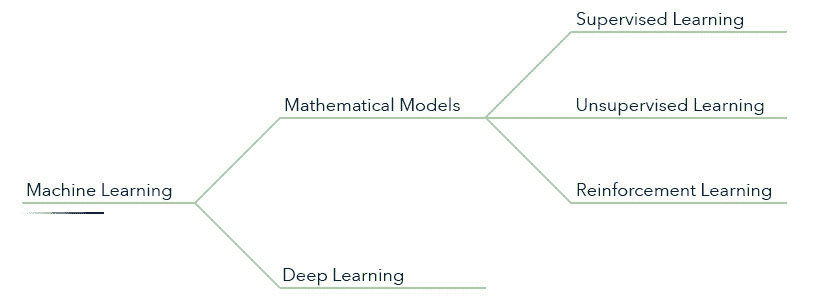
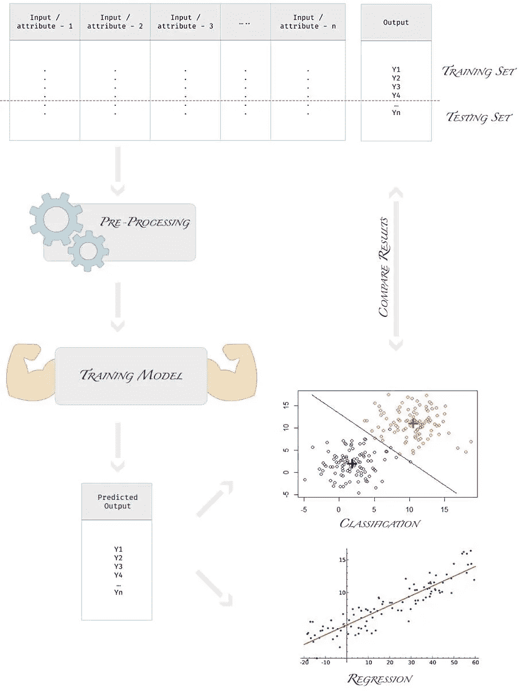
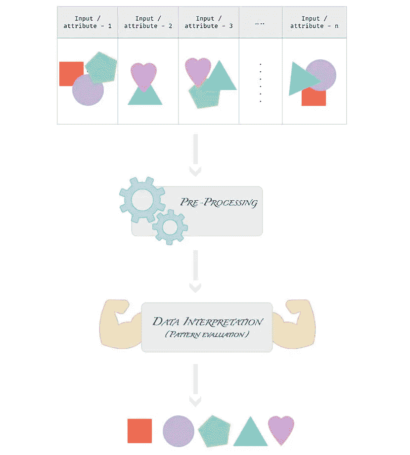

# 分类|机器学习的追求

> 原文：<https://medium.datadriveninvestor.com/classification-in-machine-learning-f5f677972a77?source=collection_archive---------2----------------------->

[](https://upscri.be/b2a0d6/)

*机器学习算法有哪些不同类型？为什么使用它们？它们如何工作的基本知识。*

*由***# GirlDressedInCode**


Photo by [Jukan Tateisi](https://unsplash.com/@tateisimikito?utm_source=medium&utm_medium=referral) on [Unsplash](https://unsplash.com?utm_source=medium&utm_medium=referral)

在前一篇文章中，我们了解到—

> [*理清机器学习、人工智能、深度学习之间的大混乱。*](https://medium.com/datadriveninvestor/difference-between-ml-ai-dl-23db64f7aa2)

在本文中，我们将研究机器学习算法的分类，并了解它们如何工作的基础知识。

[](https://www.datadriveninvestor.com/2019/03/03/editors-pick-5-machine-learning-books/) [## DDI 编辑推荐:5 本机器学习书籍，让你从新手变成数据驱动专家…

### 机器学习行业的蓬勃发展重新引起了人们对人工智能的兴趣

www.datadriveninvestor.com](https://www.datadriveninvestor.com/2019/03/03/editors-pick-5-machine-learning-books/) 

深入研究机器学习的乐趣，你一定很兴奋。你不是吗？


“Yahoo…” — I am very excited.

那我们开始吧…



Classification in Machine Learning

如图所示，我们有 3 种主要的机器学习算法—

1.  监督学习
2.  无监督学习
3.  强化学习

# 监督学习

```
*In supervised learning, the algorithm is provided with labeled data for training the model as well as for testing the efficiency of the model. By labeled data what we mean is that for each input data we also know their correct outputs.*
```

> 监督学习利用已知的数据集来学习和预测未知。

该算法在模型的*训练周期*中，借助于我们已经知道正确输出的数据集来监督模型，因此它被称为*监督学习*。在其训练的每次迭代中，模型将不断检查预期输出和它自己的输出，并不断最小化它们之间的误差差。

当训练期结束时，标记数据集的一部分也用于*测试模型效率*，如下图所示—



Model is trained with a labeled data set to either predict a continuous range of values or classify the data in some finite categories.

监督学习算法的类型—

## 回归

这种技术用于解决输出可以是连续值的问题，即输出可以位于连续的数字范围内。

示例—预测板球世界杯中各队的得分。预测的分数将总是位于一个整数范围内。

## 分类

这种技术用于解决输出可以是离散值的问题，即输出为 0 或 1(是或否)，或者输出为高、中、低等。

示例—预测球队在板球比赛中是赢还是输。

监督学习中的算法示例—

*   线性回归
*   逻辑回归
*   决策图表
*   KNN (K 近邻)
*   随机森林
*   SVM(支持向量机)…等等。

# 无监督学习

```
*In unsupervised learning, the algorithm is provided with unlabelled or unstructured data and it is required to find out patterns and groupings in the data.*
```

> 无监督学习发现人眼可能看不到的信息。

没有模型需要解决的目标问题。它只是评估数据中难以猜测的随机模式。被评估的模式可以带来神奇的发现。

模式是如何被发现的？只是数学而已！！！

传递的数据以算法更容易比较的格式标准化，然后比较不同数据条目的每个属性，找出相似性和不相似性，并最终找出模式。



Data contains different images of shapes. Using unsupervised learning, the model can differentiate and group various shapes.

无监督学习算法的类型—

## 使聚集

当我们希望根据模型发现的模式对不同的数据条目进行分组时，会使用这种类型的学习算法。

*示例——根据购买模式对顾客进行分组。这可能有助于向客户展示更好的产品推荐。*

## 联合

这种类型的学习算法用于找出各种数据属性之间的有用关系。

*例如，如果顾客买了牛奶，他很可能也会买面包。通过解析任何零售商店或任何其他企业的数据，可以产生大量这样的关联。*

无监督学习算法的例子—

*   基于划分的聚类(K-means)
*   等级聚类(聚集和分裂)
*   基于密度的聚类

# 强化学习

```
In reinforcement learning, the model is given nothing but only feedback for all the attempts it makes for solving a problem. The aim is to get better at solving that particular problem.
```

> 强化学习利用自身过去的经验来找出哪些行为更适合解决特定的问题。

？？迷茫…🤪

让我们在这里慢一点…

在强化学习中，模型是在没有任何数据集的情况下训练的。该模型试图随机解决一个问题，对于每次尝试，都会提供奖励或惩罚反馈。学习模式只是通过学习以前的经验来获得越来越多的回报。通过增加获得越来越多奖励的概率，它学会变得更好。

*例子——谷歌自动驾驶汽车、推荐系统、机器人工业自动化、游戏等等。*

*也查看这个链接—*

[*Google DeepMind’s Deep Q-learning playing Atari Breakout*](https://www.youtube.com/watch?v=V1eYniJ0Rnk)

好了，今天该结束了。但是在我们结束之前，值得一提的是

> 强化学习也使用神经网络，但它仍然不被称为深度学习 *🧐* 。


“请停止玩弄我的大脑”——你，现在？

不…别担心！！让我也告诉你原因。这只是一件小事—

1.  深度学习和强化学习都是自主学习。
2.  *深度学习需要庞大的数据集进行训练，而强化学习不需要数据。(因此，不同。)*
3.  深度学习和强化学习并不相互排斥。事实上，你可以在强化学习系统中使用深度学习，这被称为*深度强化学习*。

# 摘要

在本文中，我们研究了机器学习算法的分类，并了解了它们如何工作的基本知识。

在下一篇文章中，我们将使用线性回归建立我们的第一个机器学习模型。

*<* [*【上一张*](https://medium.com/datadriveninvestor/difference-between-ml-ai-dl-23db64f7aa2) *— | —* [*索引*](https://medium.com/datadriveninvestor/pursuit-of-machine-learning-introduction-dc58744eb3e9) *— | —下一张>*

这是 **#GirlDressedInCode** 暂时结束。Ttyl。👍🏻

> 吃吧。睡觉。代码。重复一遍。👩‍💻