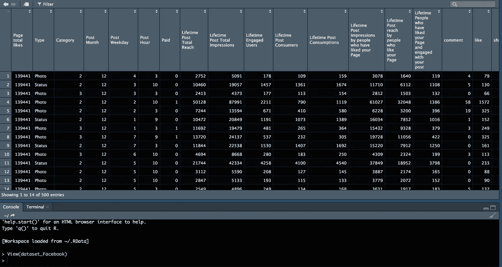
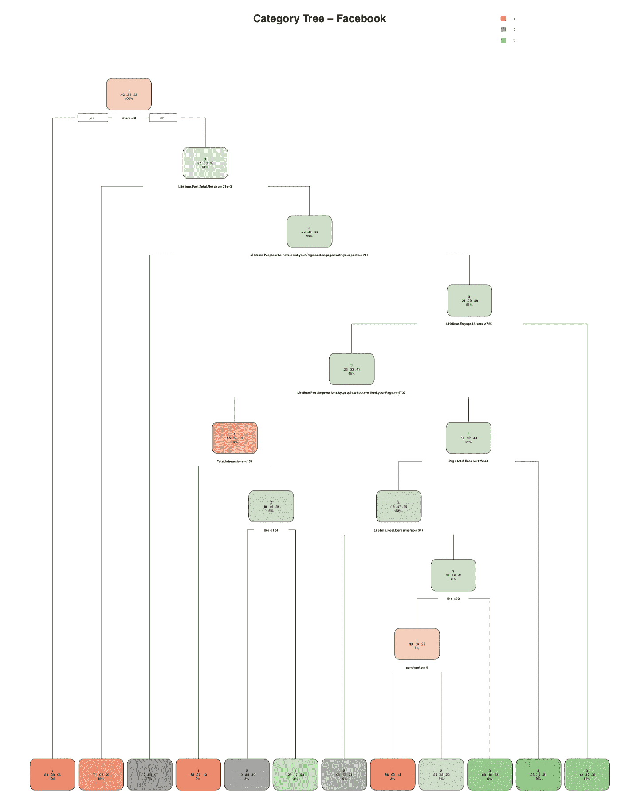
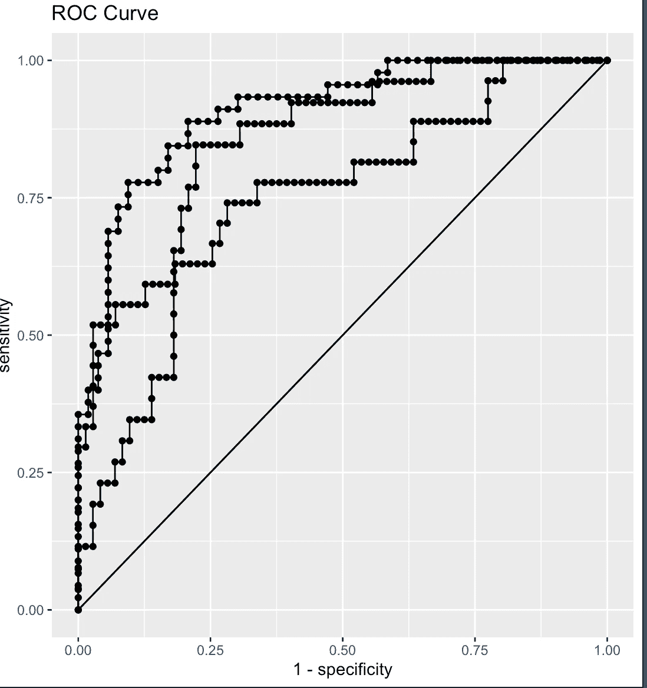

# R 中基于树的分类方法

> 原文：<https://medium.datadriveninvestor.com/classification-using-the-tree-based-method-in-r-17e2e873c4b5?source=collection_archive---------7----------------------->

[](http://www.track.datadriveninvestor.com/1B9E)

不同行业最大的问题之一是对客户进行分类，以创建更细分的营销活动。

细分营销活动的重要性在于能够获得更高的转化率，这可能会成为一个真正的挑战。

按照前面的思路，通过这篇文章，我们将介绍如何使用决策树方法对 r。

首先，理解使用“决策树方法”的概念和目的是很重要的。基于树的方法在多个区域中分割观察值，为了进行这种预测，它使用相应区域中训练观察值的平均值或模式。例如，基于树的方法可以帮助我们根据定性变量(如收入、年龄、性别、偏好)对客户进行细分，帮助我们看到通过观察数据看不到的不同关系。

例如，有一个[脸书数据集](https://archive.ics.uci.edu/ml/machine-learning-databases/00368/)，其中有一家化妆品公司在脸书的 500 篇文章，有以下数据:喜欢、分享、评论，最重要的是一个变量名“类别”，我们不知道它是什么意思。



figure 1 Facebook dataset in R

首先，我们需要了解如何确定决定每个类别的变量。

作为第一步，我们安装并使用我们的库来处理

```
#facebook Data ----install.packages("digest")
install.packages("parsnip")
install.packages("rsample")
install.packages("yardstick")
install.packages("rpart")
install.packages("xgboost")
install.packages("rpart.plot")
install.packages("tidyverse")
install.packages("Ckmeans.1d.dp")
# LIBRARIES ----library(parsnip)    # machine learning
library(rsample)  # testing/training splits
library(recipes)     # preprocessing
library(yardstick)   #  ROC/AUC
library(xgboost)    # xgboost
library(Ckmeans.1d.dp)  # feature importance plot
library(rpart)      # decision tree
library(rpart.plot) # decision tree plot
library(ggplot2) # Graphic
library(tidyverse) 
```

接下来，通过使用以下代码删除 de NA 字段来清除数据。

```
fb_data <- na.omit(fb_data)
```

重要的是预处理数据，在那里我们将有我们的训练和测试数据，看看它如何去我们的模型。

```
set.seed(1)
split_rsample <- fb_data %>%
 rsample::initial_split(prop = 0.80)train_tbl <- rsample::training(split_rsample) 
test_tbl <- rsample::testing(split_rsample)preprocessing_pipeline <- recipe(Category ~ ., data = train_tbl) 
#to implement the decision Tree#design a matrix with the preprocess Data
train_processed_tbl <- bake(preprocessing_pipeline, train_tbl)
test_processed_tbl  <- bake(preprocessing_pipeline, test_tbl)
```

一旦我们准备好了数据，我们就定义了我们的机器学习模型，在这种情况下，它将增强我们的分类模型。

```
set.seed(123)
model_xgb <- boost_tree(
           mode = "classification", 
           mtry = 80, 
           trees = 1000, 
           min_n = 3, 
           tree_depth = 8, 
           learn_rate = 0.01, 
           loss_reduction = 0.01) %>%
  # runs xgboost under the hood
    set_engine("xgboost") %>%
  # model_spec is an object.  fit similar to bake, in the sense
  # That it is applying the fit to the training data
    fit.model_spec(as.factor(Category) ~ ., data = train_processed_tbl)
```

创建模型后，我们创建预测变量，看看我们的模型是否适合对我们的 facebook 帖子进行分类。

```
predictions_test_tbl <- model_xgb %>%
    predict.model_fit(new_data = test_processed_tbl, type = "prob") %>%
    bind_cols(test_tbl) %>%
   mutate(Category = as.factor(Category))
```

然后，我们用我们的模型创建决策树并绘制它

```
fit <- rpart(as.factor(Category) ~ ., method = "class", data = train_processed_tbl)###  prune tree
pfit<-prune(fit, cp=0.015)rpart.plot(pfit, extra=104, 
           main="Category Tree - Facebook")
```

我们得到了这个结果:



Decision Tree

最后我们用 ROC 测试了我们的模型，

```
predictions_test_tbl %>% 
    roc_auc(Category, .pred_1, .pred_2, .pred_3)predictions_test_tbl %>%
    roc_curve(Category, .pred_1,  .pred_2, .pred_3) %>%
    ggplot(aes(x = 1-specificity, y = sensitivity)) +
    geom_path() +
    geom_point() +
    labs(title = "ROC Curve")
```

我们得到了下一个结果:



ROC Curve

我们得到了 0.828，这是一个非常好的预测结果，减少了假阳性和假阴性。

总之，这是对用户、客户、出版物进行分类的一种方法，它对细分我们的营销活动非常有帮助，就像在我们的例子中，我们可以对我们的出版物进行分类，看看哪些出版物得到了脸书用户的更多关注。

稍后，我会写一些关于其他分类方法的文章，如果你想知道一个特定的方法和任何其他你可以在评论区得到的结论，请告诉我。