# 机器学习中的分类器

> 原文：<https://medium.datadriveninvestor.com/classifiers-in-machine-learning-f075cb4e46b?source=collection_archive---------2----------------------->

理解逻辑回归

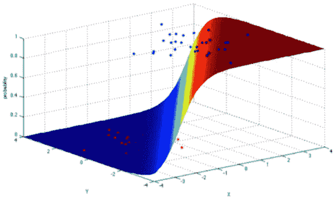

> 以下文章由三部分组成
> 1-机器学习中分类的概念
> 2-逻辑回归的概念&解释
> 3-一个在大数据集上逻辑回归的实际例子

# 分类器

可能有许多分类技术或分类器，但最常用和最广泛使用的有以下几种:

 [## DDI 编辑推荐:5 本让你从新手变成专家的机器学习书籍|数据驱动…

### 机器学习行业的蓬勃发展重新引起了人们对人工智能的兴趣

www.datadriveninvestor.com](https://www.datadriveninvestor.com/2019/03/03/editors-pick-5-machine-learning-books/) 

*   *逻辑回归*
*   *线性判别分析*
*   *K-最近邻*

不像线性回归，我们在 X 的基础上预测**定量反应**，当涉及分类时，我们实际上必须预测**定性反应**。

> 那么什么是真正的定性反应呢？

简单来说，就是我们观察的范畴化。我们将(比如 A、B 或 C)中的输出归为一类。换句话说，或者我们可以说，我们给我们的观察指定了一个类别。

> 当我们预测一个观察的定性反应时，它通常被称为**分类**，因为它涉及到将一个观察分配到一个类或类别。

# 分类示例

以下是我们可以利用逻辑回归的场景:

*   一个人有一些固定的症状，这可能导致三种特定的医疗条件之一。那么这个人具备三个条件中的哪一个？
*   银行必须评估任何个人进行的银行交易，以查明此人是否可能进行欺诈交易。有许多特征将被考虑来确定，例如:过去的交易、IP 地址等。
*   收到的电子邮件必须放入垃圾邮件文件夹或收件箱，因此电子邮件必须根据内容进行分类，无论是垃圾邮件还是合法邮件(Ham)。
*   给定泰坦尼克号数据集中的乘客细节，我们将不得不预测乘客的存活率。
    完整代码可通过以下链接获得:
    [https://github . com/rfhussain/Using-Logistic-Regression-for-Prediction](https://github.com/rfhussain/Using-Logistic-Regression-for-Prediction)

# **逻辑回归**

我们也可以称之为对线性回归的修改，其中算法确保输出是 0 和 1 之间的概率，而不是预测 y 的定量值。换句话说，输出要么被分类为 1，要么被分类为 0。当绘制在图表中时，它看起来像一条 S 形曲线。

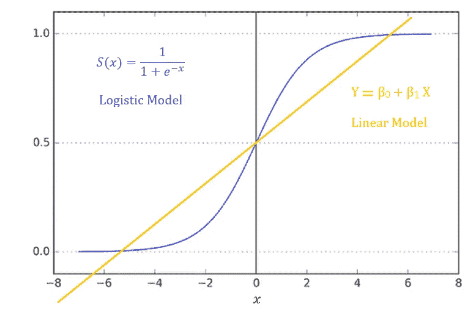

Linear Regression and Logistic Regression

这里使用的函数是 **Sigmoid 函数**。你也可以称之为**后勤功能**。

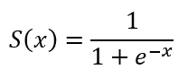

Sigmoid Function

该图显示，线性回归线超过 1，也是负值(低于 0)，而逻辑回归对响应进行了限制，因此，得到的预测是 1 或 0。

> 函数中表示的 e 称为欧拉常数，其值约为 2.71828。理解 e 背后的对数超出了我们的范围，但是您总是可以通过搜索来深入了解它，因为有大量的参考资料。

# 解释

让我们来讨论一个假设输出，我们如何根据估计的概率得到 1 或 0 的值。考虑以下假设

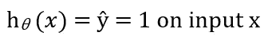

其中 **h *θ* (x)** 是某个数字。我们将把这个数字视为 y =1 的估计概率(y 带上限),以 x 为新的输入示例。

为了理解这一点，让我们举一个非常常见的肿瘤分类的例子如下

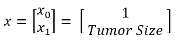

> **注**:x 的第 0 个值，一般来说，永远是 1。第一个值是肿瘤大小，如果有其他特征，比如说第二个值，它可能是肿瘤年龄等等。达到 x 的第 n 个值。

我们可能有一个特征向量 x，其中(0)的 x 一如既往地等于 1，我们的特征一是肿瘤的大小。假设一个病人有一些肿瘤大小，我们在假设中输入特征向量 x(肿瘤大小),假设假设输出数字 0.8，那么我们可以把它解释为。

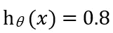

y=1 的概率是 0.8。换句话说，应该告诉病人肿瘤有 80%的可能性是恶性的。

让我们用数学来写，这是一种正式的写法。

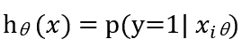

我们解读为，特征向量 x 的假设输出为，y=1 的 p(概率)，给定 x 的值，用***θ***θ参数化。

因为，这是一个分类任务，我们知道 y 可以取两个值中的一个，要么是 1，要么是 0，通过对等式做一点小改动，我们也可以写出下面的内容。

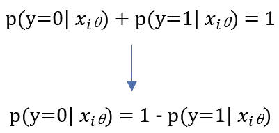

现在，我们已经清楚地展示了逻辑回归的假设解释，以及定义逻辑回归的数学公式。现在让我们来看看逻辑回归的决策边界。这意味着边界一边的决策将是 0，而另一边将是 1。

# 判别边界

我们必须回忆一下 sigmoid 函数和我们的假设，如下所示。

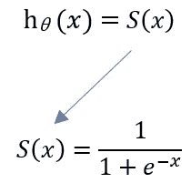

其中 S(x)会形成一条 S 形曲线，始于 x 的 0，止于 1。这里我们会看到我们的假设什么时候会做出 Y=1 的预测，什么时候会预测 Y=0。我们还必须看看当有多个特征时，假设会是什么样子。

在这一点上，我们必须考虑阈值，比如说 0.5，这样在以下条件下预测将得到 0 或 1。

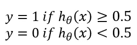

看下图将有助于理解上面的等式。

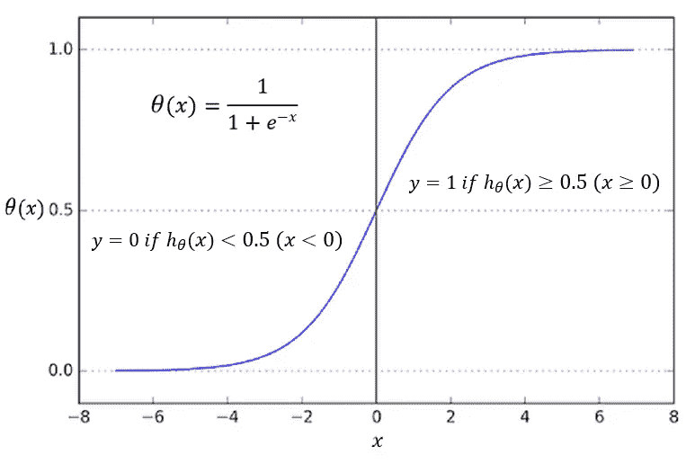

现在，考虑下面的数据集，我们有数据点，用橙色和蓝色的球体表示。

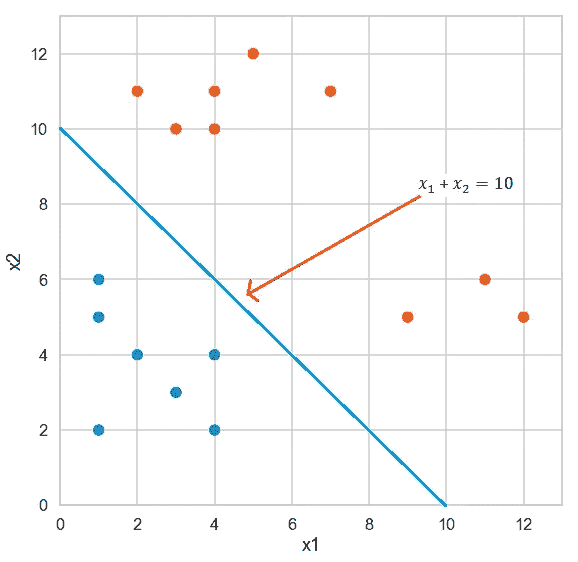

其中，预测 1 或 0 的假设如下:

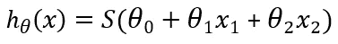

***θ*** 的值是-10，因此将其拟合到上面的等式将得到

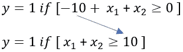

这表明 x1+x2 的值(10)形成了一条直线，该直线之上的任何值都将导致 y 预测为 1。直线以下的任何值都将导致 y 预测为 0。

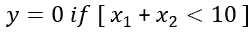

我们称这条线为决策边界。

> 此外，关于决策阈值的一个重要注意事项是，这是一个决定如何在预测概率为 1 或 0 时设置决策边界的值，我们将阈值设置为 0.5，但阈值最好通过检查阈值的假阴性和假阳性之间的成本权衡来设置。更复杂的数据集，我们将不得不检查数据并作出最佳决定，将其设置在 0 和 1 之间的某个位置。大多数情况下，我们将不得不通过反复试验来使用不同的阈值，以得出可能的最佳预测。

决策边界并不总是线性的，它们根据数据集的复杂性而变化。让我们看看下面的数据集，其中决策边界两侧的数据点用橙色和蓝色球体表示。

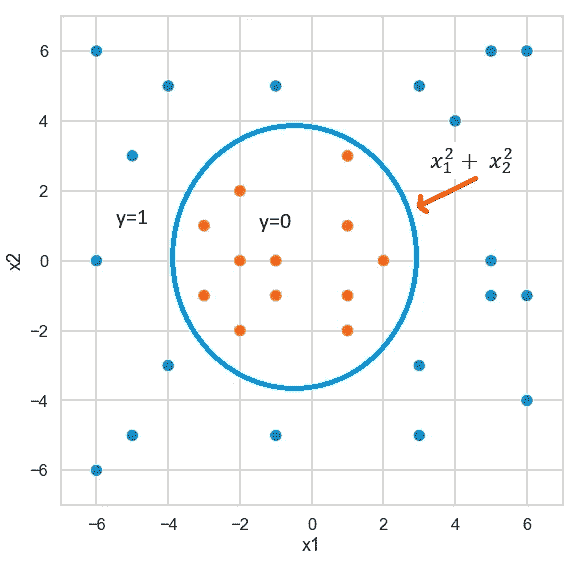

在上面的例子中，创建决策边界的假设将被表示为

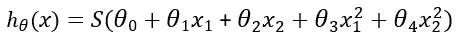

决策边界也不一定总是圆形，而是基于数据集的复杂性，当复杂性增加时，我们可能会得到一些不规则的形状。

# 价值函数

代价函数定义为，代价是什么，算法要付出什么，而它预测的是 **h *θ* (x)** ，标签是 y，换句话说，代价函数评估的是我们机器学习算法的性能。

我们需要成本函数，因为我们想最小化它。因此，最小化意味着我们减少误差值并提高模型的准确性，这是通过迭代训练数据集并调整模型的权重和偏差等参数来实现的。

让我们来看看一个训练数据集，它有如下 **m 个**值:

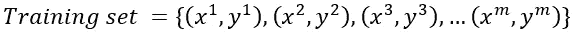

其中，x 是特征向量，具有 **n 个**特征，y 是标签，可以取值为 0 或 1。每个 x 和 y 表示如下:

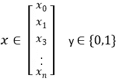

基于上面的值，我们必须为我们的假设 **h *θ* (x)，**选择θ***θ***的最佳值，这样我们的预测就尽可能准确。

为此，我们将不得不使用成本函数。我们也用一个成本函数来进行线性回归，它有一定的公式，但是在逻辑回归的情况下这个不能用在这里，只是因为它会导致我们的参数 ***θ*** *的非凸曲线表示。*因此，使用梯度下降确定全局最小值不是一种合适的方法。

相反，我们想要的是一个成本函数，它将产生一个弓形曲线，换句话说，一个凸函数，这样梯度下降将很容易收敛到全局最小值。

因此，特定于逻辑回归的成本函数的公式表示如下:

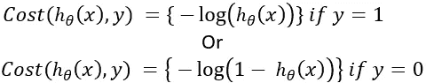

这里要理解的重要的一点是，如果我们的假设 **h *θ* (x)** 的结果为 0，而实际上 y label=1，那么成本将趋于无穷大，这同样适用于相反的情况。

如果我们将成本函数写成一行，它将如下所示:

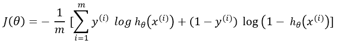

因此，通过使用这个成本函数，我们可以使用梯度下降来优化我们的机器学习模型，并得出可能的最佳精度。

# 实际实施

我在著名的泰坦尼克号数据集上实现了逻辑回归来预测 Y，Y 是名为“幸存”的标签，其可能值为 1 表示是，0 表示否。

完整的代码可以通过下面的[https://github . com/rfhussain/Using-Logistic-Regression-for-Prediction](https://github.com/rfhussain/Using-Logistic-Regression-for-Prediction)获得

# **参考文献**

本文的灵感来自吴恩达的人工智能讲座，以及 Gareth James & Daniela Witten 的《统计学习导论》一书。