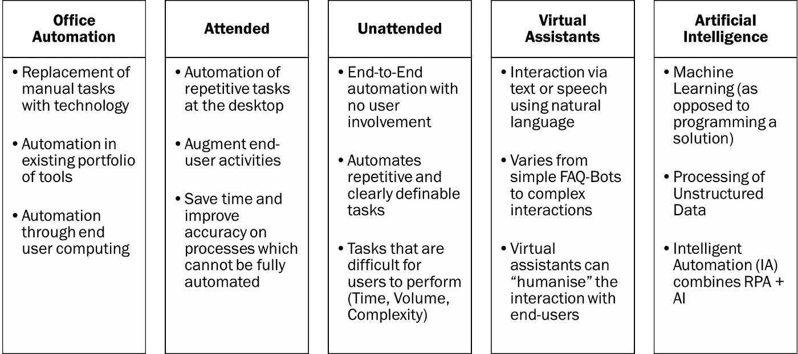

# 机器人过程自动化(RPA)的分类

> 原文：<https://medium.datadriveninvestor.com/classifying-the-types-of-robotic-process-automation-rpa-e02c45f7bf1c?source=collection_archive---------5----------------------->

为您的利益相关方创建一个**通用词汇表**将会加深他们对 RPA 的理解，并减少对 RPA 功能的误解。

理解不同类型的自动化将有助于你组织内的人们思考每种不同类型的自动化是如何工作的；可能的的*艺术的清晰示例将让您的利益相关者了解每个解决方案能最好地解决哪些问题。*

不同类型的自动化都有不同程度的复杂性。更复杂的业务问题可以解决，但需要更先进的方法，因此更难实现。当他们理解了这些差异，你公司的利益相关者将会走上正确的道路去评估最有可能是对组织最好的适合度。

在你项目的早期阶段，你收到的许多建议会被归入过于乐观或非常无知的类别。对于涉众来说，对不合适的或者太复杂的自动化过程有宏伟的想法并不罕见。

在第一次见面时，一个客户曾经向我建议，他们应该将一个他们自己的人觉得困难的过程自动化。他们认为这是自动化的绝佳机会！这过于乐观，而且非常无知，因为无法明确定义的流程不是 RPA 的良好起点。

同样，你需要记住 RPA 是关于机器人的，而*是关于过程的*；为了获得最佳结果，需要在业务流程改进(BPI)技能和自动化之间建立强有力的联系。困难的过程通常很难理解，良好的过程技能和自动化的结合将有助于评估甚至最复杂的情况。

真正复杂的东西通常是*而不是*开始你的自动化之旅的正确地方！

这是摘自《数字劳动力[一书](http://www.digitalworkforcebook.com/)

罗布·金

Rob King, Co-Founder of Wzard Innovation, Author of Digital Workforce and Interim Change and Transformation Leader