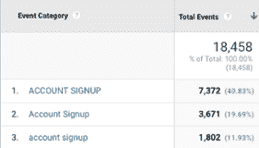
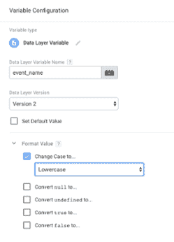

# 清理和标准化你的谷歌分析数据

> 原文：<https://medium.datadriveninvestor.com/cleaning-and-standardizing-your-google-analytics-data-8772b5603359?source=collection_archive---------7----------------------->

杂乱的数据？我们都经历过。在理想的情况下，您的数据在报告界面中应该是非常干净的。Google Analytics 会提供一行又一行、一列又一列有意义的数字，这些数字加在一起。您不必操作报表并将多行的值相加来获得 GA 事件的准确数字，也不必考虑活动名称的不同拼写。您不必应用四个高级段来捕捉 GA 数据中的所有已知错误。您不必将多个报告导出到 CSV 来操作基本的每周报告。你知道我在说什么！

我们都有自己的解决方法来理解我们的数据。如果你了解你的业务、你的客户和你的网站，你就知道你需要如何看待这些数字在 GA 中的意义。对于较重的货物，您的企业可能已经有了一个在数据进入数据库进行存储和查询之前转换数据的流程。我现在应该说，当涉及到数据仓库需求时，ETL(提取、转换、加载)任务的需求永远不会消失(我们也不希望它们消失)…但是如果 GA 中的数字更好呢？如果您团队中的一名新分析师可以直接进入 GA 并立即了解正在发生的事情，会怎么样？那不是很好吗？

要清理 Google Analytics 中的数据，你需要在源头上修复它，或者在进入的过程中修复它。

# 问题领域

我们谈论的是可能导致大问题的讨厌的细节。如果你在分析错误的数据，你的分析是没有意义的。如果你的测试数据和内部流量与你的用户数据混在一起，水就变得浑浊了。

说到杂乱的数据，通常会有一些疑点:一个活动名称有多种拼写变体；个人身份信息(PII)偷偷溜了进来(尽快解决这个问题，这违反了 GA 的服务条款)；事件大小写有差异；(事件、产品、属性、页面元素等的)命名约定不一致。您的 GA 数据中有哪些已知的罪魁祸首？

Inconsistent Event Categories in Google Analytics due to casing issues.

# 从源头修复数据

最好的情况是，从源头来看，数据是完美的。如果您的数据层中的所有东西都是原始的，那么它在 GA 中也会是原始的，所以为什么不先在那里修复它呢？这是一个伟大的解决方案！如果可以的话，这是我每次都喜欢使用的解决方案——如果手头的任务不是太困难的话。例如，如果是利用 CMS 将数据层中的属性附加到所有英雄图像上，那么就这样做吧！但是根据要求，在源头修复数据可能是开发人员的噩梦。它可能会在很长一段时间内占用您的资源，花费太多的金钱、时间和精力，而收效甚微，尤其是当分析师可以简单地提取 CSV 报告并在事后清理数据时。

但是，如果您可以相当容易地从源头上修复数据，或者如果您确定预先花费开发时间将会节省许多分析师的时间，那么就这样做吧。

# 在处理数据时修复数据

如果您的数据在来源处不正确(不一致或以您不喜欢的方式出现)，您可以将其转换为 Google Analytics。有两种主要方法:

1.  GA 过滤器
2.  谷歌标签管理器

## GA 过滤器

在一个命中被发送到 GA 之后，它在到达 GA 报告(和 BigQuery)之前被处理。你可以想象一下，Google 服务器在一个筛子中捕捉所有数据，然后根据设置的过滤规则确定哪些数据可以通过每个 Google Analytics 视图。如果你有一个过滤器来移除你所有的内部流量(使用一个基于你内部 IP 地址的排除过滤器)，那么谷歌会检查每一次点击，并问“它是否匹配这个 IP？没有吗？然后它可以通过这个视图。”与预定规则匹配的命中结果将存放在您的 GA 视图中。遗传算法过滤器一直是一个伟大的工具，清理你的数据。除了排除/包含过滤器之外，您还可以创建小写过滤器(想想:事件类别/操作/标签、活动名称、主机名等)，以及搜索和替换过滤器(您可以使用这些过滤器从请求 URIs 中删除最后一个斜杠，从 URL 中找到一个参数以插入到自定义维度中，或者用一个更清晰的文件夹结构重写 URIs)。

要记住的事情:

*   ***滤镜永久影响你的数据。*** 总是在一个重复的测试视图中测试过滤器，该视图与您希望过滤器最终出现的视图具有相同的设置。一旦你对它的表现感到满意，就把它移到合适的位置。
*   ***过滤顺序事项。*** 不要将依赖于查询参数的搜索和替换过滤器放在剥离所有查询参数的过滤器下面。它们按顺序处理。如果您有多个串联工作的过滤器，请考虑适当地标记它们，以便一眼就能看出它们是否有序(例如，移除内部流量 1/3、移除内部流量 2/3、移除内部流量 3/3)。

## 谷歌标签管理器

[Google Tag Manager](https://tagmanager.google.com/) 作为您的网站/数据层和 Google Analytics(以及您发送数据的其他工具)之间的中介。GTM 根据一组规则读取和评估数据，并选择在何时何地发送哪些数据。GTM 还可以在去往 GA(或其他地方)的途中转换数据。

您可以创建自定义的 JavaScript 变量，在数据到达 GA 之前对其进行转换(例如，通过使用 Simo Ahava 的方法[将 PII 从 URL](https://www.simoahava.com/gtm-tips/remove-pii-google-analytics-hits/)中剥离，这样它就不会出现在您的 GA Pages 报告中)。在某些情况下，这可能是最好的方法，比如去掉 PII。

但是对于其他情况，比如强制小写，GTM 中用户定义变量内的新格式值特性允许您轻松地[格式化您的变量](https://support.google.com/tagmanager/answer/9121006?hl=en)的输出以保持一致性。虽然您确实需要了解 GTM，但是您不需要成为开发人员就可以使用这个特性！这是一种非常简单的方法，可以自动执行一些流程并协调差异，从而使您的 GA 数据更清晰、更易于理解。

GTM Format Value feature (available within user-defined variable configuration).

# GA 与 GTM

没有硬性的规则来决定何时使用 GTM 或 GA 过滤器来保持数据的整洁。如果您已经有了 GA 过滤器来强制事件类别、动作和标签小写，那么您不需要切换到使用 GTM 特性。无论您为清理数据建立了什么策略，目标都是尽可能地报告和分析最佳数字——希望尽可能准确、一致和自动化。你花在清洁上的时间越少，你花在分析上的时间就越多(Metricstory 的[自动化分析解决方案](https://metricstory.com/product?utm_medium=ref&utm_source=medium.com&utm_campaign=ga+gtm+blog)也能帮上忙)。您最不希望看到的就是您的团队看到笨重、不准确的数据——所以要清理干净！

*原载于*[*blog.metricstory.com*](https://blog.metricstory.com/blog/cleaning-and-standardizing-your-google-analytics-data?utm_medium=ref&utm_source=medium.com&utm_campaign=ga+gtm+blog)*。*