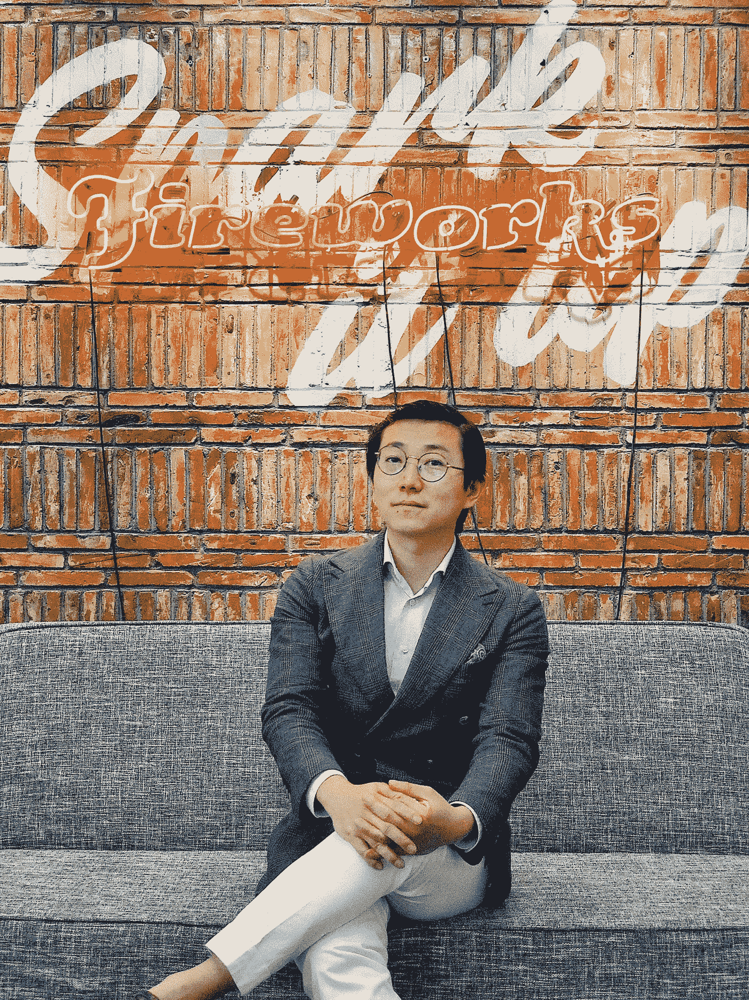
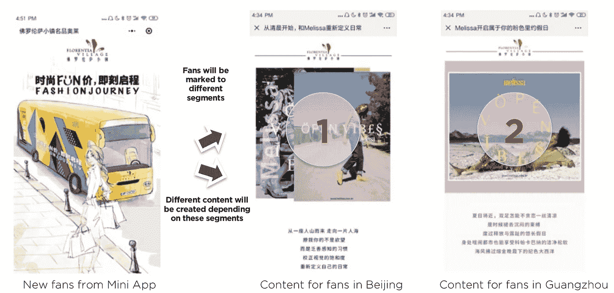
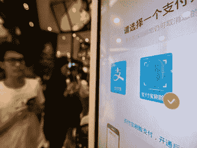

# 人工智能在中国的广告和营销

> 原文：<https://medium.datadriveninvestor.com/clearly-superior-chinese-advertising-and-marketing-ai-empowered-397510be88a4?source=collection_archive---------5----------------------->

[Chenyin Pan](https://www.linkedin.com/in/chenyinpan/)

# 你是谁？

我是潘，我是烟花公司的负责人。我们研究品牌在社交媒体上的表现。他们参与了哪些讨论。在此基础上，我们进行数字内容构思。我们帮助西方品牌涉足中国社交媒体。我们的融资人是意大利人，所以我们的商业模式要求在欧洲和中国之间建立强有力的联系。我们为一些领先的欧洲奢侈品牌工作。我很自豪地提到斯特拉·麦卡特尼。我们为 Lancel 创建了他们的城市应用程序。约翰尼·沃克也是一个客户。

我们最初是一家创意产业机构。为我们的客户设想新的想法和概念。我们已经发展成为数字技术企业。仍然珍惜我们的创造性根源，我们现在拥抱人工智能作为成功沟通的最终工具。但我们不是像上海那么多的人工智能机构。我们的创意是我们独特的销售主张。我们不是一家科技公司。我们的硬件更少。我们是一个有创造力的发电站。对我们来说，充分了解人们想要什么至关重要:仅仅是一家科技公司是不够的。数据只能帮你这么多。这实际上是用只有人类才能做到的方式解读数据。为我们工作的品牌解读数据。帮助他们看清正在发生的事情，以及这对他们意味着什么。我们是他们的情感伴侣。

 [## 人工智能与创造力:作为创意引擎的比根——数据驱动的投资者

### 的确，2018 年可以被视为人工智能创造的创造力全盛时期的开始。当然可以…

www.datadriveninvestor.com](https://www.datadriveninvestor.com/2019/02/13/ai-creativity-biggan-as-a-creative-engine/) 

# **谈到商业通信，人工智能是新的焦点吗？**

毫无疑问&无处不在。你不再有在汽车工厂工作的人；97%是自动化的。快递业也在走同样的路。阿里巴巴做智能酒店。手工设计已经过时了——除非你是高级时装设计师。甚至人类也变得人工智能提高了。不可避免的是，AI 也给广告和营销带来了巨大的变化。

与西方相比，中国的 ICT 前景非常不同。在这里，消费者的旅程都在一个生态系统中。商店、名人、当地报纸、金融交易、娱乐都在同一个网上空间。在微信上，你可以买到运动鞋和蔬菜。他们也被带到你的家门口——仍然是微信授权的。烟花完全致力于中国的超级生态系统。我们帮助欧洲品牌，主要是奢侈品、时尚、生活方式和 F & B 品牌，在其中找到成功的地方。

传统上，我们为西方品牌提供高预算和高期望的服务。由于我们的人工智能投资，五年前必须由五个人完成的工作，现在只需要一个人就可以实现。这让我们有可能帮助预算更有限的品牌。

Different landing pages — personalization

在营销传播中，我们专注于客户关系管理。两个不同的人作为我们的一个客户访问同一个网站。我们研究了他们的数据，他们的过去，他们的位置，因此，他们观看非常不同的开场画面。这本身听起来并不新鲜。当一个人打开上海或阿姆斯特丹的公司网站时，它看起来也会很不一样，比如随着天气类型的变化而变化。但是我们把这种个性化带到了更精细的下一个层次。AI 是这里面的关键因素。

# 同样在亚马逊，每个网站访问者都会得到一个个性化的开场镜头？有什么不同？

亚马逊就像一个巨大的市场。他们有所有的交通数据转移给他们。我们的角色完全专注于让我们的品牌客户受益。我们正在建立他们的 CRM 生态系统。基于他们的客户和访问者以前在哪里购物，他们看了什么，点击了什么，他们在哪里，过去，现在，预测未来。亚马逊可能是西方的终极市场空间，但我们正在为中国的品牌客户建立在线生态系统。请注意，亚马逊不太了解人们在离线世界的行为。我们知道！自从中国人用移动支付后，线上和线下的区别在这里就不再计算了。

# **哪里的广告业更先进:中国还是西方？**

AI 最基础的研究还是发生在硅谷。不过，中国非常非常擅长实现一切。我们有更多的数据来喂给人工智能。**我们对隐私不太敏感。**我们将关于人们行为的在线数据与他们的离线数据行为更好地结合起来。仅仅因为在中国我们可以而且被允许。你在关于李开复的文章中写道:[“人工智能的超能力。中国、硅谷和新的世界秩序。”](https://medium.com/datadriveninvestor/kai-fu-lee-6130b0affd)

> 西方公司通常没有头绪。

感谢这一切，我们很高兴能站在中国数字革命的前沿。我们在所有的竞技场上。我们生活和呼吸着数字。我们能接触到中国所有新奇和酷的东西。

# **什么是新酷？**

[Baltimore Times](http://baltimoretimes-online.com/news/2017/sep/05/pay-your-face-kfc-china/)

每个人都生活在手机上。电商来到你真正的线下门口。中国已经没有现金了。用脸付钱。这也更环保，因为我们正在离开印刷业。电动汽车在中国的适应速度比其他任何地方都快。更普遍的是，这里的发展速度比西方快。我们减少结构化，为强大的创造力和企业家精神留下更多空间。没有必要适应任何形式——这为破坏性的努力创造了最大的空间。中国是一个倾向于行动的国家，积极地抓住机会，并通过努力工作来完善机会，从而获得更大的回报。最后但同样重要的是，我们比其他任何地方都更快地变富。人们对致富有着巨大的不耐烦的渴望。我们将它与坚持不懈的完成任务的雄心结合起来。上海是这一切的中心，那里聚集了大量有创业精神的年轻人。

# 谈到你的工作实践，最让你吃惊的是什么？

克服跨文化障碍有多难，人们和公司对此的思考有多轻松。[中国品牌不了解西方。反之亦然。](https://medium.com/@carlrohde/china-the-smartest-d70c724ed775)西方国家往往懒得把中国品牌的名字读好。认为这无关紧要既不明智也无济于事。为了在商业上取得成功，应该有更多的跨文化的相互敏感性。我们的核心目标是成为西方品牌在中国的人工智能创意工厂。但这不应该让我们看不到这样一个事实，即“教育”跨文化差异和敏感性是有好处的。

因此，我们决定每年来欧洲两次路演，为他们未来潜在的中国市场的弱点和特点做准备。对他们来说，当他们还在欧洲的时候就了解到这一点，比他们已经在中国访问时受到冲击要好。我们很乐意多做一点，让他们更方便。作为中国企业家，我们认为这是一笔不错的投资。作为路演的一部分，我们肯定会关注中国数字化的可能性——以及实际发生的事情。**西方公司往往没有头绪。**

对烟花欧洲路演感兴趣？电子邮件:[carl@scienceofthetime.com](mailto:carl@scienceofthetime.com)

**关于作者:**
Carl Rohde 博士教授是一位关于“未来预测&创新”的国际主题演讲人，具有学术深度和实践现实性。在过去的十年中，他与 50 所大学和 10，000 多名学生合作。目标:让所有人都参与到更多的趋势和创新中。罗德在阿姆斯特丹、巴塞罗那和上海都有研究职位。卡尔·罗德还领导着 www.scienceofthetime.com T4 公司，这是一个全球市场和趋势研究人员的虚拟网络。

作为一个教育知识机构(大学、理工学院或其他),您是否有兴趣参与国际酷城搜索[请点击此处](https://scienceofthetime.com/service-title-2/)。

在 Twitter 上关注[Carl Rohde](https://twitter.com/CarlRohde)，在 Medium 上关注[。](https://medium.com/@carlrohde)