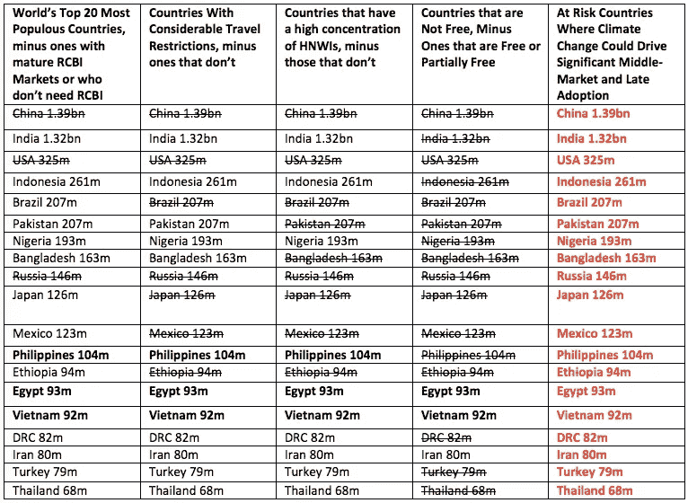

# 气候变化:投资移民市场强有力的新驱动力。

> 原文：<https://medium.datadriveninvestor.com/climate-change-a-powerful-new-driver-in-investment-migration-markets-ab06442d9947?source=collection_archive---------8----------------------->

2017 年末,《投资移民内幕》( Investment Migration Insider)发布了一份对投资移民市场潜力巨大的国家的快速分析。以下标准用于确定黄金签证和投资公民类产品的下一个大市场:

1.  **人口众多**
2.  **政治自由和财产权有限，社会经济或政治不稳定等。**

**3。相当多的旅行限制或低护照权力**

**4。大量的高净值人群。**

 [## 气候变化、ESG 和对更好数据的追求|数据驱动的投资者

### 在地球上许多地方经历了另一个令人难以置信的炎热夏季后，来自 S&P 的最新发现…

www.datadriveninvestor.com](https://www.datadriveninvestor.com/2018/08/24/climate-change-esg-and-the-quest-for-better-data/) 

利用这种方法，该出版物缩减了名单，最终越南在这些标准中脱颖而出:

入围名单是通过淘汰的方式编制的。

因此，2017 年，最大的现有和新兴市场是:

中国(成熟市场)

俄罗斯(成熟市场)

越南(有前途的新兴市场)

埃及(新兴市场前景看好，但可通过伊斯坦布尔或阿联酋提供服务)

伊朗(有前途的新兴市场，但面临制裁挑战)

*但这是在 2017 年，一个新的新兴驱动因素需要重新审视这一分析:*

# **不断升级的气候变化。**

虽然整个世界都在经历全球变暖的不利后果，但对更贫穷、更不稳定的国家的复合效应要明显得多。

The escalating impact of global warming could lead to an uptick in demand for investment immigration across all key and new markets in the coming decade. Source data: [IMIDAILY.COM](https://www.imidaily.com/asia-pacific/vietnam-next-big-market-investment-migration/)

# **投资移民:现在与未来**

移民在许多方面都具有挑战性，因此目前只有极小比例的黄金签证持有者真正移民。

对他们来说，这是一个后备计划。

但鉴于气候相关灾难的急剧升级，发展中国家的富人可能最终需要行使他们的避险选择权。

在接下来的十年里，战胜气候危机将成为那些寻求给几代人留下全球遗产的人的一个关键挑战。

因此，随着未来 20 年气候危机的展开，对于那些有能力的人来说，投资移民可能会成为一种必需品，而不是奢侈品。

新西兰将成为世界上受气候变化影响最小的国家之一。)

鉴于气候变化已经在全球新闻周期中得到大量报道，需求的上升几乎是肯定的。

**2020 年尼日利亚投资移民机会**

截至 2019 年，尼日利亚有[超过 9000 名美元百万富翁](https://e.issuu.com/embed.html?u=newworldwealth&d=africa_2019)，其中很大一部分富裕人士生活在拉各斯。此外，[尼日利亚正以世界上最快的速度产生新的百万美元富翁](https://www.cnbc.com/2019/01/16/countries-with-the-fastest-growing-millionaire-billionaire-populations.html)，埃及、孟加拉国和越南紧随其后。

每一个危机时刻都伴随着机遇。作为一个例子，尼日利亚的生活越来越艰难，即使对富人来说也是如此。预计未来十年，降雨量的增加、更强烈的风暴和海平面的上升将使拉各斯数百万人处于危险之中。

*目前有超过 1750 万人居住在这座低海拔城市和周围的贫民窟，未来人道主义灾难的范围是巨大的。*

因此，像 [Brookes & Partners](http://www.brookesandpartners.com/) 、[Beyond Residence&citizen](https://www.beyond-immigration.com/)、 [Golden Visas Nigeria](https://www.goldenvisas.com.ng) 和 EB5 specialties[Atlantic American Partners](https://www.atlanticamericanpartners.com/)这样的公司最近在尼日利亚加大了[招聘](https://www.imidaily.com/jobs/business-development-manager-lagos/)和[营销活动](https://businessday.ng/life-arts/article/atlantic-american-partners-launches-united-states-eb-5-visa-investment-program-in-nigeria/)是有道理的。

随着气候变化的余波和随之而来的不稳定不可避免地在未来袭击尼日利亚，当新的潜在移民投资者到来时，这些公司将做好充分的准备来赚钱。

同样，虽然巴西目前面临的挑战更多的是社会政治问题，而不是气候问题，但人们已经可以从 2019 年申请[葡萄牙黄金签证的巴西人数量](https://www.goldenvisas.co.za/portugal-golden-visa/)中看到[最近政治发展](https://www.imidaily.com/europe/portugal-golden-visa-applications-reach-16-month-high-in-july-as-brazilian-investors-rival-chinese/)的影响。

# **临别观察**

危机时刻经常会不期而至，所以那些能够在执行中保持敏捷，在思维中保持抗脆弱的公司将会获得最大的利益。

此外，在气候危机将在未来引发突然和重大投资移民需求的国家，现在是开始建立当地增长伙伴关系的时候了。