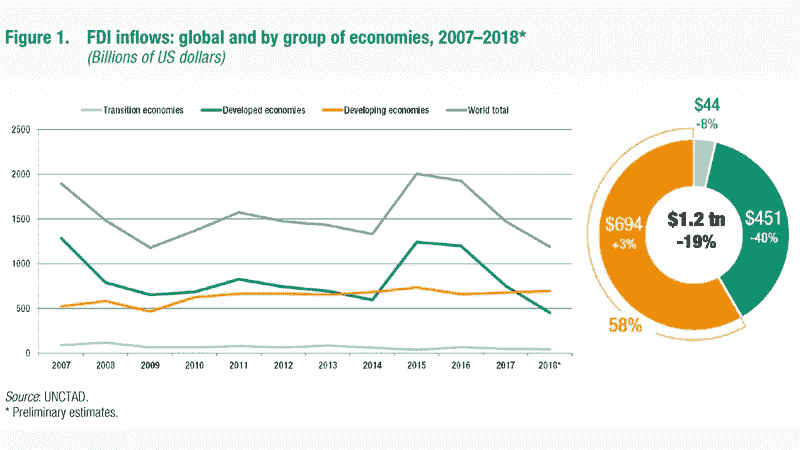
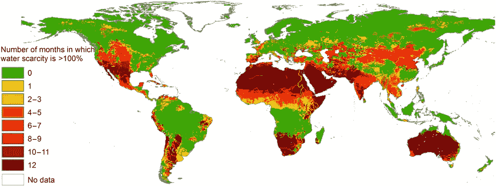

# 气候变化、新兴市场投资和水资源短缺

> 原文：<https://medium.datadriveninvestor.com/climate-change-em-investing-and-water-scarcity-23bc247aef45?source=collection_archive---------13----------------------->

2017 年，超过 6000 亿美元流入新兴市场。2018 年，这种流动在很大程度上继续，尽管有所减弱。如今，在 2019 年，关于新兴市场投资的好处和潜在回报的文章比比皆是。此外，许多经济学家认为，这些经济体将在未来几年和几十年成为世界主要的增长动力。这种投资渠道在很大程度上忽视了这些资金流入的国家内部存在的系统性风险。新兴市场处于独特的地位，既最先受到气候变化的冲击，也受到最严重的影响，同时又对形势束手无策，既缺乏在灾难发生时立即采取补救措施的现金，也缺乏组织救援和防止内乱的机构。

印度就是一个很好的例子。他们快没水了。到明年年底，大约 1 亿人将没有地下水，剩余人口中大约一半的供水将进入极度紧张的范围。受影响的城市将加入世界各地的行列，开普敦、圣保罗、东京、北京、墨西哥城、洛杉矶和许多其他城市，都遭受严重的水资源紧张。

 [## 气候变化、ESG 和对更好数据的追求|数据驱动的投资者

### 在地球上许多地方经历了另一个令人难以置信的炎热夏季后，来自 S&P 的最新发现…

www.datadriveninvestor.com](https://www.datadriveninvestor.com/2018/08/24/climate-change-esg-and-the-quest-for-better-data/) 

美国和日本等富裕国家将能够负担得起基础设施和必要的调整，以承受这种极端情况。它们拥有的政府机构将能够满足工业和公民的需求，并保持强大的民间社会。拥有财富特权的富裕国家将能够直面“零日”事件(水供应耗尽的那一天)，并且比欠发达国家有更好的规划和更少的相对腐败。

大多数新兴市场没有这些政府和社会资产。很难想象坐落在即将干涸的城市中的印度制造业的未来前景，然而它们的库存很可能再创新高。对于许多工业过程来说，替代性的取水方式作为季风和地下水的替代品在经济上是不可行的。根据 NITI Aayog 等印度政府智库的一些预测，除非政府采取极端干预措施，否则该行业有可能从某些领域完全撤离。

Water scarcity at the grid cell level is defined as the ratio of the blue water footprint within the grid cell to the sum of the blue water generated within the cell and the blue water inflow from upstream cells. Source and methodology: Science Advances 12 Feb 2016:Vol. 2, no. 2, e1500323DOI: 10.1126/sciadv.1500323

一些地区的水资源状况已经削弱了生产力，这让人想起了苏联的排队等候，人们排队等几个小时才能得到政府提供的淡水，或者花费大量资金购买私人水源。《华尔街日报》的一位消息人士称，她每月 75%的工资都花在了私人饮水上。其他人报告说，由于短缺，他们的生活方式发生了深刻的变化。在南非，邻居可以将彼此的消费视为一种公开的羞辱。在这种情况下，一个国家的生产率和增长水平是非常值得怀疑的。随着一些地区的生活变得更加艰难，潜在的种族和阶级冲突可能会重新出现，这将为新兴市场投资带来另一个不常被考虑的风险载体。人们可以从埃及的面包骚乱和阿拉伯之春中寻找例子，看看国家在这种困境中崩溃的速度有多快。

投资者应该认识到气候变化给新兴市场带来的风险。投资者应特别关注印度等已经感受到影响的地区，以及哪些可能性会失控。气候变化对新兴市场投资的影响不会在一夜之间发生，其相关性仍不及短期流动性投资的短期压力，但对于长期投资者而言，这应该是首要考虑因素。