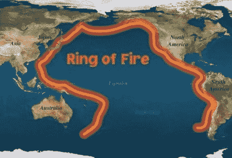
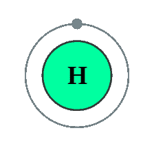
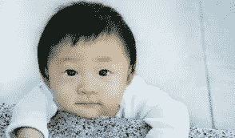
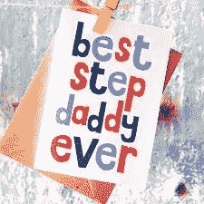

# 气候危机解决方案第一部分:亲爱的地球母亲

> 原文：<https://medium.datadriveninvestor.com/climate-crisis-solution-part-one-dear-mother-earth-1782f423d057?source=collection_archive---------4----------------------->

这是这个气候危机解决方案宣言的未知部分的第一部分。

问题的定义:由于对流层中温室气体浓度极高，阻碍了太阳辐射，破坏了维持气候稳定所需的微妙平衡，地球生物圈正变得不适于子孙后代居住。

合乎逻辑的大图景解决方案:为了恢复气候的稳定性，从而恢复生物圈的稳定性，需要从对流层中去除数十亿吨的二氧化碳和甲烷。

因此，现在的任务变成了如何到达那里，清理这个给我们的地球母亲带来如此大压力的烂摊子。

亲爱的地球母亲，

地球母亲见见氢先生，你的孩子需要你放弃与化石燃料先生的有毒关系。我们知道你在爸爸离开后开始和他约会来帮助照顾我们，我们感谢他给我们的一切，但现在我们可以看到他让你生病了。这些年来，我们已经变得足够强大，可以帮助你与化石燃料先生离婚。这就是为什么我们把你介绍给你生命中的新男人；氢先生。你已经非常了解他，因为他是整个宇宙中最丰富的。当然，他很富有，并且去过很多其他可居住的星球，但是他很老练，可以帮助你重获力量和稳定。他甚至可以帮助我们搬出房子，得到我们的第一套公寓。我们都知道你需要休息，希望看到我们独立。

在过去的几百年里，我们成长了这么多，为了表示我们对你的爱以及我们对你和氢先生的新关系蓬勃发展的渴望，我们为你准备了一份惊喜礼物，我们知道你会喜欢的。

令人惊讶的是，这是一项利用太平洋大陆架边缘无限热能的发明，我们称之为火环，产生无限量的氢先生。氢先生会帮你清理肺部的二氧化碳和甲烷，这是你和化石燃料先生约会时从二手物品中获得的。这就是你生病的原因，马，氢先生非常愿意介入，用你应得的尊重和爱来对待你。

你知道我们如何在海底挖掘化石燃料先生。我们可以用同样的技术来实现我们给你的礼物。顺便说一句，我们非常抱歉把化石燃料先生一直洒到你们的海洋里。我们承诺与氢先生一起清理所有的塑料，永远不再泄露化石燃料先生的本性。我们知道你有多爱自然状态下的海洋，你总是说“让它们保持原样”。

氢先生是个很棒的人，他做饭，打扫卫生，而且比空气还轻。这么方便，这家伙，马。他是我们一直想要的理想继父；富有，强大，有一颗充满可能性的善良的心。太好了，啊。哦，等等，我们说到哪了，哦，对了，礼物！

所以，我们已经建造了所有这些海上平台，把化石燃料从火圈周围拉出来，以实施这项新技术。这个创新的想法是，我们设计了一系列机器，它们可以进入通常什么都不会进入的管道。这些设备是一系列菊花链迷你涡轮机和水电解机制，能够产生 100 倍于表面主涡轮机的压力，但在系统底部将水分成 HHO。最终的结果是通过主涡轮机产生更多的能量，数十亿吨的氢先生和他可信赖的商业伙伴氧先生被用来清理你们的对流层和海洋。

但是等等，妈妈，还有更多。我们还设计了轻于空气的建筑，为氢先生建造一个垂直管道，直接进入你们的对流层喷射流。附在氢先生的管道上，拖过你的对流层喷射流的，将是氢先生非常特殊的过滤无人机。他的过滤手会轻轻地按摩你的喷射气流，并收集所有肮脏的二氧化碳和甲烷。过滤无人机使用燃料电池以氢先生为食，从而产生副产品 H2O。这些水被用来将二氧化碳和甲烷通过氢先生的管道送回平台。污浊的气体将被转化为可用的商品，从而获得利润并为整个努力买单。看到马，我们已经学会了不浪费任何东西。

我们需要氢先生排出数十亿吨的污浊气体，这样你就能感觉好点了，妈妈。我们知道化石燃料先生会对离婚感到不安，但因为我们真的很感激他为我们成长所做的一切，我们愿意让他在客房住一段时间，帮助提高印度和中国。当时机成熟的时候，他们将不再使用化石燃料，并学会爱他们的新继父氢先生，就像你身边的主要照顾者一样。

我们的礼物的美妙之处在于它的可扩展性，如果我们真的努力工作，从一个继父到另一个继父的安全而有趣的过渡是可能的。你会再次变得健康和富有的，妈妈，我们只是想让你为我们感到骄傲。在我们前往太空学院的第一个公寓之前，作为你们的孩子，我们有责任照顾好你们。我们每个周末都会回来洗衣服，但是把你留给化石燃料先生感觉不太好。

我们知道他和我们一起喝醉后回家后会对你进行虐待。你应该得到更好的妈妈，更好的妈妈，我们很抱歉把事情搞得一团糟。我们的青少年时代对我们来说是如此艰难和困惑。既然我们正在成熟，我们可以说我们幼稚的方式已经过去了。今世后代都知道如何尊重你。我们希望在太空学院学到更多。虽然我们还没有真正决定职业生涯，通识教育必修课程将是一个很好的机会，看看我们最喜欢什么，我们最擅长什么。

在我们打包去太空学院之前，我们会确保氢先生的位置很好，并且有合适的工具来帮助清理你的急流和海洋。这是我们送给您的礼物，马，感谢您这些年来给予我们的一切。美丽的食物，海滩，天空，动物，山脉，洞穴，季节，云，雨，药物，甚至昆虫，等等。谢谢你，地球母亲。

你最真诚的，

全人类