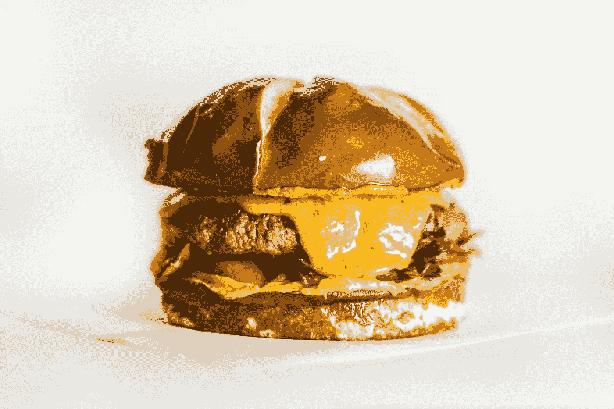
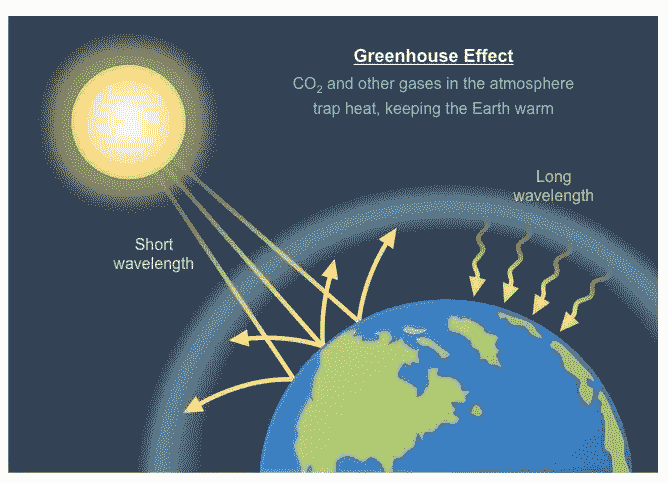
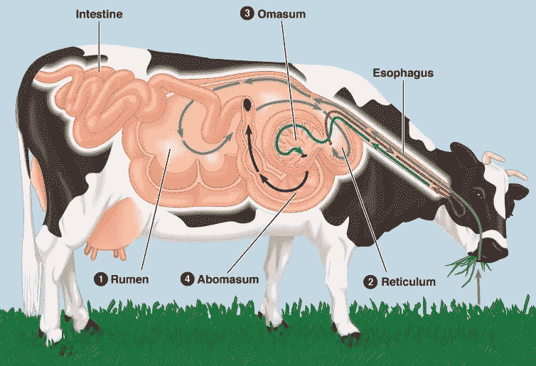
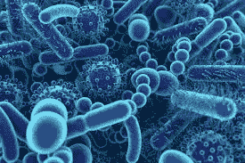
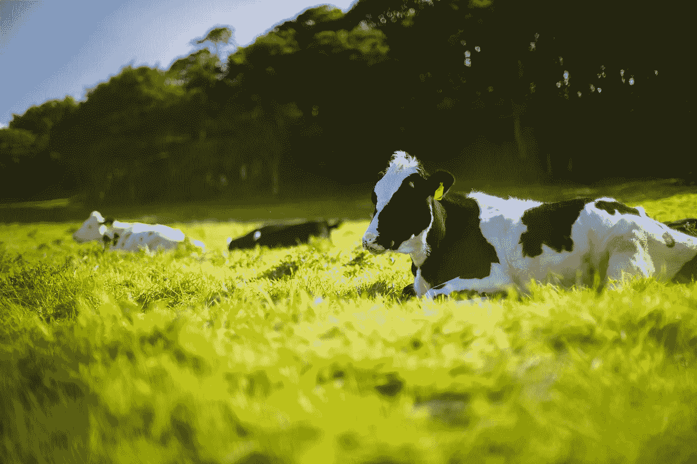
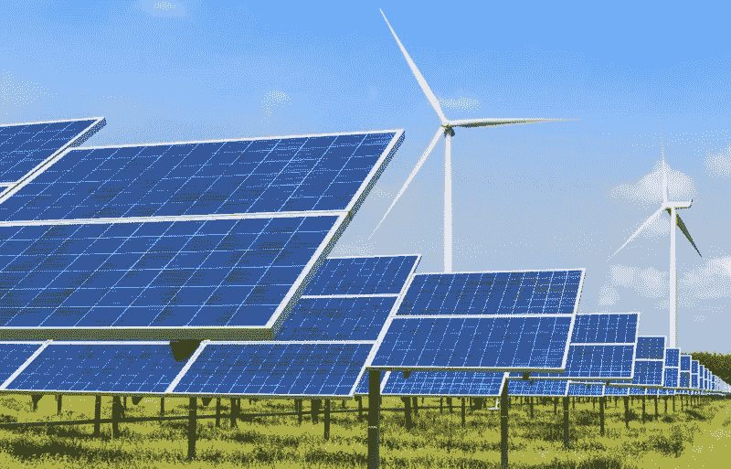

# 气候安全的奶牛🐮

> 原文：<https://medium.datadriveninvestor.com/climate-safe-cows-cc67cff70dec?source=collection_archive---------1----------------------->

## 减少奶牛甲烷产量的基因工程。

# 我喜欢好吃的汉堡！

Yum 😋

我真正❤️的另一点是环境。

可悲的是，吃我最喜欢的汉堡对环境产生了巨大的影响。

奶牛(生产牛肉的牲畜)向我们的大气中释放甲烷，导致我们的星球变暖。

 [## 气候变化、ESG 和对更好数据的追求|数据驱动的投资者

### 在地球上许多地方经历了另一个令人难以置信的炎热夏季后，来自 S&P 的最新发现…

www.datadriveninvestor.com](https://www.datadriveninvestor.com/2018/08/24/climate-change-esg-and-the-quest-for-better-data/) 

每年，一头牛产生 70 到 120 公斤的甲烷，而全世界有超过 15 亿头牛在 T2！

这是大量的甲烷排放！😓

知道这一点让我想放弃美味的汉堡，但有一种替代产生高甲烷的奶牛的方法。通过基因工程让奶牛产生更少的甲烷，我会在这篇文章中告诉你。😉

但是首先，再多一点关于甲烷的信息。

# 甲烷是一种温室气体。

它非常善于吸收大气中的热量，在“温室效应”中扮演着重要角色

这种效应是来自大气的*辐射使地球表面及其上方的空气变暖的过程。*这是由困在大气中的**“温室气体**”造成的。温室气体，如*二氧化碳、甲烷、一氧化二氮、*和*臭氧。*

☀️Diagram of the greenhouse effect. (Credit: BioNinja)

这对我们星球已经上升的温度来说并不好，因为一吨甲烷气体导致的变暖是一吨碳的 32 倍。🤯

**除了奶牛，其他大气中的甲烷都是:**

*   **厌氧分解:**这是微生物在缺氧的情况下分解生物可降解材料，产生沼气(包括甲烷)的过程。🌱
*   **化石燃料勘探:**🏭例如，天然气——主要由甲烷组成。
*   **生物质燃烧:**森林火灾，烧柴，+烧炭。🔥

在这篇文章中，我将讨论如何帮助减少牛产生的甲烷。

 [## 气候变化、ESG 和对更好数据的追求|数据驱动的投资者

### 在地球上许多地方经历了另一个令人难以置信的炎热夏季后，来自 S&P 的最新发现…

www.datadriveninvestor.com](https://www.datadriveninvestor.com/2018/08/24/climate-change-esg-and-the-quest-for-better-data/) 

# 牛的肠道会产生甲烷。

Rumen = Gut 🔑

奶牛的瘤胃(肠道或四腔胃)内有微生物，帮助消化过程中分解饲料。

某些**可遗传的微生物在奶牛⬆️产生甲烷。**

奶牛(和其他生物)继承的微生物由它们的微生物群落控制。

一个微型生物群落是生活在一个有机体内部的所有微生物的所有遗传物质。在奶牛的瘤胃中，这些是分解饲料(碳水化合物)并产生甲烷的微生物。

生物体中微生物的其他例子有*真菌、细菌、病毒*和*原生动物*。

# 目前，改变奶牛的饮食可以帮助减少它们产生的甲烷量。

奶牛饲料中碳水化合物的分解有助于它们瘤胃中甲烷的高产量。

将它们的饲料改为混合海藻后，甲烷排放量减少了 20% (2016)。

然而，这不是最有效的解决方案。

更高效的解决方案:

## 遗传学。🧬

所有生物都有一个 [**基因组**](https://medium.com/datadriveninvestor/a-journey-into-the-genome-a6235c8eb81f?source=---------5------------------) ，这是它们 DNA 的完整序列。

**DNA** 是遗传密码的*链*和*编码这一链(A，C，T，G)的核苷酸的微小变化创造了不同的特征。*

DNA. 😍

这些细微的变化也是微生物(细菌)和哺乳动物(牛)的区别。

DNA 中编码特定特征的小序列是**基因**。例如，有一种基因赋予人蓝色的眼睛。有一种基因会让人有棕色的眼睛等等。👀

使用基因知识+工具将是减少奶牛甲烷产生的更重要的解决方案。

# 牛的遗传特征控制着它们瘤胃中微生物的数量。

在这篇[研究论文](https://advances.sciencemag.org/content/5/7/eaav8391)中，研究人员确定了牛体内的**核心微生物群落**，并研究了*微生物与核心微生物群落中的*基因特征之间的关系。

Gut micro-biome.

**被发现与甲烷排放有关的微生物包括:**

*   **乳球菌**
*   **纤维杆菌**
*   **琥珀弧菌科**

所研究的微生物群落中的所有核心可遗传细菌都与**纤维素分解**中的关键角色相一致。纤维素分解是纤维素的分解。

纤维素分解的关键作用似乎是🔑*动物释放甲烷量的决定因素。*

被研究的释放甲烷的微生物是与*特征相关的。*

这意味着奶牛瘤胃中的微生物数量取决于奶牛表达的基因特征。

在这项研究中，研究人员还发现，50%的奶牛在它们的微生物群落中共有 39 种微生物。🤯

可以说是这篇论文中最有用的发现:

# 琥珀弧菌科的⬆️丰度和微生物组的其他变化与较低的甲烷产量有关！

Now we can help make cows more climate-friendly! 🎉

研究人员提出了一个*“微生物群落引导的育种/遗传计划”*来帮助*增加甲烷降低微生物的数量。*

实现这一点的一种方法是通过**基因工程**，使用像 **CRISPR Cas-9** 这样的工具，从本质上*编辑牛的基因组* *中的基因特征，以产生更多的降低甲烷的微生物。*

另一种方法是通过**表观遗传工程**，这是一种在不改变 DNA 序列的情况下*编辑遗传特征表达的方法。*

如果这行得通，我们将拥有“气候安全奶牛”和⬇️甲烷排放！🌎

# 人类活动占全球甲烷排放量的 50-65%。

降低甲烷排放的答案不仅仅在于奶牛。

这需要全球合作和有环保意识的选择。

我们需要做出的一个重大改变是从天然气等化石燃料转向更可持续的替代能源(例如，太阳能☀️).

# 🔑外卖食品

*   奶牛产生一吨甲烷。
*   甲烷是一种强大的温室气体，它使地球变暖的程度是碳的 32 倍。
*   **奶牛瘤胃(肠道)中的微生物产生甲烷。**
*   **琥珀弧菌科的丰度较高以及微生物组的其他变化与奶牛甲烷产量较低有关。**
*   **改变牛的遗传性状有助于增加降甲烷微生物。**

## 通过利用基因知识和技术，奶牛减少环境足迹的未来指日可待！🌎

气候安全的奶牛是降低全球甲烷排放的一个步骤。

继续致力于这个项目和其他有助于遏制全球变暖的项目将会改变世界！

有了效率更高的奶牛，我们可以在享受汉堡的同时少一点对环境足迹的担忧。🍔

我对你的行动呼吁(是的，你正在读这篇文章):

开始做出更有环保意识的选择，比如支持替代能源和减少温室气体排放的研究。积极努力降低你的环境足迹，并倡导其他人也这样做。

Solar + wind power are great alternatives to fossil fuels. However, their efficiency can still be improved. (Credit: KALW)

> 如果你想走得快…就一个人走，如果你想走得远…就一起走。—未知(🔑要点:**我们需要共同努力解决全球变暖等全球最紧迫的问题。)**

👋嘿！非常感谢您阅读这篇文章！💙我希望你能从中学到一些东西，并受到启发，变得更加环保。

我叫阿达拉，16 岁，是一名活动家，也是一名有抱负的遗传学家、遗传工程师、海洋生物学家和宇航员。我想用技术帮助解决一些世界上最大的问题，比如温室气体排放。

如果你喜欢这篇文章，请关注我的[媒体博客](https://medium.com/@astronautadara)中关于遗传学、技术和其他我感兴趣的事物的文章。😉

要继续我的旅程，请在 [Linkedin](https://www.linkedin.com/in/adara-hagman-78a563171/) 或 [Twitter](https://twitter.com/astro_adara) 上与我联系(或者两者都有)。

下次见！

✌️Dara