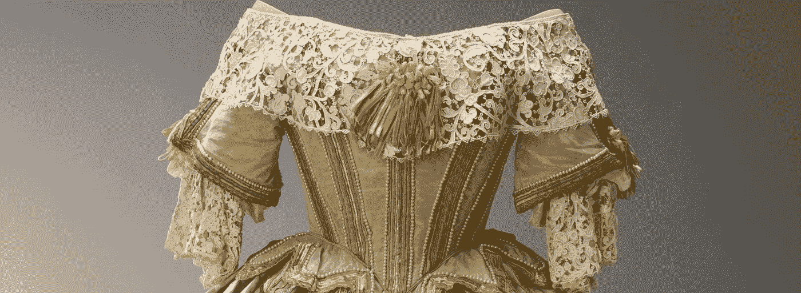
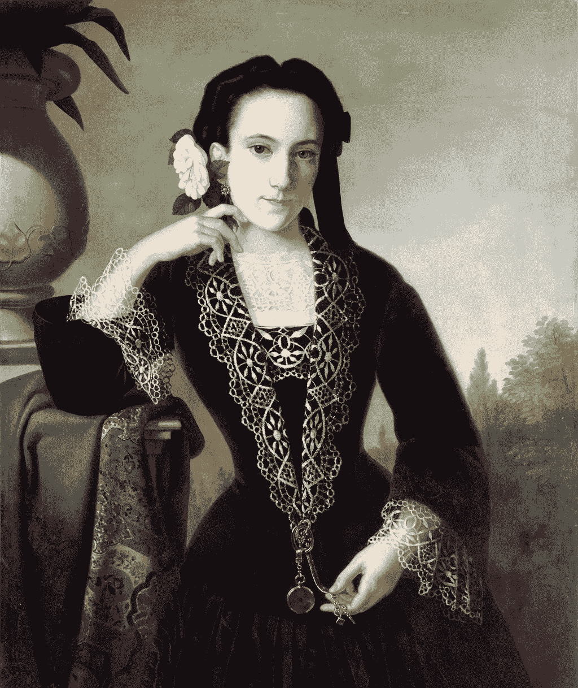
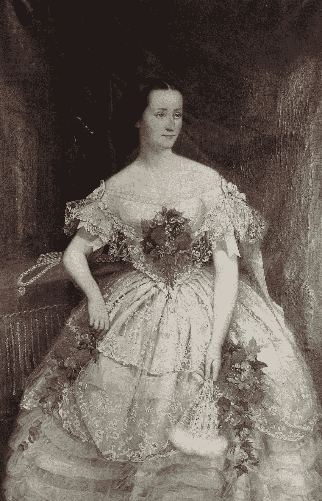

# 《克隆蕾丝》:这是一个关于一位女性创业企业家如何创办一个行业的故事，这个行业在土豆饥荒期间拯救了一个爱尔兰教区

> 原文：<https://medium.datadriveninvestor.com/clones-lace-the-story-of-how-a-female-startup-entrepreneur-launched-an-industry-which-saved-an-a0a85420bb36?source=collection_archive---------11----------------------->

Queen Victoria’s Costume for the Stuart Ball 1851 | [Royal Collection Trust](https://www.royalcollection.org.uk/copyright) | The lace featured was most likely made in Clones

在这个词被创造出来的 150 多年前，卡珊德拉·汉德是一名创业企业家。不仅如此，还有社会意识！无论从哪方面来看，她都是一位杰出的女性。1847 年，她丈夫被任命为克隆人教区的教区长，她随丈夫移居爱尔兰。当时，爱尔兰正处于“黑色 47”——成千上万的人因土豆饥荒而挨饿，并因当地没有工作而付不起房租而被驱逐。

她将钩针花边制作引入该地区，并利用她与贵族的关系，为该产品找到了市场。这个家庭手工业从济贫院和饥饿中拯救了无数的生命。她的遗产是克隆蕾丝，这是一种制作精美蕾丝的悠久传统，至今仍在镇上流传。

1855 Giuseppe Tominz — Lady with camellias — depicts the Venetian lace fashionable women were wearing at the time.

卡珊德拉的创业很成功，因为她有一个可重复的商业模式。她的主要价值主张是，爱尔兰蕾丝生产成本更低，但和当时大多数贵族购买的威尼斯蕾丝一样漂亮。

克隆蕾丝更具成本效益，因为首先，爱尔兰的劳动力比威尼斯便宜得多，其次，蕾丝可以通过利用专业化生产——即花边制作者单独编织他们擅长的图案，然后将这些图案组装成网状背景。与威尼斯花边不同，威尼斯花边是由一群妇女一起工作，用纽扣孔将图案缝合在一起。

第二，它可以用一根挖出眼睛的缝纫针，插在一个木柄里制成。这种粗糙的工具很快被称为“饥荒钩”。

最后，亚麻供应充足，因为自 17 世纪以来，爱尔兰已经有了从本地种植的亚麻生产亚麻的成熟产业——但那是另一个故事了。

很快，大约有 1500 人受雇制作花边，这些妇女为她们的家庭提供食物。在此期间，女孩的出生被大大庆祝，因为女孩更擅长花边制作的细节工作。她供应都柏林、伦敦、巴黎、罗马和纽约的市场。克隆斯将成为爱尔兰最重要的钩针花边制作中心。

卡桑德拉是女性受教育权的大力倡导者。利用花边的一些利润，她为婴儿和女孩的教育建了一所小学校。这所学校现在是卡珊德拉手中心，游客们可以在这里更多地了解这座城市、克隆人蕾丝和卡珊德拉本人。

1856 Joseph Hussenot — Portrait of a lady in a lace ballgown

卡珊德拉被安葬在罗斯丽亚的爱尔兰克隆教堂，在那里献给她的碑文上写着:

> 这块石碑是由克隆人教区居民竖立的，以纪念牧师的爱妻卡珊德拉。托马斯·汉德，这个教区的教区长，死于 1868 年 10 月 21 日。在 1847 年的饥荒期间，以及随后的几年里，她在很大程度上缓解了当时普遍存在的困境，是上帝给许多家庭带来安慰的手段。她给后代留下了不朽的丰碑，证明了她在促进这个地区人民的道德和精神福祉方面的热情和自我牺牲精神，她受到了人们的高度评价，现在他们对她的损失深感痛惜。”

我的一个朋友建议我研究一下克隆人蕾丝的故事。她认为这是一个类似于《T2》的故事，我喜欢这种比较，想知道更多。如果你知道任何关于爱尔兰花边的事，特别是 Cassandra Hand 或 Clones 花边——我很想听听，请评论！

我们在[systemally](http://systerly.com)的使命是将那些想要向前一步的女性，像卡珊德拉·汉德的人脉那样，与在家工作室工作的时装设计师联系起来。我们教我们的制造商如何使用他们自己的设备按照正确的标准生产我们的设计。

**如果你觉得这篇文章有趣，请鼓掌、连接并分享。**我是一名设计师和战略家，与我姐姐共同创建了[系统](http://systerly.com)——关注我或在 [LinkedIn](http://www.linkedin.com/in/meli-axford-77452845) 上与我联系！如果你喜欢这篇文章中的任何东西，请鼓掌帮助其他人找到它！谢谢

参考

 [## 朱塞佩·托明兹的《带山茶花的女人》

### 你需要知道的艺术——世界上最好的艺术作品

theartstack.com](https://theartstack.com/artist/giuseppe-tominz/lady-camellias)  [## 爱尔兰亚麻的历史-关于亚麻

### 托马斯·弗格森公司专门研究的爱尔兰亚麻历史

www.fergusonsirishlinen.com](https://www.fergusonsirishlinen.com/pages/index.asp?title2=history-of-irish-linen&title1=about-linen)  [## 一幅四分之三长的肖像画，画的是一个穿着蕾丝舞会礼服的女人，上面插着花，作者是…

### 在艺术网上观看约瑟夫·胡赛诺的一幅四分之三长的画，画的是一个穿着蕾丝舞会礼服、戴着花的女人…

www.artnet.com](http://www.artnet.com/artists/joseph-hussenot/a-three-quarter-length-portrait-of-a-woman-in-aa-mRLRi67whB5CgauoGLBlEw2)  [## 卡珊德拉手历史

### 编辑描述

www.cassandrahand.ie](http://www.cassandrahand.ie/Cassandra-Hand)  [## 克隆家谱，卡桑德拉手中心，克隆，莫纳亨县

### 这个项目得到了爱尔兰传统委员会的资助。它还获得了来自…的资助

www . clogherhitory . ie](http://www.clogherhistory.ie/cassandrahandcentre)  [## 国王的烛台:家谱卡桑德拉·莫尔-莫利纽克斯[8222]

### 卡珊德拉·莫尔-莫利纽克斯(8222)，生于 1809 年 5 月 13 日，科罗拉多州吉尔福德·SRY 的洛塞莱公园。1812 年 7 月 17 日，圣尼古拉斯吉尔福德…

www.thekingscandlesticks.com](http://www.thekingscandlesticks.com/webs/pedigrees/8222.html)  [## 特雷诺尔市长

### 贴在经典鞋带перепечатка的запрещены！(в том числе в личные дневники ли.ру!)…

www.irishcrochetlace.com](http://www.irishcrochetlace.com/en/lacegallery/classic-laces/560-maire-treanor)